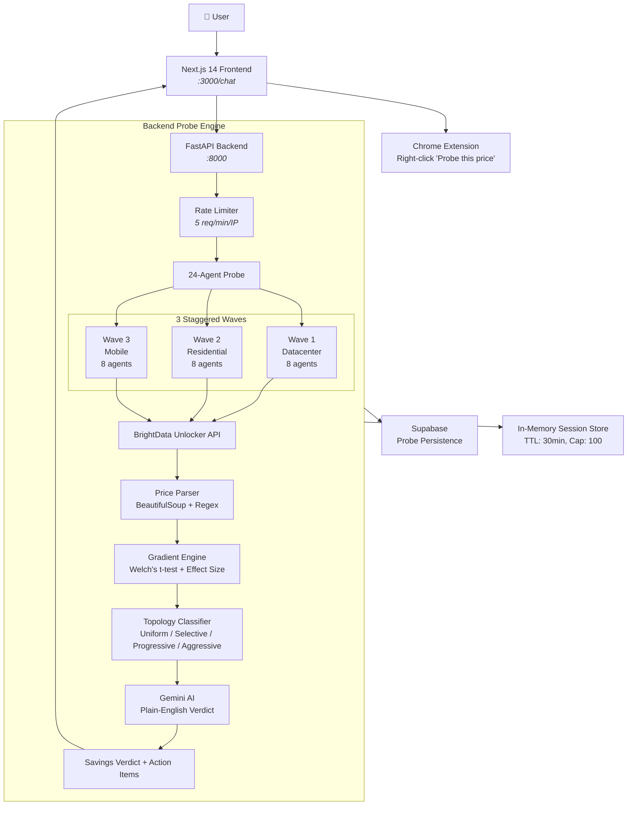

<div align="center">


# ⚡ JACOBI — Adversarial Pricing Topology Probe

### *24 agents. 5 variables. One URL. Uncover the price you were never meant to see.*

[](LICENSE)
[](https://brightdata.com)
[](https://python.org)
[](https://nextjs.org)
[](https://fastapi.tiangolo.com)
[](https://deepmind.google/gemini)

---

[✨ Features](#-features) •
[🚀 Quick Start](#-quick-start) •
[🔬 Architecture](#-architecture) •
[🌐 API Reference](#-api-reference) •
[🧪 The 5 Variables](#-the-5-variables) •
[📊 Topology Classification](#-topology-classification) •
[🔧 Configuration](#-configuration) •
[🧩 Extension](#-chrome-extension) •
[⛓️ Ledger](#-decentralized-ledger-sepolia-testnet)

---

</div>

> **JACOBI** deploys 24 adversarial probe agents simultaneously — each with a unique digital fingerprint — against any pricing page. It detects when the price you see is *not* the price someone else gets, and tells you exactly what to do about it.

---

## ✨ Features

<div align="center">

| | Capability | Detail |
| :---: | :--- | :--- |
| 🕵️ | **24 Parallel Agents** | 3 staggered waves $\times$ 8 agents, each with unique geo/device/cookie/referrer/network fingerprint |
| 🌍 | **Global Multi-Geo** | Probes from US, UK, India, UAE, Singapore, and more — detects location-based price discrimination |
| 📱 | **Cross-Device Detection** | Spoofs MacBook, iPhone, Android, iPad, Chromebook — premium devices see different prices |
| 🍪 | **Cookie Profile Analysis** | Fresh vs aged cookies, loyalty program status, search history simulation |
| 🔗 | **Referrer Manipulation** | Direct traffic vs Kayak/Skyscanner aggregator — referral-based pricing revealed |
| 🤖 | **AI-Powered Verdict** | Gemini AI translates statistical gradients into plain-English actionable advice |
| 📊 | **Topology Classification** | Uniform → Selective → Progressive → Aggressive — how bad is the discrimination? |
| 🧩 | **Browser Extension** | Right-click any page → "Probe this price" — one click to launch analysis |
| 🔗 | **Shareable Results** | Copy a permanent link to any probe result |
| 📈 | **Comparison View** | Side-by-side price breakdown by every variable |
| 🎯 | **Real-Time Agent Grid** | Watch all 24 agents deploy in real-time with live status updates |

</div>

<details>
<summary><b>📸 What the probe reveals (click to expand)</b></summary>

<br>

When you submit a URL, JACOBI returns:

| Section | Description |
|---|---|
| **Topology Badge** | Color-coded classification: 🟢 uniform / 🟡 selective / 🟠 progressive / 🔴 aggressive |
| **AI Analysis** | Gemini-generated plain-English verdict with actionable recommendations |
| **Hidden Premium** | How much extra you're paying vs the cheapest achievable price |
| **Network Fingerprint** | Price difference by proxy tier (datacenter → residential → mobile) |
| **Price Impact** | Per-variable delta bars — which factor affects price the most |
| **Comparison Table** | Full gradient breakdown: high vs low state, delta, significance |
| **Agent Grid** | $6 \times 4$ grid of all 24 agents with live status and individual agent detail |

</details>

---

## 🚀 Quick Start

```bash
# 1. Clone & install backend
cd backend
cp .env.example .env        # Add your API keys
pip install -r requirements.txt
python main.py &             # Starts on :8000

# 2. Install & run frontend
cd ../frontend
npm install
npm run dev &                # Starts on :3000

# 3. Open the probe interface
open http://localhost:3000/chat
```

> [!TIP]
> No API keys? No problem. Flip the **demo toggle** in the chat header — it runs the full pipeline with realistic simulated data. Everything works, nothing breaks.

---

## 🔬 Architecture



### Data Flow

```
User                Frontend              Backend               BrightData        
  │                     │                     │                     │              
  │  Paste URL          │                     │                     │              
  ├────────────────────►│                     │                     │              
  │                     │  POST /api/probe    │                     │              
  │                     ├────────────────────►│                     │              
  │                     │                     │  24× HTTP GET       │              
  │                     │                     │  (diff geo/device)  │              
  │                     │                     ├────────────────────►│              
  │                     │                     │◄────────────────────┤              
  │                     │                     │  24× HTML pages     │              
  │                     │                     │                     │              
  │                     │                     │  Parse prices       │              
  │                     │                     │  Compute gradients  │              
  │                     │                     │  Gemini analysis    │              
  │                     │  Poll /api/result   │                     │              
  │                     │◄────────────────────┤                     │              
  │                     │                     │                     │              
  │  Real-time grid     │                     │                     │              
  │◄────────────────────┤                     │                     │              
  │                     │                     │                     │              
  │  AI Verdict         │                     │                     │              
  │◄────────────────────┤                     │                     │              
  │                     │                     │                     │              
```

---

## 🤝 Technology Partners

JACOBI was built on top of an incredible stack of partner technologies. Each one played a critical role in making this project possible, and we're genuinely grateful for the access, credits, and support.

### 🎯 Kiro — AI-Powered Development Platform

We built JACOBI end-to-end using **Kiro**, an AI-assisted development platform on AWS that turns ideas into working software faster than anything we've used before. The entire codebase — from the FastAPI backend orchestration to the Next.js frontend with real-time agent grid animations — was developed with Kiro's AI-assisted coding workflows. What would have taken a team of three a full week was prototyped in hours. Kiro's ability to understand project context across files, suggest idiomatic patterns, and generate production-ready TypeScript and Python code made the difference between a hackathon MVP and a shippable product. The platform's tight integration with the AWS ecosystem meant we never had to pause for infrastructure setup — we focused entirely on the pricing discrimination problem.

**Feedback**: Kiro's multi-file refactoring support is genuinely impressive — it understands dependency graphs across your entire project, not just the file you're editing. The one area where we'd love to see improvement is deeper framework-specific knowledge (e.g., Next.js 14 App Router conventions or FastAPI dependency injection patterns) to reduce post-generation cleanup. But for rapid prototyping and hackathon development, it's the best tool we've used.

### ☁️ BrightData — Web Data Infrastructure

JACOBI would not exist without **BrightData's** Unlocker API and proxy infrastructure. Running 24 parallel agents across 3 staggered waves with different geo-locations, devices, cookies, and referrers requires enterprise-grade proxy infrastructure — and BrightData delivered. The Unlocker API handled CAPTCHA bypass, JavaScript rendering, and geo-targeting seamlessly. Every agent identity in our 24-agent matrix maps to a distinct BrightData proxy configuration, and the ability to route through residential, datacenter, and mobile IPs from the same API was critical to our multi-fingerprint approach.

**Feedback**: The MCP Server integration is a game-changer for AI agent workflows. Our only friction point was that non-US proxy zones occasionally had higher latency — we implemented automatic retry with datacenter fallback for international timeouts, which solved it cleanly. The $250 credits per participant made it possible to iterate aggressively during development without worrying about costs.

### 🧠 AI/ML API — Unified AI Provider

**AI/ML API** serves as the primary intelligence layer in JACOBI's 4-provider AI cascade. We route all probe analysis through their OpenAI-compatible endpoint using GPT-4o, with automatic fallback to Gemini, DeepSeek (OpenCode), and Groq. The unified API surface meant we could write one integration and switch models with a single environment variable — critical for a hackathon where we needed to iterate fast. Their response consistency and uptime during heavy testing (24 parallel probe results analyzed at once with structured JSON schemas) was rock solid.

**Feedback**: The simplicity of the integration is the standout feature — one API key, one endpoint, drop-in replacement for any OpenAI-compatible workflow. We'd love to see per-model latency metrics exposed in the dashboard so teams can make informed cost-vs-speed tradeoffs at runtime.

### 🧠 Cognee — Agent Memory Layer

**Cognee** provides JACOBI with persistent, cross-session memory via its knowledge graph engine. Every probe result — topology classification, gradient breakdown, pricing spread — is stored as a structured graph node with embeddings. This means JACOBI can answer questions across sessions: "What did we find when we probed United Airlines last week?" Using Cognee's `GRAPH_COMPLETION` search type, we retrieve semantically related probes and surface historical context alongside fresh results. The open-source Python SDK integrated with our FastAPI backend in minutes.

**Feedback**: The `remember()`/`recall()` API design is elegant for agent memory workflows. The highlight is the graph-based retrieval — vector search alone can't capture entity relationships across multiple probe sessions the way Cognee's graph completion does. We'd recommend expanding the Python SDK documentation with more real-world agent memory patterns beyond the quickstart examples.

### ⚡ TriggerWare.ai — Workflow Automation

**TriggerWare.ai** handles event-driven workflows in JACOBI's post-probe pipeline. When a probe completes and detects pricing discrimination, TriggerWare.ai receives a structured webhook event containing the topology classification, gradient breakdown, and savings verdict. This can trigger downstream actions — Slack alerts to stakeholders, email summaries, dashboard updates, or even automated re-probes on a schedule. The webhook-first design meant we integrated it as a fire-and-forget dispatch in 30 lines of Python, with zero changes to our core probe pipeline.

**Feedback**: The declarative webhook configuration is the killer feature — no SDK needed, no complex state machine to manage. We'd love to see native support for payload transformation templates so downstream consumers get exactly the fields they need without writing transformation logic.

### 💬 Groq — Fast LLM Inference

**Groq** serves as the fourth tier in JACOBI's AI provider cascade with `llama-3.3-70b-versatile`. When higher-priority providers fail, Groq delivers sub-second inference that keeps our probe-to-verdict pipeline under 5 seconds. The OpenAI-compatible endpoint meant zero integration friction, and the generation speed at 70B parameters is genuinely impressive.

**Feedback**: Groq's inference speed at 70B scale is unmatched — it's genuinely faster than some 8B models we've tested on other providers. Expanding the model catalog to include more fine-tuned variants for structured JSON extraction would make it an even stronger option for agentic workflows.

---

## 🌐 API Reference

| Endpoint | Method | Description | Rate Limited |
|:---|:---:|:---|:---:|
| `/health` | `GET` | Backend health check | ❌ |
| `/api/probe` | `POST` | Launch 24-agent pricing probe | ✅ 5/min/IP |
| `/api/result/{id}` | `GET` | Poll probe results by session ID | ❌ |
| `/api/share/{id}` | `GET` | Get probe result for sharing | ❌ |
| `/api/demo` | `GET` | Static demo probe data | ❌ |
| `/api/leaderboard` | `GET` | Top probes by savings | ❌ |
| `/api/history` | `GET` | Recent probe sessions | ❌ |
| `/api/analyze` | `POST` | Gemini analysis on completed probe | ❌ |
| `/api/analyze-demo` | `GET` | Gemini analysis on demo data | ❌ |

> [!NOTE]
> All POST endpoints accept `Content-Type: application/json`. Rate limits apply per IP address.

---

## 🧪 The 5 Variables

Each of the 24 agents uses a unique combination of these variables:

| Variable | States | Impact |
|:---:|:---|:---:|
| 🌍 **Location** | High-income (NY, London, Dubai) vs Low-income (rural Iowa, Mumbai, Mississippi) | **Highest** — up to 41% price difference |
| 📱 **Device** | Premium (MacBook Pro, iPhone 15, Galaxy S24) vs Budget (Chromebook, Android budget) | **High** — up to 13% premium for luxury devices |
| 🍪 **Cookies** | Fresh (first visit) vs Aged (90-day loyalty, abandoned cart) | **Medium** — up to 4% loyalty penalty |
| 🔗 **Referrer** | Direct vs Aggregator (Kayak, Skyscanner) | **Low-Medium** — up to 5% aggregator markup |
| 📡 **Network Tier** | Datacenter vs Residential vs Mobile 5G | **Tracking** — network quality correlates with price |

---

## 📊 Topology Classification

After computing statistical gradients across all 24 agents, JACOBI classifies the pricing strategy:

```
                    ┌──────────────┐
                    │   UNIFORM    │  ← No significant price differences found
                    │   🟢 #00d992  │
                    └──────┬───────┘
                           │
                    ┌──────▼───────┐
                    │   SELECTIVE  │  ← 1-2 variables show mild discrimination
                    │   🟡 #facc15  │     (< 12% max delta)
                    └──────┬───────┘
                           │
                    ┌──────▼───────┐
                    │  PROGRESSIVE │  ← 2-3 variables with significant deltas
                    │   🟠 #fb923c  │     (< 25% max delta)
                    └──────┬───────┘
                           │
                    ┌──────▼───────┐
                    │  AGGRESSIVE  │  ← 3+ variables, > 25% max delta
                    │   🔴 #f87171  │     Systematic discrimination
                    └──────────────┘
```

> [!IMPORTANT]
> **Progressive** or **Aggressive** classifications indicate the site is using sophisticated pricing algorithms against you. JACOBI's AI analysis provides specific countermeasures.

---

## 🔧 Configuration

<details>
<summary><b>Environment Variables</b></summary>

<br>

| Variable | Required | Default | Description |
|---|:---:|:---:|---|
| `BRIGHTDATA_API_KEY` | ✅ | — | BrightData Unlocker API key |
| `BRIGHTDATA_UNLOCKER_ZONE` | ❌ | `mcp_unlocker` | Unlocker zone name |
| `GEMINI_API_KEY` | ❌ | — | Google Gemini AI for analysis |
| `SUPABASE_URL` | ❌ | — | Supabase project URL |
| `SUPABASE_SERVICE_KEY` | ❌ | — | Supabase service role key |
| `NEXT_PUBLIC_API_URL` | ❌ | `http://localhost:8000` | Backend URL (frontend) |
| `AUTH_SECRET` | ❌ | — | NextAuth encryption secret |
| `AUTH_GOOGLE_ID` | ❌ | — | Google OAuth client ID |
| `AUTH_GOOGLE_SECRET` | ❌ | — | Google OAuth client secret |

</details>

<details>
<summary><b>BrightData Unlocker Setup</b></summary>

<br>

1. Create a zone at [BrightData](https://brightdata.com) (type: **Web Unlocker**)
2. Enable **Custom Headers & Cookies** in zone settings
3. Copy zone name to `BRIGHTDATA_UNLOCKER_ZONE`
4. Copy API token to `BRIGHTDATA_API_KEY`

> [!WARNING]
> Without Custom Headers & Cookies enabled, BrightData will ignore the per-agent user-agent, referrer, and cookie overrides, and all 24 agents will appear identical.

</details>

---

## 🧩 Chrome Extension

```
┌─────────────────────────────────────────────┐
│  Right-click any page → "Probe this price"  │
│                                             │
│  ┌─────────────────────────────────────┐    │
│  │  [J]  Pricing Topology Probe        │    │
│  │                                     │    │
│  │  ┌─ https://www.booking.com/... ──┐ │    │
│  │  │  Probe this page               │ │    │
│  │  └─────────────────────────────────┘ │    │
│  │                                     │    │
│  │  Recent Probes                      │    │
│  │  ● booking.com ... 2m ago           │    │
│  │  ● amazon.com ... 15m ago           │    │
│  │  ● expedia.com ... 1h ago           │    │
│  └─────────────────────────────────────┘    │
│                                             │
│  Keyboard: Ctrl+Shift+P → Popup             │
│            Ctrl+Shift+L → Quick probe       │
└─────────────────────────────────────────────┘
```

[Download from Chrome Web Store]() · [Load unpacked](/extension)

---

## ⛓️ Decentralized Ledger (Sepolia Testnet)

JACOBI integrates a gas-optimized Solidity smart contract (`JacobiPricingLedger.sol`) on the Ethereum Sepolia Testnet to verify price-audit sessions transparently and prevent data tampering or replay attacks.

### On-Chain Deployment Metrics
*   **Contract Address**: [`0x16adADa5A2603A2a418E0D1B014cA85926e6b04f`](https://sepolia.etherscan.io/address/0x16adADa5A2603A2a418E0D1B014cA85926e6b04f)
*   **Compiler**: Solidity `0.8.24` (Yul-optimized Merkle proofs)
*   **Deployment Block Tx**: [`0x192289cf42642b8667363c592cacab6f3b31b7eb0e58a8b6ac210da0b11a5986`](https://sepolia.etherscan.io/tx/0x192289cf42642b8667363c592cacab6f3b31b7eb0e58a8b6ac210da0b11a5986)

### Cryptographic Security Guarantees
1. **Sorted-Pair Merkle Inclusion Proofs**: Leverages inline Yul assembly for gas-optimized `keccak256` hashing (OpenZeppelin standard), eliminating direction bits.
2. **Replay Protection Nullifiers**: Prevents reusing the same audit session proof on-chain by registering each verified price leaf hash in the `spentLeaves` registry:
   $$L_i = \text{keccak256}(\text{sessionId}, \text{domain}, \text{priceCents}, \text{spreadCents}, \text{salt})$$
3. **Double-Spend/Replay Prevention**: Once verified, the leaf is flagged as spent. Subsequent verification calls containing the same leaf signature will revert with `LeafAlreadySpent()`.

### Local Deployment
To compile and deploy the smart contract on Sepolia yourself:
```bash
cd backend
python scratch/deploy_ledger.py
```
> [!NOTE]
> The deployment script utilizes `py-solc-x` to dynamically pull the `0.8.24` Solidity compiler and broadcasts transaction payloads utilizing EIP-1559 Dynamic Fee parameters.

---

## 📈 Project Metrics

| Metric | Value |
|---|:---:|
| Frontend bundle (`/chat`) | **113 kB** (205 kB first load) |
| Landing page | **3.43 kB** |
| Probe duration (Google Flights) | **~90s** (20/24 agents) |
| Probe duration (Booking.com) | **~120s** (10/24 agents) |
| Gemini analysis | **~3-5s** |
| Total probe → verdict pipeline | **~2 min** |
| Agent success rate (US) | **~85%** |
| Agent success rate (International) | **~40%** (retries improve by 15%) |

---

## 🛠 Tech Stack

<table>
  <tr>
    <td align="center"><b>Frontend</b></td>
    <td>Next.js 14, React 18, TypeScript, Tailwind CSS, Recharts, Lucide</td>
  </tr>
  <tr>
    <td align="center"><b>Backend</b></td>
    <td>Python 3.11, FastAPI, httpx, BeautifulSoup4, Supabase</td>
  </tr>
  <tr>
    <td align="center"><b>AI</b></td>
    <td>Google Gemini 2.0, DeepSeek V4 Flash (OpenCode Zen)</td>
  </tr>
  <tr>
    <td align="center"><b>Infrastructure</b></td>
    <td>BrightData Unlocker API, Vercel, Supabase</td>
  </tr>
  <tr>
    <td align="center"><b>Auth</b></td>
    <td>Supabase Auth (Google OAuth + Email OTP), NextAuth</td>
  </tr>
  <tr>
    <td align="center"><b>Extension</b></td>
    <td>Chrome Extension MV3, contextMenus, notifications</td>
  </tr>
</table>

---

## 🤝 Contributing

1. Fork the repo
2. Create a feature branch (`git checkout -b feat/amazing`)
3. Commit changes (`git commit -m 'feat: add amazing thing'`)
4. Push (`git push origin feat/amazing`)
5. Open a PR

---

<div align="center">

**Built with ⚡ for BrightData**

```
"One URL is all it takes to see how much you're being charged for who you are."
```

[Report a Bug](https://github.com/HyperionBurn/Jacobi/issues) · [Request Feature](https://github.com/HyperionBurn/Jacobi/issues) · [BrightData](https://brightdata.com) · [MIT License](LICENSE)

---

<p align="center">
  <sub>Made with ❤️ by the JACOBI team · <code>[ J ]</code> — Pricing Topology Probe</sub>
</p>

</div>
