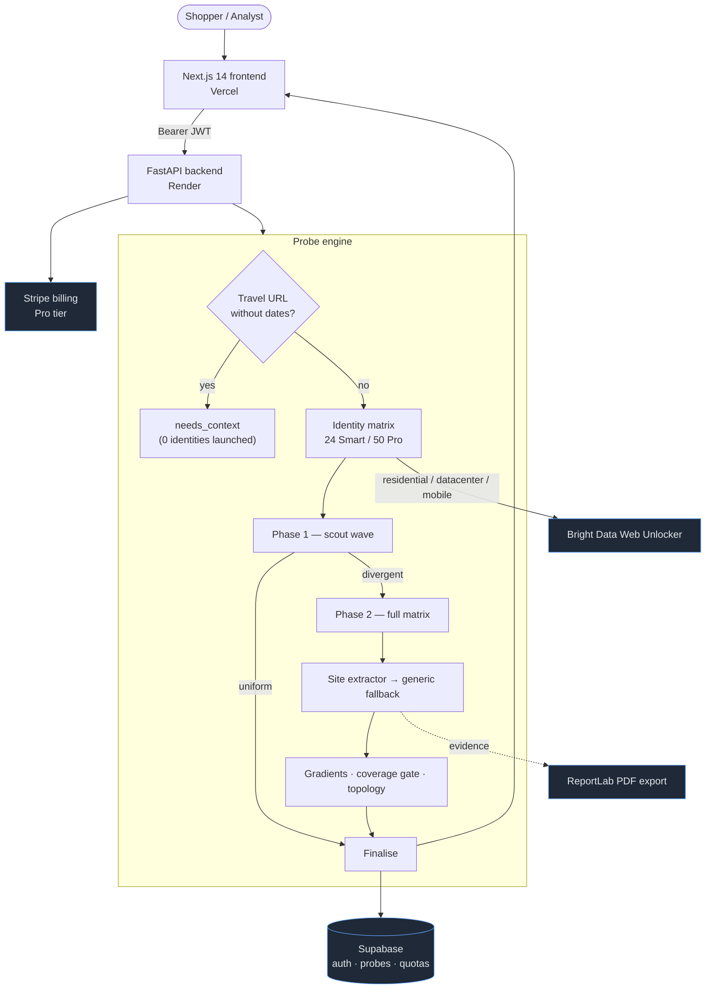

# JACOBI

### Evidence-grade pricing-discrimination intelligence

Paste one URL. A swarm of synthetic shoppers checks the price from every angle —
geography, device, cookies, referrer, language — and tells you, **with statistics
and receipts**, whether you are being charged for *who you are*.

**[Live demo →](https://jacobi-mark3.vercel.app)**

## Table of contents

- [What is JACOBI?](#what-is-jacobi)
- [Why it matters](#why-it-matters)
- [Features](#features)
- [How it works](#how-it-works)
  - [The synthetic-identity matrix](#the-synthetic-identity-matrix)
  - [The probe engine](#the-probe-engine)
  - [Evidence & the coverage gate](#evidence--the-coverage-gate)
  - [Topology classification](#topology-classification)
  - [Site extractors & travel pre-flight](#site-extractors--travel-pre-flight)
- [Architecture](#architecture)
- [Tech stack](#tech-stack)
- [Getting started](#getting-started)
- [Configuration](#configuration)
- [Running locally](#running-locally)
- [API reference](#api-reference)
- [Testing](#-testing)
- [Deployment](#deployment)
- [Project structure](#project-structure)
- [Roadmap](#roadmap)
- [Contributing](#contributing)
- [License](#license)

## What is JACOBI?

**JACOBI** is a pricing-intelligence platform that detects **personalised price
discrimination** — when an online price changes based on *who the shopper appears
to be* rather than *what they are buying*.

Give it a product, hotel, or flight URL. JACOBI dispatches a matrix of **synthetic
shopper identities** — 24 on the free *Smart* tier, 50 on *Pro* — each carrying a
distinct, controlled fingerprint (location, device, cookie age, referrer, and
browser language). Every identity fetches the page through residential, datacenter,
and mobile proxies, the price is extracted with site-aware parsers, and the results
are run through a statistical pipeline that asks one disciplined question:

> *Did a controlled buyer-context variable significantly move the price — or is the
> variation just noise?*

The output is an **evidence-grade report**: a pricing-topology verdict, the exact
price each identity saw, the on-page currency and raw text used as proof, and a
downloadable research-style PDF. Crucially, JACOBI is built to **never cry wolf** —
it refuses to claim discrimination from thin samples or unattributable spread.

## Why it matters

Dynamic and personalised pricing is now routine across travel, retail, and
subscriptions. The same seat, room, or SKU can cost materially more depending on
your IP geography, the device you browse on, whether you arrived from an
aggregator, or how "loyal" your cookies look. For shoppers this is invisible; for
analysts, regulators, and journalists it is **hard to prove** because you need to
hold every other variable constant and vary exactly one at a time, at scale.

JACOBI turns that controlled experiment into a one-click product:

- **Reproducible** — every identity is a declared, version-controlled fingerprint.
- **Attributable** — price deltas are tied to a single changed variable, not vibes.
- **Defensible** — claims are gated on statistical significance and sample coverage.
- **Auditable** — every data point keeps its native currency and raw on-page text.

## Features

- **Synthetic-identity matrix** — 24 (Smart) or 50 (Pro) controlled fingerprints
  varying location, device, cookie age, referrer, and `Accept-Language`.
- **Multi-network proxying** — datacenter, residential, and mobile egress via the
  Bright Data Web Unlocker, with automatic direct-HTTP fallback per identity.
- **Two-phase progressive probing** — a fast scout wave short-circuits uniform
  sites in seconds; the full matrix only runs when prices actually diverge.
- **Bounded latency** — adaptive per-site timeouts and a global wall-clock deadline
  keep scans inside a predictable window and finalise partial results gracefully.
- **Site-aware extraction** — a dedicated Booking.com/travel parser reads prices
  from embedded rate JSON, with a generic parser fallback for everything else.
- **Native currency + USD normalisation** — the headline shows the on-page value
  the shopper actually sees; a normalised USD basis powers comparison.
- **Statistical topology verdict** — `uniform`, `selective`, `progressive`,
  `aggressive`, `indeterminate`, or `insufficient_data` — derived from significance
  testing, not raw spread.
- **Coverage gate** — refuses to assert discrimination from thin samples and never
  invents check-in/check-out dates for a travel scan.
- **Research-grade PDF export** — a typeset report with the per-identity evidence
  table, native + normalised prices, and the methodology.
- **Accounts & billing** — Supabase (Google OAuth) auth, monthly quotas, and Stripe
  upgrade to the 50-identity Pro tier.
- **History, sharing & leaderboard** — every scan is persisted, shareable, and
  optionally published to a public savings board.

## How it works

JACOBI is a controlled experiment wrapped in a web app. Each scan moves through
four stages — **fan out** a fingerprint matrix, **fetch** every variant through
proxies, **extract** a comparable price with proof, then **reason** about whether
any single variable moved it enough to matter.

### The synthetic-identity matrix

Every identity is a declared fingerprint that changes exactly one axis at a time,
so any price delta is attributable to that axis:

| Vector | Example states | What it probes |
| :--- | :--- | :--- |
| **Location** | high-income metro vs. lower-income region | geo-based price steering |
| **Device** | premium (MacBook / flagship phone) vs. budget | device-tier markups |
| **Cookies** | fresh first-visit vs. aged / returning | loyalty & intent signals |
| **Referrer** | direct vs. aggregator (Kayak, Skyscanner) | channel-based pricing |
| **Language** | `Accept-Language` pairs, all else held constant | locale-based variation |

Identities are organised into **control** and **variant** pairs. A control holds
every vector at a baseline; each variant flips one vector. Comparing a variant to
its control isolates the causal effect of that single change.

### The probe engine

The engine is tuned for **speed without sacrificing honesty**:

- **Two-phase progressive probing.** A scout wave runs a representative subset
  first. If those prices are uniform within a tight tolerance, the run
  short-circuits and finalises immediately — most non-discriminating product pages
  resolve in seconds. Only when the scout detects divergence does the full matrix
  deploy for statistical analysis.
- **Adaptive concurrency.** Concurrency is set from measured sweeps per site class
  (`asyncio.Semaphore`), because JS-heavy travel pages and lightweight product
  pages have very different throughput profiles.
- **Adaptive timeouts + global deadline.** Each identity gets a per-site timeout;
  the whole scan is bounded by a wall-clock deadline so a slow tail can never run
  away. Whatever has completed is finalised cleanly.
- **Per-identity fallback.** If a proxy fetch times out, that identity silently
  falls back to a direct request rather than failing the whole scan.
- **Honest accounting.** The report distinguishes identities that were *really
  probed* from any that were *inferred* by the uniform short-circuit — the two are
  never conflated.

### Evidence & the coverage gate

A price with no proof is a rumour. Every extracted price carries an **evidence
record**: the extraction method and selector, the raw on-page text, the detected
native currency, the native value, and the normalised USD figure.

Before any verdict is computed, the run passes through a **coverage gate** based on
how many identities returned a comparable price:

| Coverage | Priced identities | Behaviour |
| :--- | :--- | :--- |
| **Strong** | many | full topology verdict, normal confidence |
| **Partial** | some | verdict computed, flagged "moderate confidence" |
| **Limited** | few | **no discrimination claim** — data shown as `insufficient_data` |

This is the rule the whole system is organised around: **JACOBI never asserts price
discrimination from a sample too thin to support it.** It reports the prices it
captured and tells you to try a more specific URL instead.

### Topology classification

For each controlled variable, JACOBI computes a **gradient** — the price delta
between its high and low states — and tests it for significance (Welch's t-test
with an effect-size check). The verdict is driven by **how many variables
significantly moved the price**, never by raw spread alone:

| Topology | Meaning |
| :--- | :--- |
| `uniform` | No measurable difference across identities. |
| `selective` | One variable drives a small, significant delta. |
| `progressive` | Several variables stack into a graded structure. |
| `aggressive` | Multiple strong signals — systematic discrimination. |
| `indeterminate` | Prices varied, but **no** variable significantly explains it (e.g. different hotel rooms across identities) — reported, never claimed as discrimination. |
| `insufficient_data` | Too few comparable prices to classify (coverage gate). |

The `indeterminate` class exists for a specific honesty reason: on travel sites a
large spread is often just different rooms or availability caught by different
identities. Without a significant gradient, that spread is **not** attributable to
who the shopper is — so JACOBI labels it indeterminate instead of crying
"aggressive."

### Site extractors & travel pre-flight

Most product pages expose a price the generic parser can read. Travel sites do not
— Booking.com, for example, renders rates from an embedded JSON blob, not a simple
price tag. JACOBI solves this with an **isolated, site-specific extractor registry**
(`backend/extractors/`):

- `get_extractor(url)` routes a URL to a dedicated parser (e.g. Booking.com) or
  returns `None` to use the generic parser — routing is explicit and auditable.
- The Booking extractor reads structured `b_stay_prices` rate data, keeps the raw
  visible text as evidence, flags `price_kind` (`total_stay` / `room_rate`) and
  whether tax inclusion is verifiable, and normalises localised separators.
- The generic parser and the rest of the engine are **never** touched by a
  site extractor — they only run first and fall back cleanly.

Travel prices are only comparable **with dates and occupancy**. JACOBI never
silently invents them: a dateless travel URL is caught by a **pre-flight gate**
*before any identity is launched* and returns, instantly and with zero proxy spend:

> *Travel pricing requires dates and occupancy for reliable comparison. Add
> check-in/check-out parameters or use a specific booking URL.*

## Architecture

The system splits cleanly into a **Next.js 14** frontend (deployed on Vercel),
a **FastAPI** backend probe engine (containerised on Render), **Bright Data** for
egress, and **Supabase** + **Stripe** for accounts and billing. The frontend proxies
all API traffic through a Next.js route so the backend origin stays single-sourced.

## Tech stack

| Layer | Technologies |
| :--- | :--- |
| **Frontend** | Next.js 14 (App Router), React 18, TypeScript, Tailwind CSS, Zustand, Framer Motion, Recharts, Three.js, Lucide |
| **Backend** | Python 3.11, FastAPI, Uvicorn, httpx (async), Pydantic v2 |
| **Extraction** | BeautifulSoup4, lxml, site-specific extractor registry |
| **Reporting** | ReportLab (server-side PDF), jsPDF (client) |
| **Data egress** | Bright Data Web Unlocker (residential / datacenter / mobile) |
| **Auth & data** | Supabase (Postgres + Google OAuth) |
| **Billing** | Stripe (subscriptions, customer portal) |
| **AI (optional)** | Google Gemini (`google-genai`), Groq — natural-language summaries |
| **Observability** | Sentry |
| **Deployment** | Vercel (frontend), Render (Docker backend) |

<!-- more -->
