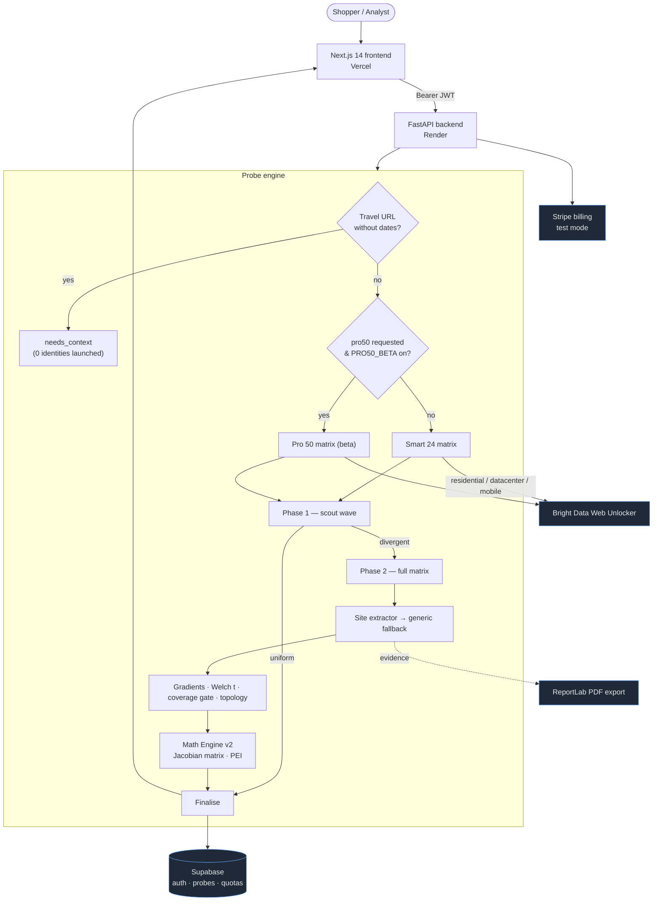

<div align="center">

<picture>
  <source media="(prefers-color-scheme: dark)" srcset="assets/logo-dark.svg" />
  <source media="(prefers-color-scheme: light)" srcset="assets/logo-light.svg" />
  
</picture>

### Evidence-grade pricing-discrimination intelligence

Paste one URL. A swarm of synthetic shoppers checks the price from every angle —
geography, device, cookies, referrer, language — and tells you, **with statistics
and receipts**, whether you are being charged for *who you are*.

[](LICENSE)
[](https://www.python.org/)
[](https://fastapi.tiangolo.com/)
[](https://nextjs.org/)
[](#-the-mathematics)
[](https://brightdata.com/)
[](#-testing)

**[Live demo →](https://jacobi-mark3.vercel.app)**

<sub><b>Smart 24</b> — live (early-access waitlist) &nbsp;·&nbsp; <b>Pro 50</b> — private beta</sub>

</div>

---

## Table of contents

- [What is JACOBI?](#what-is-jacobi)
- [Why it matters](#why-it-matters)
- [The name — why a *Jacobian*](#the-name--why-a-jacobian)
- [Features](#features)
- [How it works](#how-it-works)
  - [The synthetic-identity matrix](#the-synthetic-identity-matrix)
  - [The probe engine](#the-probe-engine)
  - [Evidence & the coverage gate](#evidence--the-coverage-gate)
  - [Topology classification](#topology-classification)
  - [Site extractors & travel pre-flight](#site-extractors--travel-pre-flight)
- [🧮 The mathematics](#-the-mathematics)
  - [1. The price gradient — a discrete Jacobian](#1-the-price-gradient--a-discrete-jacobian)
  - [2. Significance — Welch's *t*-test](#2-significance--welchs-t-test)
  - [3. The robust baseline — trimmed median & MAD](#3-the-robust-baseline--trimmed-median--mad)
  - [4. Inequality — the Gini coefficient](#4-inequality--the-gini-coefficient)
  - [5. Monotonic structure — Spearman's ρ](#5-monotonic-structure--spearmans-ρ)
  - [6. The sensitivity matrix — the literal Jacobian view](#6-the-sensitivity-matrix--the-literal-jacobian-view)
  - [7. Aggregate magnitude — the Minkowski *p*-norm](#7-aggregate-magnitude--the-minkowski-p-norm)
  - [8. The Price Exploitation Index (PEI)](#8-the-price-exploitation-index-pei)
  - [9. The attribution gate — why JACOBI never cries wolf](#9-the-attribution-gate--why-jacobi-never-cries-wolf)
- [Launch status — Smart 24 & Pro 50 (private beta)](#launch-status--smart-24--pro-50-private-beta)
- [Architecture](#architecture)
- [🔐 Security & safety posture](#-security--safety-posture)
- [Tech stack](#tech-stack)
- [Getting started](#getting-started)
- [Configuration](#configuration)
- [Running locally](#running-locally)
- [API reference](#api-reference)
- [🧪 Testing](#-testing)
- [Deployment](#deployment)
- [Project structure](#project-structure)
- [Honesty principles](#honesty-principles)
- [Roadmap](#roadmap)
- [Contributing](#contributing)
- [License](#license)

## What is JACOBI?

**JACOBI** is a pricing-intelligence platform that detects **personalised price
discrimination** — when an online price changes based on *who the shopper appears
to be* rather than *what they are buying*.

Give it a product, hotel, or flight URL. JACOBI dispatches a matrix of **synthetic
shopper identities** — **24** on the live *Smart 24* tier, **50** on the
private-beta *Pro 50* tier — each carrying a distinct, controlled fingerprint
(location, device, cookie age, referrer, and browser language). Every identity
fetches the page through residential, datacenter, and mobile proxies; the price is
extracted with site-aware parsers; and the results are run through a statistical
pipeline that asks one disciplined question:

> *Did a controlled buyer-context variable **significantly** move the price — or is
> the variation just noise?*

The output is an **evidence-grade report**: a pricing-topology verdict, a 0–100
**Price Exploitation Index**, the **Jacobian sensitivity matrix**, the exact price
each identity saw, the on-page currency and raw text used as proof, and a
downloadable research-style PDF. Crucially, JACOBI is built to **never cry wolf** —
it refuses to claim discrimination from thin samples or from price spread that no
single buyer-context variable can explain.

> **Honest timing.** Smart 24 audits typically complete within **60–100 seconds**,
> depending on the target site (JS-heavy travel pages sit at the slower end).

## Why it matters

Dynamic and personalised pricing is now routine across travel, retail, and
subscriptions. The same seat, room, or SKU can cost materially more depending on
your IP geography, the device you browse on, whether you arrived from an
aggregator, or how "loyal" your cookies look. For shoppers this is invisible; for
analysts, regulators, and journalists it is **hard to prove** because you need to
hold every other variable constant and vary exactly one at a time, at scale.

JACOBI turns that controlled experiment into a one-click product:

- **Reproducible** — every identity is a declared, version-controlled fingerprint.
- **Attributable** — price deltas are tied to a single changed variable, not vibes.
- **Defensible** — claims are gated on statistical significance and sample coverage.
- **Auditable** — every data point keeps its native currency and raw on-page text.

## The name — why a *Jacobian*

In multivariable calculus, the **Jacobian** is the matrix of first-order partial
derivatives of a vector-valued function — it tells you how each output responds to a
small change in each input. JACOBI treats **price as a function of the buyer-context
vector**:

$$
p = f(\mathbf{x}), \qquad
\mathbf{x} = (x_{\text{geo}},\, x_{\text{device}},\, x_{\text{cookie}},\, x_{\text{referrer}},\, x_{\text{lang}})
$$

The product's whole job is to estimate the **price row of the Jacobian** —

$$
J = \left[\; \frac{\partial p}{\partial x_{\text{geo}}},\;
\frac{\partial p}{\partial x_{\text{device}}},\;
\frac{\partial p}{\partial x_{\text{cookie}}},\;
\frac{\partial p}{\partial x_{\text{referrer}}},\;
\frac{\partial p}{\partial x_{\text{lang}}} \;\right]
$$

— and to decide which components are **real** (statistically separable from noise)
versus zero. Every controlled identity is a finite-difference probe of one partial
derivative. The name is the method.

## Features

- **Synthetic-identity matrix** — 24 (Smart) or 50 (Pro, beta) controlled
  fingerprints varying location, device, cookie age, referrer, and `Accept-Language`.
- **Multi-network proxying** — datacenter, residential, and mobile egress via the
  Bright Data Web Unlocker, with automatic direct-HTTP fallback per identity.
- **Two-phase progressive probing** — a fast scout wave short-circuits uniform
  sites quickly; the full matrix only runs when prices actually diverge.
- **Bounded latency** — adaptive per-site timeouts and a global wall-clock deadline
  keep scans inside a predictable window and finalise partial results gracefully.
- **Math Engine v2** — robust statistics (trimmed median, MAD, Gini, Spearman), the
  **Jacobian sensitivity matrix**, and an **attribution-gated Price Exploitation
  Index** (PEI ∈ [0, 100]). Surfaced in the UI as the *Jacobian Matrix View* and in
  the PDF, with a runtime kill-switch.
- **Site-aware extraction** — a dedicated Booking.com/travel parser reads prices
  from embedded rate JSON, with a generic parser fallback for everything else.
- **Native currency + USD normalisation** — the headline shows the on-page value
  the shopper actually sees; a normalised USD basis powers comparison.
- **Statistical topology verdict** — `uniform`, `selective`, `progressive`,
  `aggressive`, `indeterminate`, or `insufficient_data` — derived from significance
  testing, not raw spread.
- **Coverage gate** — refuses to assert discrimination from thin samples and never
  invents check-in/check-out dates for a travel scan.
- **Research-grade PDF export** — a typeset report with the per-identity evidence
  table, native + normalised prices, the math appendix, and the methodology.
- **Accounts & billing** — Supabase (Google OAuth) auth, monthly quotas, Stripe in
  test mode (no public sale of Pro 50 during the Smart 24 waitlist).
- **History, sharing & leaderboard** — every scan is persisted, shareable, and
  optionally published to a public savings board.

## How it works

JACOBI is a controlled experiment wrapped in a web app. Each scan moves through
four stages — **fan out** a fingerprint matrix, **fetch** every variant through
proxies, **extract** a comparable price with proof, then **reason** about whether
any single variable moved it enough to matter.

### The synthetic-identity matrix

Every identity is a declared fingerprint that changes exactly one axis at a time,
so any price delta is attributable to that axis:

| Vector | Example states | What it probes |
| :--- | :--- | :--- |
| **Location** | high-income metro vs. lower-income region | geo-based price steering |
| **Device** | premium (MacBook / flagship phone) vs. budget | device-tier markups |
| **Cookies** | fresh first-visit vs. aged / returning | loyalty & intent signals |
| **Referrer** | direct vs. aggregator (Kayak, Skyscanner) | channel-based pricing |
| **Language** | `Accept-Language` pairs, all else held constant | locale-based variation |

Identities are organised into **control** and **variant** pairs. A control holds
every vector at a baseline; each variant flips one vector. Comparing a variant to
its control isolates the causal effect of that single change — a finite-difference
estimate of one partial derivative.

### The probe engine

The engine is tuned for **speed without sacrificing honesty**:

- **Two-phase progressive probing.** A scout wave runs a representative subset
  first. If those prices are uniform within a tight tolerance, the run
  short-circuits and finalises immediately. Only when the scout detects divergence
  does the full matrix deploy for statistical analysis.
- **Adaptive concurrency.** Concurrency is set from measured sweeps per site class
  (`asyncio.Semaphore`), because JS-heavy travel pages and lightweight product
  pages have very different throughput profiles.
- **Adaptive timeouts + global deadline.** Each identity gets a per-site timeout;
  the whole scan is bounded by a wall-clock deadline so a slow tail can never run
  away. Whatever has completed is finalised cleanly.
- **Per-identity fallback.** If a proxy fetch times out, that identity silently
  falls back to a direct request rather than failing the whole scan.
- **Honest accounting.** The report distinguishes identities that were *really
  probed* from any that were *inferred* by the uniform short-circuit — the two are
  never conflated, and inferred agents never appear as real evidence.

### Evidence & the coverage gate

A price with no proof is a rumour. Every extracted price carries an **evidence
record**: the extraction method and selector, the raw on-page text, the detected
native currency, the native value, and the normalised USD figure.

Before any verdict is computed, the run passes through a **coverage gate** based on
how many identities returned a comparable price:

| Coverage | Priced identities | Behaviour |
| :--- | :--- | :--- |
| **Strong** | many | full topology verdict, normal confidence |
| **Partial** | some | verdict computed, flagged "moderate confidence", PEI carries an uncertainty penalty |
| **Limited** | few | **no discrimination claim** — data shown as `insufficient_data`, PEI hard-gated to 0 |

This is the rule the whole system is organised around: **JACOBI never asserts price
discrimination from a sample too thin to support it.**

### Topology classification

For each controlled variable, JACOBI computes a **gradient** — the price delta
between its high and low states — and tests it for significance. The verdict is
driven by **how many variables significantly moved the price**, never by raw spread:

| Topology | Meaning |
| :--- | :--- |
| `uniform` | No measurable difference across identities. |
| `selective` | One variable drives a small, significant delta. |
| `progressive` | Several variables stack into a graded structure. |
| `aggressive` | Multiple strong signals — systematic discrimination. |
| `indeterminate` | Prices varied, but **no** variable significantly explains it (e.g. different hotel rooms across identities) — reported, never claimed as discrimination. |
| `insufficient_data` | Too few comparable prices to classify (coverage gate). |

The `indeterminate` class exists for a specific honesty reason: on travel sites a
large spread is often just different rooms or availability caught by different
identities. Without a significant gradient, that spread is **not** attributable to
who the shopper is — so JACOBI labels it indeterminate instead of crying
"aggressive."

### Site extractors & travel pre-flight

Most product pages expose a price the generic parser can read. Travel sites do not
— Booking.com, for example, renders rates from an embedded JSON blob, not a simple
price tag. JACOBI solves this with an **isolated, site-specific extractor registry**
(`backend/extractors/`):

- `get_extractor(url)` routes a URL to a dedicated parser (e.g. Booking.com) or
  returns `None` to use the generic parser — routing is explicit and auditable.
- The Booking extractor reads structured rate data, keeps the raw visible text as
  evidence, flags `price_kind` (`total_stay` / `room_rate`) and whether tax
  inclusion is verifiable, and normalises localised separators.
- The generic parser and the rest of the engine are **never** mutated by a site
  extractor — they only run first and fall back cleanly.

Travel prices are only comparable **with dates and occupancy**. JACOBI never
silently invents them: a dateless travel URL is caught by a **pre-flight gate**
*before any identity is launched* and returns, instantly and with zero proxy spend:

> *Travel pricing requires dates and occupancy for reliable comparison. Add
> check-in/check-out parameters or use a specific booking URL.*

## 🧮 The mathematics

> Math Engine v2 lives in `backend/math_engine.py` (orchestration + the PEI) and
> `backend/pricing_engine.py` (the robust statistical primitives). It runs **after**
> the gradient + significance stack inside `finalize_pricing_session`, is purely
> additive, fail-soft, and can be disabled at runtime with `MATH_ENGINE_V2=0`. It
> turns severity into a **score**, but it can **never** override the verdict gate.

### 1. The price gradient — a discrete Jacobian

For a controlled variable $x_k$ observed at a "high" state and a "low"/baseline
state, JACOBI estimates the partial derivative by **finite difference**. Working in
relative terms (absolute price scale varies wildly by product), the gradient
component is the percentage price move attributable to flipping only $x_k$:

$$
\delta_k \;=\; 100 \cdot \frac{\bar p_k^{+} - \bar p_k^{-}}{B}\quad[\%],
\qquad
J_k \;\approx\; \frac{\partial p}{\partial x_k}
$$

where $\bar p_k^{+},\bar p_k^{-}$ are the mean prices of the high/low groups for
axis $k$ and $B$ is the robust baseline (§3). The vector $J=[\,J_1,\dots,J_n\,]$ is
the price row of the Jacobian.

### 2. Significance — Welch's *t*-test

A raw delta is not a finding; it must be separable from noise. For the variant and
control groups (means $\bar p_1,\bar p_2$, variances $s_1^2,s_2^2$, sizes
$n_1,n_2$), JACOBI uses **Welch's unequal-variance *t*-statistic**:

$$
t \;=\; \frac{\bar p_1 - \bar p_2}{\sqrt{\dfrac{s_1^2}{n_1} + \dfrac{s_2^2}{n_2}}}
$$

A gradient is flagged **significant** when $|t| > 2$ (≈ 95% under normality) — a
deliberately simple, conservative bar. **Only significant components feed the
verdict and the PEI.**

A robust, outlier-resistant companion to Cohen's *d* is also reported per axis,
standardising the delta by a MAD-derived scale (§3):

$$
d_{\text{rob}} \;=\; \frac{\delta}{1.4826 \cdot \mathrm{MAD}}
$$

### 3. The robust baseline — trimmed median & MAD

The reference price must not be dragged by a single outlier (a wrong room, a coupon,
a parse glitch). Instead of the mean, JACOBI uses a **trimmed median**: sort the
priced set, discard the top and bottom $\alpha$ fraction (default $\alpha = 0.10$),
take the median of the interior.

$$
B \;=\; \tilde p_{\,\alpha} \;=\; \mathrm{median}\,\Big(\{\, p_{(i)} : \lfloor \alpha n\rfloor < i \le n - \lfloor \alpha n\rfloor \,\}\Big)
$$

Dispersion is measured with the **Median Absolute Deviation**, which has a 50%
breakdown point — half the data can be corrupted before it misleads:

$$
\mathrm{MAD} \;=\; \mathrm{median}_i\big(\,\lvert p_i - \tilde p\rvert\,\big),
\qquad
\widehat{\mathrm{MAD}} \;=\; \frac{\mathrm{MAD}}{\tilde p}
$$

The normalised form $\widehat{\mathrm{MAD}}$ is scale-invariant, so it is comparable
across products at different price levels. ($1.4826 \cdot \mathrm{MAD} \approx
\sigma$ for normal data, which is what §2's robust effect size uses.)

### 4. Inequality — the Gini coefficient

To summarise how *unequal* prices across identities are, JACOBI computes the **Gini
coefficient** $G \in [0,1]$ of the priced set:

$$
G \;=\; \frac{\displaystyle\sum_{i=1}^{n}\sum_{j=1}^{n} \lvert p_i - p_j\rvert}{2\,n^2\,\bar p}
\;=\; \frac{2\displaystyle\sum_{i=1}^{n} i\,p_{(i)} - (n+1)\displaystyle\sum_{i=1}^{n} p_i}{n\displaystyle\sum_{i=1}^{n} p_i}
$$

The right-hand form (on sorted prices $p_{(1)}\le\dots\le p_{(n)}$) is the
$O(n\log n)$ identity JACOBI actually evaluates. $G \approx 0$ means everyone paid
the same; $G \to 1$ means one price dominates.

### 5. Monotonic structure — Spearman's ρ

For ordered axes (e.g. network tier as an income proxy), JACOBI tests whether price
moves *monotonically* with the axis using **Spearman's rank correlation** on the
rank variables (average ranks for ties):

$$
\rho_s \;=\; 1 - \frac{6\displaystyle\sum_{i} d_i^{2}}{n\,(n^{2}-1)},
\qquad d_i = \mathrm{rank}(x_i) - \mathrm{rank}(p_i)
$$

To avoid rank-correlation theatre, $\rho_s$ is only computed when there are **≥ 3
distinct ordered tiers with ≥ 3 samples**; otherwise it contributes 0.

### 6. The sensitivity matrix — the literal Jacobian view

`build_sensitivity_matrix` assembles the price row of the Jacobian as an auditable
table — one row per controlled gradient plus each controlled language pair — with,
for every axis: the signed delta (USD and %), the *t*-statistic, the robust effect
size, the sample size $n$, a significance flag, and a confidence label. This is
rendered as the **Jacobian Matrix View** in the cockpit and in the PDF appendix.
Its significant components form the vector $J_{\text{sig}}$.

> It is honestly declared as a **single-output** Jacobian (the price row). Multi-
> output rows (fees, availability, ranking) are a roadmap item — the artifact never
> over-claims to be a full multi-output Jacobian.

### 7. Aggregate magnitude — the Minkowski *p*-norm

The overall size of the *attributed* signal is the **Minkowski $p$-norm** of the
significant gradient components, each expressed as a fraction $\lvert\delta_k\rvert/100$:

$$
\lVert J_{\text{sig}}\rVert_p \;=\; \left( \sum_{k\,\in\,\text{sig}} \left\lvert \frac{\delta_k}{100} \right\rvert^{\,p} \right)^{1/p}
$$

with $p = 2$ (Euclidean) by default. $p=1$ is city-block (all axes linear);
$p\to\infty$ is Chebyshev (the worst single axis dominates). Components that are
**not** significant contribute **nothing** — this norm is zero unless §2 opened the
gate.

### 8. The Price Exploitation Index (PEI)

The headline 0–100 score fuses the attributed magnitude with the dispersion
descriptors, then squashes the result through a logistic map. With robust scalars
$G$ (§4), $\widehat{\mathrm{MAD}}$ (§3), $\lvert\rho_s\rvert$ (§5), and a coverage
uncertainty term $u$:

$$
z \;=\; \max\!\Big(0,\;\; \underbrace{\alpha\,\lVert J_{\text{sig}}\rVert_p}_{\text{attributed}} \;+\; \beta\,G \;+\; \gamma\,\widehat{\mathrm{MAD}} \;+\; \delta\,\lvert\rho_s\rvert \;-\; \underbrace{\lambda\,u}_{\text{uncertainty}} \Big)
$$

$$
\boxed{\;\mathrm{PEI} \;=\; 100\left(\frac{2}{1 + e^{-s\,z}} - 1\right) \;=\; 100\,\tanh\!\left(\frac{s\,z}{2}\right)\;}
$$

| Parameter | Symbol | Default | Env override |
| :--- | :---: | :---: | :--- |
| Jacobian weight | $\alpha$ | 1.00 | `PEI_ALPHA` |
| Gini weight | $\beta$ | 0.35 | `PEI_BETA` |
| MAD weight | $\gamma$ | 0.25 | `PEI_GAMMA` |
| Spearman weight | $\delta$ | 0.15 | `PEI_DELTA` |
| Uncertainty weight | $\lambda$ | 0.60 | `PEI_LAMBDA` |
| Minkowski power | $p$ | 2.0 | `PEI_PNORM` |
| Sigmoid steepness | $s$ | 3.0 | `PEI_STEEP` |
| Trim fraction | $\alpha_{\text{trim}}$ | 0.10 | `PEI_TRIM` |

The coverage term is $u = 0$ for **strong** coverage and $u = 0.5$ for **partial**
(its penalty pulls the score down when the sample is shakier). Weights keep
$\lVert J_{\text{sig}}\rVert_p$ dominant by design — dispersion can only *sharpen* an
already-attributed signal, never manufacture one. The logistic shape (equivalently
$\tanh$) is deliberately non-linear: small, plausibly-incidental deltas stay low;
coordinated, large deltas climb fast. Scores map to interpretation bands:

| PEI | Band |
| :--- | :--- |
| 0 | No verified exploitation (gated) / Minimal |
| < 15 | Minimal |
| 15–35 | Low |
| 35–55 | Moderate |
| 55–75 | High |
| ≥ 75 | Severe |

When the gate is closed, a purely **descriptive** dispersion index
$100\cdot\min(1,\;0.6\,G + 0.4\,\widehat{\mathrm{MAD}})$ is still reported — labelled
as "how unequal the observed prices are", explicitly **not** a verdict.

### 9. The attribution gate — why JACOBI never cries wolf

The single most important line of math in the system. The PEI is **hard-gated to 0**
unless at least one gradient is statistically significant **and** coverage is not
limited:

$$
\mathrm{PEI} = 0 \quad\text{if}\quad \big\lvert\{\,k : \lvert t_k\rvert > 2\,\}\big\rvert = 0 \;\;\lor\;\; \text{coverage} = \text{limited}
$$

So a page where prices vary wildly but *no single buyer-context variable explains
it* (different rooms, stock availability, currency artefacts) scores **PEI 0 /
`indeterminate`** — never "aggressive." Raw spread can never produce a
discrimination score; only **attributable** spread can. This is the mathematical
expression of JACOBI's core promise, and exactly what stops the classic Booking.com
"aggressive" false positive.

## Launch status — Smart 24 & Pro 50 (private beta)

JACOBI is opening a **Smart 24 early-access waitlist**. The production app reflects
this honestly:

| | **Smart 24** | **Pro 50** |
| :--- | :--- | :--- |
| Agents | 24-identity matrix | 50-identity matrix |
| Status | **Live** (waitlist) | **Private beta** |
| Typical runtime | **60–100 s** (site-dependent) | ~140–150 s on current infra |
| Public sale | — (free to start) | **Not sold yet** — Stripe stays in test mode |

**Pro 50 is gated, not just hidden.** It is locked behind a single flag on both
tiers:

- **Frontend** — `NEXT_PUBLIC_PRO50_BETA`. Unless set to `1`, the cockpit depth
  toggle is disabled and badged *"· beta"*, the pricing card shows **PRIVATE BETA**
  with no checkout CTA, and the landing copy is Smart-24-only.
- **Backend** — `PRO50_BETA` (default `0`). The depth resolver downgrades **any**
  `pro50` request — even from a Pro/Enterprise account, even via a direct API call —
  to the Smart 24 matrix. This is the **authoritative** lock; the UI toggle is just
  the first line.

Pro 50's 50-agent fan-out currently runs **~140–150 s** on the Render free tier,
above our ~100 s interactive SLA. The bottleneck is **infrastructure, not code** (an
identical local run finishes well under budget). The launch sequence — upgrade the
host, re-benchmark to P95 ≤ 100 s, *then* flip `PRO50_BETA=1` — is tracked in
[`docs/POST_LAUNCH_TODO.md`](docs/POST_LAUNCH_TODO.md).

## Architecture



The system splits cleanly into a **Next.js 14** frontend (Vercel), a **FastAPI**
backend probe engine (Docker on Render), **Bright Data** for egress, and
**Supabase** + **Stripe** for accounts and billing. The frontend proxies all API
traffic through a Next.js route so the backend origin stays single-sourced.

## 🔐 Security & safety posture

JACOBI fetches arbitrary user-supplied URLs and fans them out through proxies, so
the trust boundary is taken seriously:

- **SSRF guard** (`backend/url_guard.py`) — `validate_public_url` rejects non-public
  targets (loopback, private ranges, link-local, and the cloud metadata endpoint
  `169.254.169.254`) **before** any fetch. Verified live: a metadata-IP probe
  returns *"non-public address blocked"*.
- **Auth & tier enforcement** — live probes require a Supabase `Bearer` JWT;
  anonymous launches get `401`, foreign/guessed session ids get `404`. Pro 50 is
  gated server-side (`PRO50_BETA`).
- **CORS** — locked to an explicit `ALLOWED_ORIGINS` allow-list (no wildcard).
- **Security headers** — `X-Content-Type-Options`, `X-Frame-Options`,
  `Referrer-Policy`, and a restrictive `Permissions-Policy` on responses.
- **Resource bounds** — a global `MAX_CONCURRENT_SCANS` semaphore plus the
  per-scan wall-clock deadline cap fan-out and runaway tails.
- **Runtime kill-switches (no redeploy)** — `MATH_ENGINE_V2=0` isolates the math
  layer (numpy never imports); `PRO50_BETA=0` keeps the 50-agent matrix locked.
- **Secret hygiene** — no secrets in the repo; PDF/CSV/JSON exports are scanned in
  tests to ensure tokens, cookies, and keys never leak into artifacts.

**Tracked hardening before scaling** (see [`docs/POST_LAUNCH_TODO.md`](docs/POST_LAUNCH_TODO.md)):
explicit owner-checks on `/api/result` & `/api/export`, per-IP/per-window rate
limiting, and dependency upgrades (`starlette`, `python-dotenv`, `mcp`, Next.js).

## Tech stack

| Layer | Technologies |
| :--- | :--- |
| **Frontend** | Next.js 14 (App Router), React 18, TypeScript, Tailwind CSS, Zustand, Framer Motion, Recharts, Three.js, Lucide |
| **Backend** | Python 3.11, FastAPI, Uvicorn, httpx (async), Pydantic v2 |
| **Math engine** | NumPy — robust statistics, Jacobian sensitivity matrix, attribution-gated PEI |
| **Extraction** | BeautifulSoup4, lxml, site-specific extractor registry |
| **Reporting** | ReportLab (server-side PDF), jsPDF (client) |
| **Data egress** | Bright Data Web Unlocker (residential / datacenter / mobile) |
| **Auth & data** | Supabase (Postgres + Google OAuth) |
| **Billing** | Stripe (subscriptions, customer portal) — **test mode** |
| **AI (optional)** | Google Gemini (`google-genai`), Groq — natural-language summaries |
| **Observability** | Sentry |
| **Deployment** | Vercel (frontend), Render (Docker backend) |

## Getting started

### Prerequisites

- **Python 3.11+**
- **Node.js 18+**
- A **Bright Data** Web Unlocker zone (API key + zone name) for live probing
- *(optional)* **Supabase** project for auth/history and **Stripe** keys for billing

### Clone & install

```bash
git clone https://github.com/Hussain800/Jacobi_mark3.git
cd Jacobi_mark3

# Backend
cd backend
python -m venv .venv && source .venv/bin/activate   # Windows: .venv\Scripts\activate
pip install -r requirements.txt

# Frontend
cd ../frontend
npm install
```

## Configuration

Copy the example and fill in your keys. The app runs in a **demo / direct-HTTP
fallback** mode when Bright Data isn't configured, so you can explore the UI
without any credentials.

```bash
cp backend/.env.example backend/.env
```

**Backend (`backend/.env`)**

| Variable | Required | Purpose |
| :--- | :---: | :--- |
| `BRIGHTDATA_API_KEY` | ✅ | Bright Data Web Unlocker API key |
| `BRIGHTDATA_UNLOCKER_ZONE` | ✅ | Unlocker zone name |
| `BRIGHTDATA_CUSTOM_HEADERS_ENABLED` | – | `true` once the zone allows custom headers/cookies |
| `SUPABASE_URL` / `SUPABASE_SERVICE_KEY` / `SUPABASE_ANON_KEY` | – | Auth, history & quotas |
| `STRIPE_SECRET_KEY` / `STRIPE_PRO_PRICE_ID` / `STRIPE_WEBHOOK_SECRET` | – | Pro-tier billing (test mode) |
| `GEMINI_API_KEY` / `GROQ_API_KEY` | – | Optional natural-language summaries |
| `FREE_MONTHLY_PROBES` / `PRO_MONTHLY_PROBES` | – | Monthly quota per tier (defaults 24 / 50) |
| `FRONTEND_URL` / `ALLOWED_ORIGINS` | – | Stripe redirect origin / CORS allow-list |
| `MAX_CONCURRENT_SCANS` | – | Global scan-concurrency cap (default 3) |
| `MATH_ENGINE_V2` | – | `0` disables the math layer (numpy never imports) |
| `PRO50_BETA` | – | `1` opens the 50-agent matrix for Pro/Enterprise (default `0` = locked) |
| `PEI_ALPHA` … `PEI_TRIM` | – | PEI calibration weights (see [§8](#8-the-price-exploitation-index-pei)) |
| `SENTRY_DSN` | – | Error tracking (blank disables) |

**Frontend (`frontend/.env.local`)**

| Variable | Required | Purpose |
| :--- | :---: | :--- |
| `NEXT_PUBLIC_API_URL` | ✅ | Backend base URL (e.g. `http://localhost:8000`) |
| `NEXT_PUBLIC_SUPABASE_URL` / `NEXT_PUBLIC_SUPABASE_ANON_KEY` | – | Client auth |
| `NEXT_PUBLIC_STRIPE_PUBLISHABLE_KEY` | – | Stripe checkout |
| `NEXT_PUBLIC_PRO50_BETA` | – | `1` reveals/unlocks the Pro 50 beta UI (default off) |

> [!IMPORTANT]
> Enable **Custom Headers & Cookies** on the Bright Data zone and set
> `BRIGHTDATA_CUSTOM_HEADERS_ENABLED=true`. Without it, per-identity user-agent,
> referrer, and cookie overrides are ignored and every identity looks the same.

> [!NOTE]
> `PRO50_BETA` (backend) and `NEXT_PUBLIC_PRO50_BETA` (frontend) should be flipped
> **together**, and only after the host can hit P95 ≤ 100 s for 50 agents.

## Running locally

Open two terminals from the repo root.

```bash
# Terminal 1 — backend API on :8000
cd backend
uvicorn main:app --reload --port 8000

# Terminal 2 — frontend on :3000
cd frontend
npm run dev
```

Then open **http://localhost:3000**, sign in, paste a product or hotel URL, and run
a scan. A `GET http://localhost:8000/health` is the quickest way to confirm the
backend is live and whether Bright Data is configured.

## API reference

All endpoints are served by the FastAPI backend. Live probes require a Supabase
`Authorization: Bearer <jwt>`; read-only and demo endpoints are open.

| Method | Endpoint | Auth | Description |
| :--- | :--- | :---: | :--- |
| `GET` | `/health` | – | Liveness + Bright Data / Supabase config status |
| `POST` | `/api/probe` | ✅ | Launch a scan; returns a `session_id` (engine runs in the background). `audit_depth` ∈ `smart24` \| `pro50` (pro50 honoured only when `PRO50_BETA=1`) |
| `GET` | `/api/result/{session_id}` | – | Poll a scan's status and full result (incl. `sensitivity_matrix`, `pei`) |
| `GET` | `/api/export/{session_id}/pdf` | – | Research-grade PDF report |
| `GET` | `/api/export/{session_id}/csv` | Pro | Per-identity prices as CSV |
| `GET` | `/api/export/{session_id}/json` | Pro | Structured result as JSON |
| `GET` | `/api/leaderboard` | – | Top public scans by observed spread |
| `GET` | `/api/demo` | – | Static demo report (no engine run) |
| `*` | `/api/billing/*` | ✅ | Stripe plan, checkout, portal, and webhook |

<details>
<summary><b>Example — launch a scan and poll the result</b></summary>

```bash
# 1. Launch (returns {"session_id": "...", "status": "running"})
curl -X POST https://jacobi-mark3.onrender.com/api/probe \
  -H "Authorization: Bearer $JWT" \
  -H "Content-Type: application/json" \
  -d '{"target_url": "https://www.amazon.ae/dp/B0FL4HLJ56", "target_name": "Lenovo Legion", "audit_depth": "smart24"}'

# 2. Poll until status is "completed" | "needs_context" | "failed"
curl https://jacobi-mark3.onrender.com/api/result/<session_id>
```

</details>

## 🧪 Testing

The backend ships a comprehensive `pytest` suite (**1,310 tests** collected)
covering the probe engine, the coverage gate, topology classification, the Booking
extractor and its regional fixtures, the dateless pre-flight gate, currency
normalisation, **Math Engine v2** (the attribution gate, trimmed median, sensitivity
matrix, and PEI), PDF export, and the API surface.

```bash
cd backend
pytest tests/ -q
```

The frontend is type-checked and built as part of CI:

```bash
cd frontend
npx tsc --noEmit     # type safety
npm run build        # production build
```

> [!NOTE]
> Run the suite against `backend/tests/` specifically — a couple of legacy
> ad-hoc scripts live at the backend root and are not part of the maintained suite.

## Deployment

JACOBI runs as two independently deployed services, both auto-deploying from `main`.

**Backend → Render (Docker)**

The repo root `Dockerfile` builds the FastAPI app and runs it under Uvicorn:

```dockerfile
FROM python:3.11-slim
WORKDIR /app
COPY backend/requirements.txt .
RUN pip install --no-cache-dir -r requirements.txt
COPY backend/ .
CMD ["uvicorn", "main:app", "--host", "0.0.0.0", "--port", "8000"]
```

Set the backend environment variables in the Render dashboard and point the service
at this repo's `main` branch.

> [!IMPORTANT]
> Math Engine v2 makes **NumPy** a runtime dependency. It is pinned in
> `backend/requirements.txt` (`numpy>=1.26,<3`) and the math import is wrapped
> fail-soft, but if you slim the image, keep numpy — or set `MATH_ENGINE_V2=0`.

**Frontend → Vercel**

Import the repo, set the project root to `frontend/`, and configure the
`NEXT_PUBLIC_*` variables — most importantly `NEXT_PUBLIC_API_URL` pointing at the
Render backend. Vercel proxies API calls through a Next.js route, so the backend
origin is configured in exactly one place.

| Environment | URL |
| :--- | :--- |
| Frontend (Vercel) | `https://jacobi-mark3.vercel.app` |
| Backend (Render) | `https://jacobi-mark3.onrender.com` |

## Project structure

```
Jacobi_mark3/
├── Dockerfile                 # Render backend image
├── docs/
│   └── POST_LAUNCH_TODO.md    # Pre–Pro 50 / hardening backlog
├── backend/
│   ├── main.py                # FastAPI app, probe engine, depth gate, API
│   ├── math_engine.py         # Math Engine v2 — sensitivity matrix + PEI (gated)
│   ├── pricing_engine.py      # Robust primitives: trimmed median, Gini, MAD, Spearman, Minkowski
│   ├── url_guard.py           # SSRF guard (validate_public_url)
│   ├── extractors/            # Site-specific price extractors
│   │   ├── __init__.py        #   registry + travel-context + PriceHit
│   │   └── booking.py         #   Booking.com / travel parser
│   ├── report_export.py       # ReportLab PDF / CSV / JSON export router
│   ├── auth_user.py           # Supabase JWT verification
│   ├── billing.py             # Stripe plans, checkout, quotas (test mode)
│   ├── supabase_client.py     # Persistence (probes, profiles)
│   ├── requirements.txt
│   └── tests/                 # pytest suite (1,310) + fixtures
└── frontend/
    ├── app/                   # Next.js 14 App Router
    │   ├── chat/              #   probe cockpit
    │   ├── history/  leaderboard/  pricing/  share/
    │   └── api/[...path]/     #   proxy to the backend origin
    ├── components/            # Cockpit, Jacobian Matrix View, design system
    └── package.json
```

## Honesty principles

These are enforced in code and tests, not just aspirations:

1. **No claim without a significant gradient.** PEI and the discrimination verdict
   are hard-gated on `|t| > 2` (§9). Spread alone is `indeterminate`, never
   "aggressive."
2. **No claim from a thin sample.** The coverage gate downgrades limited-coverage
   scans to `insufficient_data`.
3. **No invented data.** Dateless travel URLs are stopped pre-flight; prices are
   never fabricated; native currency and raw on-page text are preserved as evidence.
4. **No conflating real and inferred.** Identities short-circuited by the uniform
   scout are reported separately and never counted as real evidence.
5. **No over-claiming the product.** Pro 50 is labelled **private beta** and locked
   until the infrastructure can meet its SLA; timing copy is the honest 60–100 s.

## Roadmap

- [x] Two-phase progressive probing with adaptive concurrency
- [x] Coverage gate — no discrimination claims from thin samples
- [x] `indeterminate` topology for unattributable spread
- [x] Booking.com / travel extractor + dateless pre-flight gate
- [x] Native-currency evidence + research-grade PDF export
- [x] Supabase auth, history, leaderboard
- [x] **Math Engine v2** — robust stats, Jacobian sensitivity matrix, attribution-gated PEI
- [ ] **Pro 50 GA** — upgrade host, re-benchmark to P95 ≤ 100 s, flip `PRO50_BETA` (see TODO)
- [ ] Owner-checks on result/export endpoints + per-IP rate limiting
- [ ] Multi-output Jacobian rows (fees, availability, ranking)
- [ ] Additional site extractors (more OTAs, marketplaces)
- [ ] Scheduled re-scans with change alerting
- [ ] Public, documented REST API with API keys

## Contributing

Contributions are welcome.

1. Fork the repo and create a branch: `git checkout -b feat/your-change`
2. Make focused commits with clear messages (the engine has invariants — see below)
3. Run the checks: `pytest tests/` (backend) and `tsc --noEmit` + `npm run build` (frontend)
4. Open a pull request describing the change and how you verified it

**Please preserve the core invariants** when touching the engine: never claim
discrimination without a significant gradient, never bypass the coverage gate, never
fabricate prices or invent travel dates, keep the bounded-latency guarantees, and
never let Math Engine v2 override the verdict gate.

## Acknowledgements

- **[Bright Data](https://brightdata.com/)** — the Web Unlocker infrastructure that
  makes multi-geo, multi-network probing possible.
- **[FastAPI](https://fastapi.tiangolo.com/)**, **[Next.js](https://nextjs.org/)**,
  **[NumPy](https://numpy.org/)**, **[Supabase](https://supabase.com/)**,
  **[Stripe](https://stripe.com/)**, and **[ReportLab](https://www.reportlab.com/)**
  — the foundations this is built on.

## License

Released under the **MIT License** — see [`LICENSE`](LICENSE) for details.

<div align="center">
<sub>JACOBI · evidence-grade pricing-discrimination intelligence · one URL is all it takes to see the price you were never meant to compare.</sub>
</div>
