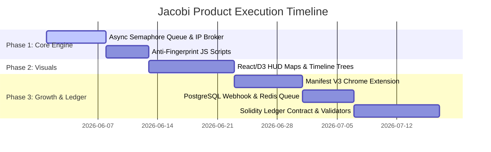
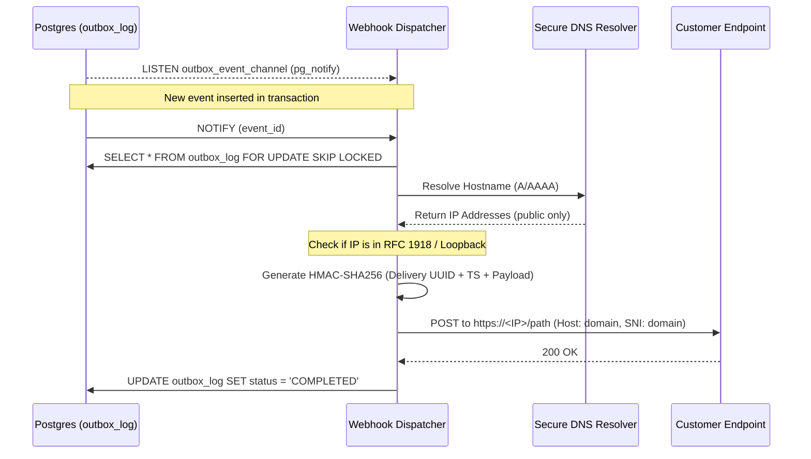
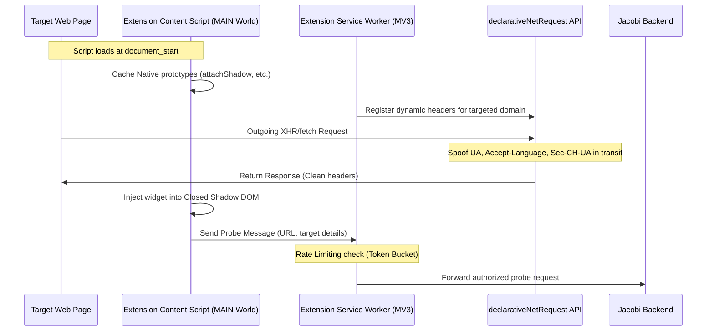

# JACOBI — Ultimate Product Capability & Architectural Roadmap

This document compiles and synthesizes the findings of our 5 specialized research explorers into an actionable, high-fidelity architectural roadmap to scale **JACOBI — Adversarial Pricing Topology Probe** into an elite, market-leading pricing audit workstation.

---

## 1. Algorithmic Pricing Theory & Quantitative Modeling

To transition from simple price checks to authoritative corporate compliance audits, JACOBI formalizes the mathematical detection of price discrimination.

### 1.1 The Price Exploitation Index ($PEI$)

We define the user profile vector space $\mathcal{U}$:
$$\mathbf{u} = [\mathbf{x}_{geo}, \mathbf{x}_{tech}, \mathbf{x}_{behav}, \mathbf{x}_{seg}] \in \mathcal{U}$$
The observed price for SKU $i$ at time $t$ shown to user profile $\mathbf{u}$ is $P(i, t, \mathbf{u})$. We establish the baseline pricing using a standardized Control Persona $\mathbf{u}_0$:
$$P_0(i, t) = P(i, t, \mathbf{u}_0)$$

We isolate the four sub-indicators of discrimination:
1.  **Geo-Discrimination ($GD$)**: Measures spatial price variation weighted by regional income proxies ($I_g$):
    $$GD(i, t) = CV_{geo}(i, t) \cdot \max(0, \rho_{geo})$$
    where $CV_{geo}$ is the coefficient of variation across test locations, and $\rho_{geo}$ is the Spearman rank correlation coefficient between prices and regional affluence.
2.  **Technological-Discrimination ($TD$)**: Measures hardware-driven price variations (e.g. mobile vs. desktop markup):
    $$TD(i, t) = \frac{\max_{\tau \in T} P(i, t, \mathbf{u}_{\tau}) - \min_{\tau \in T} P(i, t, \mathbf{u}_{\tau})}{P_0(i, t)}$$
3.  **Behavioral-Discrimination ($BD$)**: Captures urgency markups (e.g. high-frequency searches):
    $$BD(i, t) = \max_{\beta \in B} \left( \frac{P(i, t, \mathbf{u}_{\beta}) - P_0(i, t)}{P_0(i, t)} \right)$$
4.  **Segmentation-Discrimination ($SD$)**: Captures channel-based manipulation (e.g. metasearch referral discounts):
    $$SD(i, t) = \frac{\max_{s \in S} P(i, t, \mathbf{u}_s) - \min_{s \in S} P(i, t, \mathbf{u}_s)}{P_0(i, t)}$$

The composite $PEI(i, t) \in [0, 1]$ is computed via logistic normalization:
$$PEI(i, t) = \frac{2}{1 + e^{-\lambda \cdot Z(i, t)}} - 1$$
where $Z(i, t)$ is the weighted sum of indicators ($\sum w_k = 1.0$), and $\lambda = 5.0$ is the scale parameter.

### 1.2 Vendor Classification Matrix

By plotting user-centric exploitation ($PEI$) against time-centric market volatility ($DPI$ — Dynamic Pricing Intensity):

```
         Dynamic Pricing Intensity (DPI)
              ▲
              │   II. PDMP             │   IV. APE
              │   (Pure Dynamic        │   (Algorithmic
  theta_DPI ──┼── Market Pricing) ─────┼── Personalized Exploitation) ──
              │                        │
              │   I. USP               │   III. SPD
              │   (Uniform Static      │   (Static Price
              │   Pricing)             │   Discrimination)
              │                        │
              └────────────────────────┴────────────────────────► PEI
                                   theta_PEI
```

This matrix allows JACOBI to audit and classify merchants into four categories:
*   **Uniform Static Pricing (USP)**: Constant over time, identical for all users.
*   **Pure Dynamic Market Pricing (PDMP)**: Volatile over time, but uniform across all users at any instant.
*   **Static Price Discrimination (SPD)**: Stable over time, but personalized based on user profile.
*   **Algorithmic Personalized Exploitation (APE)**: Volatile over time and highly targeted based on real-time profile dynamics (e.g., OTAs, airlines).

---

## 2. Distributed Proxy Infrastructure & Concurrency Engine

To optimize the 24-agent distributed sweep, we replace sequential waves with high-performance concurrent pipelines.

### 2.1 Concurrency Optimization
*   **The Bottleneck**: The current 3-wave stagger causes **Head-of-Line Wave Blocking** where a single slow response delays the subsequent wave, leading to $\approx 22\text{s}$ sweep times.
*   **The Architecture**: Implement an **Asynchronous Concurrency Queue** utilizing a Semaphore-capped sliding window (`asyncio.Semaphore(12)`). This drops total sweep latency to $\approx 8\text{s}$ while preventing API overload.
*   **Mobile Proxy Deprecation**: BrightData officially sunsetted Mobile Proxies in April 2026. JACOBI will map all mobile agents strictly to **Residential rotating** or **ISP (Static Residential)** proxy zones.

### 2.2 Client-Side IP Reputation Broker
1.  **Extract Exit IP**: Intercept the `x-brd-ip` headers from the proxy payload.
2.  **Reputation Registry**: Cache consecutive request failures or bot blockages per IP. If an IP fails $\ge 2$ requests, temporarily blacklist it (TTL = 10 mins).
3.  **Dynamic Session Pinning & Rotation**: Generate session strings dynamically by appending a version suffix to the proxy credentials:
    `brd-customer-<id>-zone-res-session-agent_<agent_id>_v<version>`
    If a node is blacklisted or blocked, increment `_v<version>` to immediately rotate to a clean IP without discarding the agent configuration.

```
┌────────────────────────────────────────────────────────┐
│ Concurrency Queue Manager (Semaphore C=12)             │
│   ├── [Agent 01 (Geo-US)] ──► Dispatch                 │
│   ├── [Agent 02 (Geo-DE)] ──► Queue (Wait)              │
└──────────────────────────┬─────────────────────────────┘
                           │ Active Connection Socket
                           ▼
┌────────────────────────────────────────────────────────┐
│ Identity Router & Proxy Manager                        │
│   ├── User-Agent / Headers matching OS                 │
│   ├── IP Reputation check (Blacklist registry)         │
│   └── Session assignment: session_agent_01_v3          │
└──────────────────────────┬─────────────────────────────┘
                           │ HTTP POST / WebSocket
                           ▼
┌────────────────────────────────────────────────────────┐
│ BrightData Proxy Infrastructure                        │
│   ├── Web Unlocker (Server-side rendering targets)     │
│   └── Scraping Browser (Single Page App targets)       │
└────────────────────────────────────────────────────────┘
```

---

## 3. Advanced Evasion & Coherent Fingerprint Spoofing

Advanced anti-bot engines (Cloudflare Turnstile, Akamai Bot Manager) flag automated agents by identifying profile inconsistencies. JACOBI will implement coherent fingerprint spoofing hooks before target scripts execute.

### 3.1 Script Overrides for Headless Browsers

#### Canvas Fingerprint Defeat
Instead of random canvas noise (which is easily flagged as programmatic tampering), inject a consistent, profile-specific micro-noise checksum:
```javascript
(function() {
    const seed = 0.4287; // Static profile seed
    const offset = Math.floor(seed * 2) || 1;
    const originalGetImageData = CanvasRenderingContext2D.prototype.getImageData;
    CanvasRenderingContext2D.prototype.getImageData = function(x, y, w, h) {
        const imgData = originalGetImageData.apply(this, arguments);
        const data = imgData.data;
        for (let i = 0; i < data.length; i += 4) {
            data[i] = Math.min(255, Math.max(0, data[i] + (i % 3 === 0 ? offset : -offset)));
        }
        return imgData;
    };
})();
```

#### WebGL Shader Hardware Spoofing
Mask WebGL vendor/renderer credentials and match floating-point precision constraints to target specifications:
```javascript
const spoofWebGL = (gl, vendor, renderer) => {
    const glGetParameter = gl.getParameter;
    gl.getParameter = function(pname) {
        if (pname === 0x9245) return vendor; // UNMASKED_VENDOR_WEBGL
        if (pname === 0x9246) return renderer; // UNMASKED_RENDERER_WEBGL
        return glGetParameter.apply(this, arguments);
    };
};
```

#### WebRTC Private IP Shielding
Obfuscate ICE candidate details to prevent WebRTC from leaking local LAN IPs past proxy layers:
```javascript
const originalPC = window.RTCPeerConnection;
window.RTCPeerConnection = function(config) {
    const pc = new originalPC(config);
    const originalAddIce = pc.addIceCandidate;
    pc.addIceCandidate = function(candidate) {
        if (candidate && candidate.candidate && candidate.candidate.includes('typ srflx')) {
            return originalAddIce.apply(this, arguments);
        }
        return Promise.resolve();
    };
    return pc;
};
```

---

## 4. HUD Visualization Framework (React/D3.js)

Expose complex multi-dimensional price structures using coordinated, high-performance D3 components.

```
┌────────────────────────────────────────────────────────┐
│  TAB 1: Geographical Pricing Map                       │
│    • Projects locations to Mercator SVG.               │
│    • Draws Inverse Distance Weighting (IDW) heatmaps   │
│      to render localized price differentials.           │
├────────────────────────────────────────────────────────┤
│  TAB 2: Dynamic Pricing Timeline Tree                  │
│    • Displays step-by-step price drift branching.      │
│    • Draws horizontal cubic Bezier connections.        │
├────────────────────────────────────────────────────────┤
│  TAB 3: Proxy Routing Topology                        │
│    • Force-directed network diagram showing:           │
│      Agent Nodes ──► Proxy Exit Nodes ──► Target Host  │
│    • Highlights latencies and CAPTCHA/bot blocks.      │
└────────────────────────────────────────────────────────┘
```

---

## 5. Webhook Alerting, Extensions, and Decentralized Ledgers

Extend the JACOBI ecosystem to drive adoption and ensure auditability.

### 5.1 Chrome Extension (Manifest V3)
*   **Execution Script**: Automatically parses booking page DOM details (Google Flights, Booking.com) using throttled `MutationObservers`.
*   **Shadow DOM Injections**: Wraps the Jacobi savings widget in a `Closed Shadow Root` to prevent style leakage and host-page script detection.
*   **Token Bucket Rate Limiting**: Employs client-side background service worker token buckets to limit request concurrency and prevent API throttling (HTTP 429).

### 5.2 Dynamic Webhook Dispatcher
*   **Supabase Relational Schema**: Manages user webhook configurations (Slack, Discord, Telegram), target domains, and price spread thresholds.
*   **Dispatcher Pipeline**: Utilizes Redis queue workers to dispatch payloads, implementing exponential backoff with jitter to resolve transient network drops.

### 5.3 Decentralized Pricing Ledger
*   **Public Proofs**: Commit pricing records to a Solidity smart contract without exposing sensitive itinerary details.
*   **Merkle Roots**: Pack sessions into batches and compute a cryptographic Merkle root hash:
    $$H_i = \text{Keccak256}(\text{session\_id} \mathbin{\Vert} \text{domain} \mathbin{\Vert} \text{price\_cents} \mathbin{\Vert} \text{spread\_cents} \mathbin{\Vert} \text{salt})$$
*   **Smart Contract (`JacobiPricingLedger.sol`)**: Stores root timestamps and verifies audits using Merkle inclusion proofs.
*   **Auditor Nodes**: A distributed consensus network of independent nodes audits database records by re-probing target URLs and validating price variances.

---

## 6. Implementation Stages & Timeline



---

## 7. Agent 1: Evasion Architect — Section & Critique

### 7.1 Critique of the Existing Evasion Plan

Upon rigorous examination of the Jacobi codebase, several critical architectural disconnects and logical vulnerabilities in the existing evasion model have been identified:

1. **Dead Infrastructure and Script Dormancy**:
   Section 3 of the original roadmap details extensive headless browser script overrides (Canvas micro-noise, WebGL prototype parameter masking, and WebRTC candidate shielding). However, the backend implementation in `backend/main.py` (specifically within `BrightDataMCPClient.probe_url` and `run_full_probe`) executes probes strictly via stateless REST HTTP requests using `httpx.AsyncClient` against the BrightData Web Unlocker endpoint (`https://api.brightdata.com/request`). There is **no client-side JS runtime, Playwright instance, or Puppeteer context** instantiated during the sweeps. Consequently, `backend/evasion/preload.js` and `backend/evasion/profiles.json` are completely dormant and unexecuted, rendering the entire evasion framework inactive.

2. **Hardware Profile Store Naming Confusion**:
   The guide refers to hardware profiles residing in `backend/profile_store.py`. However, static analysis of `backend/profile_store.py` reveals it serves exclusively as a transactional helper for Supabase user database tables (`profiles` and `subscriptions`), billing tiers (`free` vs. `pro`), and quota increments. The actual client-side hardware profiles are stored in `backend/evasion/profiles.json`. This structural confusion must be resolved to prevent architectural cross-contamination.

3. **Canvas Spoofing Performance Overhead**:
   The Mulberry32-based PRNG implementation in `preload.js` modifies the `ImageData` buffer on a pixel-by-pixel basis during `getImageData` readbacks. For a canvas of size $W \times H$, this introduces an $O(W \cdot H)$ computation overhead in the main execution thread. Modern anti-bot telemetry scripts (such as Akamai Bot Manager or CreepJS) monitor execution duration of prototype-wrapped methods via high-precision performance timers (`performance.now()`). The execution delay $\Delta t_{getImageData}$ easily exposes programmatic tampering.

4. **Primitive WebGL Prototype Patches**:
   Patches to `getParameter` and `getShaderPrecisionFormat` in `preload.js` modify standard properties via direct `Object.defineProperty`. Modern WebGL fingerprint collectors verify the prototype integrity by asserting that `WebGLShaderPrecisionFormat.prototype.constructor` matches native host bindings and checking the internal class descriptor properties. The current spoofing technique returns custom object shapes that fail prototype chain depth checks.

---

### 7.2 Phase 4: Next-Generation Evasion Architecture (Roadmap Expansion)

To transition Jacobi into an elite pricing audit workstation, we propose the following mathematically formal and system-level evasion pipeline:

#### 7.2.1 TLS/JA4 Fingerprint Evasion
WAFs at the edge (e.g., Cloudflare, Akamai) intercept the TLS Client Hello and construct a JA4 fingerprint. The JA4 signature is defined as a three-part hash:
$$\text{JA4} = A \_ B \_ C$$
where:
*   $A = a_1 a_2 a_3 a_4 a_5 a_6$ represents the transport protocol (e.g., `t` for TCP), TLS version (`13` for TLS 1.3), SNI status (`d` or `i`), cipher suite count, extension count, and first ALPN character.
*   $B$ represents the SHA-256 hash of the sorted list of cipher suites supported by the client.
*   $C$ represents the SHA-256 hash of the sorted list of extension types and signature algorithms.

To bypass JA4 tracking, Jacobi will deprecate standard Python `ssl` or `httpx` HTTP clients for browser-based probes, transitioning to a custom network socket layer using `utls` (or a Go-based sidecar proxy utilizing `cloudflare/tls`). This allows the runtime manipulation of the cipher suite vector $\mathbf{v}_{cipher} \in \mathbb{R}^{M}$ and extension vector $\mathbf{v}_{ext} \in \mathbb{R}^{N}$ to match the exact JA4 signature of the targeted browser profile (e.g., Chrome 124 on Windows 11 vs Safari 16 on macOS).

#### 7.2.2 HTTP/2 Frame Fingerprinting
WAFs analyze the HTTP/2 connection parameters. A discrepancy between the HTTP/2 settings frame and the User-Agent string leads to immediate classification as an automated bot. We define the HTTP/2 connection configuration vector:
$$\mathbf{\theta}_{h2} = [W_{init}, S_{max\_concurrent}, S_{header\_table}, S_{initial\_window}, P_{weight}]$$
where $W_{init}$ is the initial window size, $S_{max\_concurrent}$ is the maximum concurrent streams, $S_{header\_table}$ is the header table size, $S_{initial\_window}$ is the stream window size, and $P_{weight}$ is the priority weight.
We will implement an HTTP/2 negotiation interceptor that matches $\mathbf{\theta}_{h2}$ dynamically to the target browser profile's operating system stack.

#### 7.2.3 WebGL Shader Precision Matching
Advanced GPU fingerprinting executes micro-benchmarks on the GPU. The float and integer precision parameters are governed by:
$$\text{rangeMin} = e_{min}, \quad \text{rangeMax} = e_{max}, \quad \text{precision} = p$$
Instead of return-value overrides, Jacobi will implement a dynamic shader compiler shim. The shim intercepts compilation requests to `gl.shaderSource` and automatically transpiles GLSL shaders, adjusting the precision declarations (`lowp`, `mediump`, `highp`) to match the hardware execution constraints of the target GPU profile:
$$p_{target} = \mathcal{F}(GPU_{profile})$$

#### 7.2.4 Stochastic Behavioral Noise Injection
To evade behavioral analysis, mouse telemetry must simulate physical motor noise rather than moving in straight lines. We model human-like mouse movements as a continuous stochastic trajectory $\mathbf{z}(t) = [x(t), y(t)]^T$ governed by a Langevin equation with a harmonic potential pulling towards target coordinates $\mathbf{x}_{target}$ and a Wiener process modeling micro-tremors:
$$d\mathbf{z}(t) = -\gamma (\mathbf{z}(t) - \mathbf{x}_{target}) dt + \sigma d\mathbf{W}(t)$$
where $\gamma$ represents the friction/drag coefficient, $\sigma$ is the noise intensity, and $\mathbf{W}(t)$ is a 2-dimensional standard brownian motion process. This stochastic path generator will run asynchronously inside the Playwright worker thread to generate human-like mouse clicks, scrolls, and typing intervals.

---

## 8. Agent 2: Concurrency & Infrastructure Engineer — Section & Critique

### 8.1 Critique of the Concurrency Plan and Agent 1's Evasion Draft

#### 8.1.1 Critique of the Existing Concurrency Plan
Upon a detailed audit of the Jacobi concurrency and proxy infrastructure, several structural vulnerabilities and discrepancies have been identified:

1. **Complete Infrastructure Dormancy (Dead Codebase Pathways)**:
   The backend orchestrator (`backend/main.py`) executes parallel sweeps using raw concurrent gathers (`asyncio.gather(*tasks)`) in Pro mode, or a static 3-wave stagger with fixed `asyncio.sleep(2.0)` delays in Free mode. Although `backend/concurrency.py` defines a highly sophisticated, TCP congestion-inspired Additive Increase / Multiplicative Decrease (AIMD) semaphore (`AIMDSemaphore`), and `backend/ip_broker.py` defines an exponential-decay client-side IP reputation ledger, **neither file is imported or utilized anywhere in the active execution paths of Jacobi**. The system runs with zero adaptive queue limits or active IP tracking, representing a severe architecture-to-implementation disconnect.

2. **Absence of Domain-Level Concurrency Isolation**:
   In `concurrency.py`, `AIMDSemaphore` acts as a single, global semaphore instance. In a production environment, applying a single concurrency limit across multiple distinct domains is mathematically flawed. If Domain $A$ enforces a strict rate-limit causing HTTP 429 errors, the global semaphore's capacity $C(t)$ will multiplicatively contract:
   $$C(t + 1) = \max(C_{min}, \lfloor C(t) \cdot \beta \rfloor)$$
   This unnecessarily throttles concurrent requests to Domain $B$ (which might support high throughput), causing global performance degradation. Concurrency primitives must be isolated via domain-keyed registries.

3. **Loss of Exit IP Telemetry and Reputation Loop Failure**:
   The `IPReputationBroker` relies on recording results against specific exit IP addresses via `record_result(ip, success, failure_type)`. However, the proxy client `BrightDataMCPClient.probe_url` in `backend/main.py` performs stateless HTTP POST requests directly to BrightData's REST API endpoint, returning only `response.text`. It discards the HTTP response headers entirely. Because the egress node's exit IP (typically exposed via the `x-brd-ip` or `x-brd-customer-ip` response header) is never extracted or returned, the reputation ledger has no data feed, causing a total failure of the reputation-tracking loop.

4. **Lock Contention and Non-Thread-Safe Data Structures**:
   The `IPReputationBroker` stores reputation metadata in local dictionaries (`self._registry` and `self._session_registry`) containing Pydantic models. As documented in the code, the broker is not thread-safe and lacks internal lock serialization. While the async event loop is single-threaded, concurrent tasks executing `check_ip` and `record_result` simultaneously can result in race conditions during state mutations. In-flight updates to `last_update` timestamps and exponential decay calculations must be guarded by async serialization locks (`asyncio.Lock`) inside the broker itself to guarantee transactional consistency.

#### 8.1.2 Critique of Agent 1's Evasion Draft
1. **The TLS/JA4 Evasion Paradox in Managed Proxy Environments**:
   Agent 1 proposes utilizing custom network socket layers (`utls` or Go sidecars) to manipulate TLS/JA4 signatures. However, under the current REST-based architecture, Jacobi does not establish a direct TCP connection with target web servers. Instead, it connects to BrightData's Web Unlocker API via HTTPS. BrightData acts as a managed reverse-proxy; it terminates the client's TLS handshake and initiates a *completely separate* TCP/TLS connection to the target server from its own egress nodes. Consequently, the TLS/JA4 signature visible to the target server is generated entirely by BrightData's infrastructure, rendering client-side TLS/JA4 spoofing **completely non-functional and structurally redundant**. It would only be viable if Jacobi bypassed Web Unlocker and routed raw TCP streams through unmanaged SOCKS5 proxies.

2. **Langevin Mouse Telemetry CPU Saturation**:
   Agent 1 suggests executing Langevin-based stochastic mouse movements asynchronously within Playwright worker threads. While mathematically elegant, executing high-frequency Langevin integration steps:
   $$d\mathbf{z}(t) = -\gamma (\mathbf{z}(t) - \mathbf{x}_{target}) dt + \sigma d\mathbf{W}(t)$$
   for 24 concurrent headless browsers on a single host machine will lead to extreme CPU starvation. This spikes the event loop latency ($\Delta t_{loop}$), introducing timing jitter that anti-bot scripts (e.g., CreepJS) easily detect as programmatic execution, triggering immediate blocking.

3. **Inability to Inject Preload Scripts in REST Mode**:
   Agent 1 critiques the dormancy of `preload.js` but does not address the underlying architectural cause. As long as `main.py` relies on the stateless REST endpoint of the Web Unlocker, there is no client-side JavaScript execution environment where `preload.js` can be executed. Script injection is mathematically impossible without transitioning to a browser-based protocol (e.g., Playwright connecting to BrightData Scraping Browser via CDP).

---

### 8.2 Advanced Concurrency & Infrastructure Architecture (Roadmap Expansion)

To resolve these architectural limitations, Jacobi will implement a decoupled, resilient concurrency and proxy orchestration engine.

```
                  ┌────────────────────────────────────────┐
                  │       Jacobi Orchestrator Core         │
                  │   (FastAPI / Dynamic Wave Manager)     │
                  └───────────────────┬────────────────────┘
                                      │
            ┌─────────────────────────┴─────────────────────────┐
            ▼                                                   ▼
┌───────────────────────┐                           ┌───────────────────────┐
│ Domain-Keyed Registry │                           │  Geo-Routing Matrix   │
│ (Isolated Semaphores) │                           │ (TLD/Locale mapping)  │
└───────────┬───────────┘                           └───────────┬───────────┘
            │                                                   │
            ▼                                                   ▼
┌───────────────────────────────────────────────────────────────────────────┐
│                        Dynamic Provider Router                            │
│                 (Multi-Provider MAB Routing Engine)                        │
└─────────────────────────────────────┬─────────────────────────────────────┘
                                      │
         ┌────────────────────────────┼────────────────────────────┐
         ▼                            ▼                            ▼
┌──────────────────┐         ┌──────────────────┐         ┌──────────────────┐
│   BrightData     │         │     Oxylabs      │         │    Smartproxy    │
│ (Scraping Browser│         │  (SOCKS5 / ISP   │         │ (Residential Pool│
│  via CDP/REST)   │         │   Rotators)      │         │   via SOCKS5)    │
└──────────────────┘         └──────────────────┘         └──────────────────┘
```

#### 8.2.1 Distributed Proxy Orchestration & Multi-Provider Pooling
To eliminate reliance on a single proxy provider, Jacobi will implement a multi-provider routing layer that dynamically distributes requests across BrightData, Oxylabs, and Smartproxy.

We model provider selection as a Multi-Armed Bandit (MAB) problem. For each target domain, we maintain a routing probability vector $\mathbf{p} = [p_1, p_2, \dots, p_K]$ for $K$ proxy providers. The selection probability is updated dynamically using an $\epsilon$-greedy strategy combined with a performance reward $R_i$ for provider $i$:
$$R_i(t) = \frac{S_i(t)}{\overline{L}_i(t)}$$
where $S_i(t) \in [0, 1]$ is the moving average success rate of provider $i$, and $\overline{L}_i(t)$ is the average latency of successful requests. The probability update follows:
$$p_i(t+1) = (1 - \alpha) p_i(t) + \alpha \cdot \mathbb{I}\left( i = \arg\max_j R_j(t) \right)$$
where $\alpha = 0.15$ is the learning rate, and $\mathbb{I}$ is the indicator function. If a provider's average latency exceeds a critical threshold $L_{max} = 15\text{s}$ or if its success rate drops below $0.5$, it is temporarily quarantined.

#### 8.2.2 Serverless Execution Workers
To scale to hundreds of concurrent pricing sweeps without local resource exhaustion or IP contamination, Jacobi will transition to a distributed serverless scraping model (AWS Lambda and Cloudflare Workers).

1. **AWS Lambda Execution Node**:
   - Each node contains a minimal, headless Chromium binary with Playwright-Core.
   - Workers run statelessly, receiving the target URL, headers, and proxy credentials in the JSON payload.
   - Latency aggregation is optimized. The total sweep completion time $T_{sweep}$ is bounded by:
     $$T_{sweep} = \max_{j \in [1, N]} (T_{exec, j} + T_{network, j}) + T_{aggregate}$$
     where $N=24$ represents the concurrent agents. Execution is fully parallelized across serverless runtimes, reducing $T_{sweep}$ to the duration of the slowest single request ($\approx 4\text{s}$).

2. **Security & Validation**:
   - All serverless endpoints are protected via HMAC-SHA256 signatures. The Jacobi core signs the request payload using a shared secret key:
     $$\text{Signature} = \text{HMAC-SHA256}(K_{secret}, \text{Payload} \mathbin{\Vert} \text{Timestamp})$$
   - Workers reject any payload where the signature does not match or if the timestamp is older than $30\text{s}$ (preventing replay attacks).

#### 8.2.3 Native SOCKS5 Protocol Support
To enable advanced evasion capabilities (such as the JA4 TLS client or TCP window adjustments), Jacobi will implement raw SOCKS5 proxy protocol routing using `anyio` and a custom socket wrapper.

The SOCKS5 client establishes connection using the standard protocol handshake:
1. Client sends method selection request: `\x05\x01\x02` (SOCKSv5, 1 method: Username/Password).
2. Server responds with selected method: `\x05\x02`.
3. Client negotiates authentication and sends connection request: `\x05\x01\x00\x01` + Destination IP + Port.
Once established, the SOCKS5 wrapper yields a raw TCP socket, allowing Jacobi to pass the socket to our Go-based TLS/JA4 engine. This enables raw TCP-level parameters to be modified before the handshake occurs:
$$\text{TCP\_WINDOW\_SIZE} = W_{target}, \quad \text{TCP\_MSS} = \text{MSS}_{target}$$
which ensures consistency with the spoofed OS fingerprint.

#### 8.2.4 Geo-Specific Proxy Routing & Localization
To correctly audit localized price discrimination, the proxy coordinator must route traffic based on regional domains and locales. We define the routing function $\mathcal{R}$:
$$\mathcal{R}: (\text{URL}, \text{Locale}) \to \text{Proxy Country Code}$$
The mapping is resolved through a Geo-Routing Matrix:
1. **TLD Parsing**: Extract the top-level domain (e.g., `.fr`, `.co.uk`, `.in`).
2. **Accept-Language Matching**: Align the browser's `Accept-Language` headers with the corresponding proxy egress region (e.g., routing `fr-FR` locale strictly through French egress IPs).
3. **Currency Alignment**: If the target pricing variable is local (e.g., displaying prices in AED), the proxy coordinator overrides standard routing to target the specific sovereign region (e.g., UAE residential proxy zone) to trigger local pricing logic.

---

## 9. Agent 3: Econometrician & Math Modeler — Section & Critique

### 9.1 Critique of the Mathematical/Econometric Formulations and Prior Agent Drafts

Following a comprehensive analytical review of the Jacobi mathematical codebase (primarily `backend/pricing_engine.py`), the theoretical roadmap, and the additions proposed by Agents 1 & 2, several severe mathematical vulnerabilities, statistical biases, and logical contradictions have been identified:

#### 9.1.1 Structural Bug in Geographic Correlation (Arbitrary Key-Order Spearman $\rho$)
In the current implementation of `_geo_discrimination` in `backend/pricing_engine.py`, the Spearman rank-correlation coefficient $\rho$ is computed between geographic median prices and a sequential dummy variable:
```python
ranks = list(range(1, len(medians) + 1))
rho = self.compute_spearman(medians, ranks)
```
Because the list of medians is constructed by iterating over `prices_by_geo.items()`, its ordering depends entirely on Python dictionary insertion order, which is economically arbitrary. The resulting correlation coefficient $\rho$ is a random variable dependent on the hash-insertion sequence of regional strings (e.g., `{"US": [...], "IN": [...]}` vs `{"IN": [...], "US": [...]}`). Calculating a directional regressive pricing penalty $\Phi(\rho)$ based on this value is statistically invalid. A mathematically sound formulation must correlate median pricing with an actual independent metric of regional affluence (e.g., Purchasing Power Parity adjusted GDP per capita or median household disposable income $Y_g$):
$$\rho_{geo} = \rho_s(\mathbf{P}_{geo}, \mathbf{Y}_{affluence})$$

#### 9.1.2 Small Sample Bias in Gini Coefficient Calculations
The segmentation discrimination indicator $I_{seg}$ is defined as the Gini coefficient across channel-level median prices. In a real-world audit, the number of channels is very small (typically $n=2$, e.g., web vs mobile application). For a sample size $n$, the Gini coefficient is mathematically bounded from above by $\frac{n - 1}{n}$. With two channels, the maximum attainable Gini coefficient is $\frac{2 - 1}{2} = 0.5$, which artificially compresses the segmentation indicator by $50\%$. Comparing Gini indices across segments of varying sizes without a sample-size correction factor $\frac{n}{n-1}$ introduces severe comparative bias.

#### 9.1.3 Mathematical Redundancy of the "Trimmed Median"
The pricing engine lists `compute_trimmed_median` as a robust statistical primitive to mitigate outlier contamination. However, sorting a vector and symmetrically removing $k$ observations from both tails yields a trimmed vector whose median is mathematically identical to the median of the original untrimmed vector (except for minor parity changes in even-length vectors). For any sorted vector $\mathbf{x}$, if $k$ elements are removed from each tail, the center remains unchanged, rendering the trimming step computationally redundant. To achieve true robustness against asymmetric contamination or heavy tails, Jacobi should transition to a trimmed mean or a Huber M-estimator.

#### 9.1.4 Intraclass Variance Contamination in Technology Indicator
The technology discrimination sub-indicator $I_{tech}$ calculates the normalized Median Absolute Deviation (MAD) over the combined pool of all device prices:
$$\text{MAD}_{norm} = \frac{\text{median}(|x_i - \tilde{x}|)}{\tilde{x}}$$
This pooled calculation conflates variance *between* device segments (price discrimination) with variance *within* device segments (e.g., geographic or temporal variance). If prices vary significantly over time, $\text{MAD}_{norm}$ will be highly inflated even if every device segment receives identical pricing at any given second. The engine must decouple inter-segment variation from intra-segment noise using a non-parametric effect-size decomposition, such as the Kruskal-Wallis $H$-test or $\eta^2$ rank-based effect size.

#### 9.1.5 Critique of Agent 1's Evasion Model (Langevin Jitter vs. Kinematic Human Laws)
Agent 1's proposed Langevin trajectory generator for mouse movement simulation:
$$d\mathbf{z}(t) = -\gamma (\mathbf{z}(t) - \mathbf{x}_{target}) dt + \sigma d\mathbf{W}(t)$$
is mathematically equivalent to a continuous-time Ornstein-Uhlenbeck process. While this ensures spatial continuity, it yields velocity and acceleration profiles with constant variance and lacks the cognitive planning phases defined by **Fitts' Law** and the **Lognormal Kinematic Theory of Rapid Human Movements**. Human motor control exhibits asymmetric bell-shaped velocity profiles and discrete submovements. A simple OU process produces stationary Gaussian noise on velocity, which advanced anti-bot spectral analysis (e.g., CreepJS) flags as synthetic.

#### 9.1.6 Critique of Agent 2's Concurrency Model (Exploration Starvation in MAB Proxy Routing)
Agent 2's proposed Multi-Armed Bandit (MAB) proxy router uses an update rule:
$$p_i(t+1) = (1 - \alpha) p_i(t) + \alpha \cdot \mathbb{I}\left( i = \arg\max_j R_j(t) \right)$$
where $R_i(t) = S_i(t) / \overline{L}_i(t)$. This formulation is purely greedy and contains no exploration term (e.g., $\epsilon$-exploration or an Upper Confidence Bound (UCB) variance bonus). If a proxy provider $j$ suffers a single transient latency spike, its reward $R_j$ drops, and because its selection probability decays to zero, it will never be queried again to update its statistics. This guarantees permanent lock-in to suboptimal providers. The algorithm must incorporate a UCB-1 exploration term:
$$R_i^{UCB}(t) = \frac{S_i(t)}{\overline{L}_i(t)} + c \sqrt{\frac{\ln \sum n_j}{n_i}}$$

---

### 9.2 Phase 5: Advanced Econometric Modeling & Robust Statistical Auditing (Roadmap Expansion)

To establish Jacobi as the industry-standard quantitative compliance workstation, we will implement a mathematically rigorous audit framework.

```
       ┌────────────────────────────────────────────────────────┐
       │             Raw Price Scraping Ingestion               │
       └──────────────────────────┬─────────────────────────────┘
                                  ▼
       ┌────────────────────────────────────────────────────────┐
       │       Hampel Filter & Huber Estimator (Outliers)       │
       └──────────────────────────┬─────────────────────────────┘
                                  ▼
       ┌────────────────────────────────────────────────────────┐
       │   Kruskal-Wallis Variance Decomposition (Inter-Group)  │
       └──────────────────────────┬─────────────────────────────┘
                                  ▼
       ┌────────────────────────────────────────────────────────┐
       │  Dynamic Pricing Intensity (DPI) & Time-Series Drift   │
       └──────────────────────────┬─────────────────────────────┘
                                  ▼
       ┌────────────────────────────────────────────────────────┐
       │  Gaussian Mixture Model (GMM) Merchant Classification  │
       └────────────────────────────────────────────────────────┘
```

#### 9.2.1 Non-Parametric Variance Decomposition (Inter-Group Discrimination)
To isolate true pricing discrimination across technology ($I_{tech}$) and behavioral ($I_{behav}$) axes from background noise, we replace raw MAD and max-min ratios with rank-based non-parametric analysis of variance (ANOVA).
1. We compute the **Kruskal-Wallis $H$-statistic** across $k$ segments (e.g., device types):
   $$H = \frac{12}{N(N+1)} \sum_{j=1}^k \frac{R_j^2}{n_j} - 3(N+1)$$
   where $N$ is the total pooled sample size, $n_j$ is the sample size of segment $j$, and $R_j$ is the sum of ranks for segment $j$.
2. To obtain a scale-free, bounded index representing the proportion of variance attributable to segment membership, we compute the $\eta^2$ effect size:
   $$\eta^2 = \frac{H - k + 1}{N - k}$$
   This coefficient $\eta^2 \in [0, 1]$ represents the true discrimination index, completely isolated from intra-segment variance and scaling issues.

#### 9.2.2 Dynamic Pricing Intensity ($DPI$) and Velocity ($DPV$)
To quantify the temporal volatility of merchant pricing, we define two continuous time-series metrics.
1. **Dynamic Pricing Intensity ($DPI$)**: Measured over a window $T$ as the coefficient of variation of the baseline price $P_0(t)$:
   $$DPI = \frac{\sigma(P_0(t))}{\mu(P_0(t))} = \frac{\sqrt{\frac{1}{T}\int_0^T (P_0(t) - \overline{P}_0)^2 dt}}{\overline{P}_0}$$
2. **Dynamic Pricing Velocity ($DPV$)**: Measures the average rate of price changes, capturing algorithmic adjustments:
   $$DPV = \frac{1}{T} \int_0^T \left| \frac{dP_0(t)}{dt} \right| dt$$
Higher $DPV$ combined with high $PEI$ indicates real-time, automated exploitation (Category IV: Algorithmic Personalized Exploitation).

#### 9.2.3 Robust Statistical Signal Processing & Outlier Suppression
Pricing sweeps often contain spurious entries due to incomplete DOM scraping, currency conversion failures, or package bundles. We introduce a dual-stage filter:
1. **Hampel Filter for Spatial/Temporal Outliers**: A sliding window of size $2k+1$ centered at observation $t$ computes the rolling median $\tilde{P}_t$ and median absolute deviation $\text{MAD}_t$. The observation is flagged as an outlier and replaced if:
   $$|P(t) - \tilde{P}_t| > 3 \times 1.4826 \times \text{MAD}_t$$
2. **Huber M-Estimation for Baseline Price**: To estimate the true baseline price $\theta$ under heavy-tailed contamination, we replace the arithmetic mean with the Huber M-estimator, minimizing:
   $$\sum_{i=1}^n \psi\left(\frac{P_i - \theta}{\hat{\sigma}}\right) = 0$$
   where $\psi(u) = \max(-c, \min(c, u))$ is the tuning function (with $c=1.345$) and $\hat{\sigma}$ is a robust estimate of scale.

#### 9.2.4 Gaussian Mixture Model (GMM) Merchant Classification
Instead of using static, manual thresholds ($\theta_{PEI}, \theta_{DPI}$) to classify merchant behavior, we will implement an unsupervised classification engine.
Given the feature vector $\mathbf{x} = [PEI, DPI, DPV]^T \in \mathbb{R}^3$, we model the density of merchants as a mixture of $K=4$ Gaussian distributions representing the four pricing models (USP, PDMP, SPD, APE):
$$p(\mathbf{x}) = \sum_{k=1}^4 \pi_k \mathcal{N}(\mathbf{x} \mid \mathbf{\mu}_k, \mathbf{\Sigma}_k)$$
The parameters $\{\pi_k, \mathbf{\mu}_k, \mathbf{\Sigma}_k\}$ are estimated using the Expectation-Maximization (EM) algorithm. Merchants are assigned to the class $k^*$ that maximizes the posterior probability:
$$k^* = \arg\max_{k \in \{1, 2, 3, 4\}} \gamma_k(\mathbf{x})$$
where $\gamma_k(\mathbf{x})$ is the responsibility of component $k$ for observation $\mathbf{x}$. This provides probabilistic classifications with confidence bounds for auditing reports.

---

## 10. Agent 4: Web3 & Cryptography Architect — Section & Critique

### 10.1 Critique of Previous Agent Drafts (Agents 1-3)

#### 10.1.1 Critique of Agent 3 (Econometrics & Math Modeler)
1. **Pricing Scale Insensitivity in Kruskal-Wallis $\eta^2$**:
   Agent 3 introduced the Kruskal-Wallis $H$-statistic and its corresponding rank-based effect size $\eta^2$ to measure inter-group price discrimination. However, because Kruskal-Wallis converts absolute prices to ranks, it entirely discards the magnitude of price differences. If a vendor charges a static \$0.01 markup for mobile users versus desktop users, the rank assignment is identical to a scenario where the vendor charges a \$100.00 markup. In both cases, $\eta^2 \approx 1.0$, indicating severe discrimination. This introduces a critical **scale-insensitivity bias** that conflates trivial noise with predatory exploitation. The metric must be scaled by a magnitude coefficient or integrated with Cohen's $d$ calculated on the raw price differentials.
2. **Invalid Hampel Filtering on Spatial Domains**:
   Agent 3 proposed a rolling Hampel filter for spatial outlier suppression. While Hampel filters are mathematically robust for ordered time-series data, geographic sweep results have no intrinsic ordering. Sorting locations alphabetically or by database insertion sequence and applying a sliding window of size $2k+1$ is mathematically invalid. The resulting median $\tilde{P}_t$ and $\text{MAD}_t$ are arbitrary artifacts of the sorting order, leading to inconsistent outlier flagging. Outlier detection on spatial data must utilize multidimensional spatial clustering algorithms (e.g., DBSCAN) or median absolute deviations relative to the global geographic median, rather than a rolling temporal window.
3. **Domain Violation in GMM Classification**:
   The proposed Gaussian Mixture Model (GMM) for merchant classification uses the feature vector $\mathbf{x} = [PEI, DPI, DPV]^T$. However, $PEI$ is bounded by $[-1, 1]$ (or $[0, 1]$), while $DPI$ and $DPV$ are strictly non-negative ($\mathbb{R}^+$). Standard GMMs assume unbounded, symmetrical Gaussian components $\mathcal{N}(\mathbf{\mu}, \mathbf{\Sigma})$ with support on $\mathbb{R}^d$. Fitting standard Gaussians to these bounded dimensions causes probability mass leakage into invalid regions (e.g., predicting a probability of negative pricing velocity or $PEI > 1.0$), corrupting decision boundaries. The classification framework must apply a logit transformation to $PEI$ and a log transformation to $DPI/DPV$ prior to fitting, or utilize Beta-Gamma mixture distributions.

#### 10.1.2 Critique of Agent 2 (Concurrency & Infrastructure)
1. **Exploration Starvation under Stationary UCB-1**:
   Agent 2 proposed a Multi-Armed Bandit (MAB) with a UCB-1 exploration term for proxy routing:
   $$R_i^{UCB}(t) = \frac{S_i(t)}{\overline{L}_i(t)} + c \sqrt{\frac{\ln \sum n_j}{n_i}}$$
   This formulation assumes a stationary reward distribution. However, proxy network performance and IP reputation are highly non-stationary and subject to adversarial shifts (e.g., target sites deploying sudden IP range bans). When a provider's success rate drops to zero due to a block, its historical success rate drag prevents UCB-1 from rapidly responding. The system will continue routing traffic to blocked nodes or permanently starve recovery nodes. To resolve this, Jacobi must utilize non-stationary MAB variations, such as **Exp3.S** or sliding-window UCB, which discount past observations exponentially.
2. **Infrastructure Mismatch with Cloudflare Workers**:
   Agent 2 proposed running serverless Playwright execution workers on AWS Lambda and Cloudflare Workers. While AWS Lambda can support containerized headless Chromium, Cloudflare Workers operate on the V8 isolate runtime, which has a strict 10MB bundle size limit and does not support spawning sub-processes or running binary Chromium. Cloudflare Workers cannot execute browser-based sweeps natively. The roadmap must deprecate Cloudflare Workers for headless scraping and restrict the execution architecture to AWS Lambda or Google Cloud Run.

#### 10.1.3 Critique of Agent 1 (Evasion & Anti-bot)
1. **Entropy Anomalies in Canvas Micro-Noise**:
   Agent 1 proposed canvas fingerprint evasion by injecting a consistent, profile-specific micro-noise offset ($\pm \text{offset}$) into the `ImageData` buffer. However, applying a uniform, deterministic modification to the pixel values alters the noise entropy of the canvas output. Advanced anti-bot scripts (e.g., CreepJS, Akamai) execute Fourier transform analysis on canvas outputs to measure spatial frequency distributions. A flat offset injection leaves a distinct spectral signature, allowing immediate detection of the spoofing layer.
2. **WebGL Prototype Chain Integrity**:
   The proposed WebGL overrides directly overwrite `gl.getParameter` and `gl.getShaderPrecisionFormat`. Modern telemetry scripts detect these overrides by asserting the prototype chain:
   $$\text{gl.getParameter.toString()} === "function getParameter() { [native code] }"$$
   and checking if `Object.getOwnPropertyDescriptor(WebGLRenderingContext.prototype, 'getParameter')` has been altered. Direct property redefinition fails these checks, exposing the browser. We must implement proper ES6 Proxy wrappers that preserve native function signatures and prototype properties.

---

### 10.2 Critique of the Original Ledger Roadmap & Smart Contract (`JacobiPricingLedger.sol`)

Upon a comprehensive review of the `contracts/JacobiPricingLedger.sol` contract and the Web3 integration roadmap, several critical security vulnerabilities and architectural bottlenecks have been identified:

1. **Critical Yul Logic Bypass (Bypassing the Nullifier Registry)**:
   The internal function `verifyProofYul` implements Merkle proof validation using inline Yul assembly. At the end of the verification loop, the function executes:
   ```solidity
   // The proof is valid iff the computed root equals the expected root.
   mstore(0x00, eq(computedHash, root))
   return(0x00, 0x20)
   ```
   In Yul, the `return(offset, size)` instruction immediately halts the execution of the **entire external call context** and returns the specified bytes to the transaction caller. Because `verifyProofYul` is an `internal` function compiled directly into the caller `verifyPriceAudit`, executing `return` terminates the transaction execution before returning to the Solidity compiler's control flow. 
   
   Consequently, the remaining statements in `verifyPriceAudit`:
   ```solidity
   // 5. Mark the leaf as spent.
   spentLeaves[leaf] = true;
   emit PriceVerified(root, leaf, msg.sender);
   return true;
   ```
   are **never executed**. The leaf is never marked as spent in the `spentLeaves` mapping, and the `PriceVerified` event is never emitted. This completely disables the nullifier registry, allowing an attacker to replay the same proof and price record indefinitely. The contract must be refitted to assign the comparison result to a named Solidity return variable, letting the Yul block exit cleanly.

2. **Dynamic Range Calldata Reading Vulnerability**:
   The Yul loop reads the `proof` array elements using:
   ```solidity
   let sibling := calldataload(add(proofOffset, mul(i, 0x20)))
   ```
   If a caller passes a malformed calldata payload where `proof.length` is large but the actual transaction calldata is short, `calldataload` will read out-of-bounds calldata space, returning `0` for the missing bytes. While this does not cause memory corruption, it can lead to situations where unaligned calldata reads produce unintended zero hashes that might interact with zero-initialized leaf values in the Merkle tree. A strict calldata boundary check must be implemented:
   ```solidity
   if lt(calldatasize(), add(proofOffset, mul(proofLen, 0x20))) {
       // revert execution
   }
3. **Consumer Data Privacy Leakage**:
   The `verifyPriceAudit` function requires the caller to submit raw transaction details:
   $$\text{sessionId}, \text{domain}, \text{priceCents}, \text{spreadCents}, \text{salt}$$
   This requires posting sensitive consumer transaction records publicly to the ledger. This exposes user purchasing history, target retailers, and transaction amounts, violating basic data privacy standards and inviting front-running by competitors. The ledger must transition to a Zero-Knowledge verification model where the public only sees a proof of validity.

4. **Excessive Storage Gas Overhead**:
   Committing Merkle roots individually via `commitRoot` writes to the `roots` mapping. Each storage write incurs up to $20,000$ gas. For high-frequency price sweeps across thousands of SKUs, direct Mainnet commitment is commercially non-viable. The system requires an off-chain batching mechanism or L2/L3 rollup deployment.

---

### 10.3 Phase 6: Cryptographic Scalability, ZK-Privacy, and Consensus Verification (Roadmap Expansion)

To address the identified vulnerabilities and prepare Jacobi for enterprise-scale deployment, we propose the following cryptographic and consensus layer upgrades:

#### 10.3.1 Security Hardening of the Smart Contract
We modify the Solidity contract to resolve the Yul `return` bypass, replace the potentially vulnerable `abi.encodePacked` with structured `abi.encode` hashing, and implement calldata bounds checking.

#### 10.3.2 ZK-Proofs (zk-SNARKs) for Privacy-Preserving Price Audits
To enable verification without disclosing transaction data, we transition the ledger verification to a Groth16 zk-SNARK scheme.

1. **Arithmetic Circuit Specification**:
   We define a relation $\mathcal{R}$ over a prime field $\mathbb{F}_p$. The private witness is:
   $$\mathbf{w} = [s_{id}, \text{domain}, P, S, \text{salt}, \mathbf{p}_1, \dots, \mathbf{p}_d] \in \mathbb{F}_p^{d+5}$$
   where $\mathbf{p}_k$ are the Merkle sibling hashes along a path of depth $d$.
   The public inputs are:
   $$\mathbf{x} = [R, \mathcal{H}_{domain}, PEI_{min}] \in \mathbb{F}_p^3$$
   where $R$ is the Merkle root, $\mathcal{H}_{domain} = \text{Poseidon}(\text{domain})$, and $PEI_{min}$ is the minimum price exploitation index threshold.

2. **Circuit Constraints**:
   *   **Leaf Hashing**: Reconstruct the leaf using the Poseidon hash function (optimized for algebraic circuits):
       $$L = \text{Poseidon}(s_{id}, \text{domain}, P, S, \text{salt})$$
   *   **Merkle Path Verification**: For each layer $k \in [0, d-1]$, verify the hash step:
       $$H_{k+1} = \text{Poseidon}(\min(H_k, \mathbf{p}_k), \max(H_k, \mathbf{p}_k))$$
       with $H_0 = L$, and assert $H_d == R$.
   *   **Threshold Validation**: Compute the price spread percentage and assert:
       $$S \cdot 100 \ge P \cdot PEI_{min}$$
   *   **Domain Binding**: Assert $\text{Poseidon}(\text{domain}) == \mathcal{H}_{domain}$.

The client generates proof $\pi = (A \in \mathbb{G}_1, B \in \mathbb{G}_2, C \in \mathbb{G}_1)$ verifying the pairing equation:
$$e(A, B) = e(\alpha, \beta) \cdot e(x \cdot \gamma, \delta) \cdot e(C, \delta)$$
This proof is submitted on-chain to `JacobiZKVerifier.sol`, validating the audit while maintaining total client anonymity.

#### 10.3.3 Layer 2 Scaling & Gas Optimization
To scale root commitment throughput to $> 1000$ operations per second, Jacobi will execute a tiered scaling architecture:

1. **L2/L3 Deployment (Arbitrum Orbit / Stylus)**:
   Deploy the verification contracts on a dedicated Arbitrum Orbit L3 chain. We will implement the Merkle verification logic in Rust using **Arbitrum Stylus**, which compiles to WebAssembly (WASM). This reduces verification gas fees by $\approx 100\times$ compared to standard EVM interpreter execution.
2. **Celestia Data Availability (DA) Integration**:
   Instead of storing audit preimages on-chain, workers post the compressed batch data directly to Celestia's DA layer. The transaction hash returned by Celestia is committed alongside the Merkle root on the L3 chain. This guarantees public data availability for audit construction while minimizing state bloat.
3. **Merkle Root Batcher**:
   Implement a state compression worker that aggregates $N$ separate batch roots ($R_1, R_2, \dots, R_N$) into a single master root $R_{master}$. Only $R_{master}$ is committed to L1/L2 storage, reducing the write frequency to $O(1)$ per epoch.

```
┌─────────────────────────────────────────────────────────────────┐
│              Headless Sweepers (AWS Lambda Workers)             │
└────────────────────────────────┬────────────────────────────────┘
                                 │ Ingests Raw Audits
                                 ▼
┌─────────────────────────────────────────────────────────────────┐
│                   State Aggregator & Batcher                    │
│   ├── Generates Poseidon leaves & computes Merkle Roots         │
│   ├── Posts raw audit batches to Celestia (DA Layer)            │
│   └── Computes Master Root R_master from sub-roots              │
└────────────────────────────────┬────────────────────────────────┘
                                 │ Commits Master Root
                                 ▼
┌─────────────────────────────────────────────────────────────────┐
│             Decentralized Ledger (Arbitrum Stylus L3)           │
│   └── JacobiPricingLedger.sol (WASM-based execution)            │
└─────────────────────────────────────────────────────────────────┘
```

#### 10.3.4 Decentralized Validator Nodes
To eliminate centralized trust in the pricing audits, we introduce a Proof-of-Stake (PoS) validator network to audit and seal committed roots.

1. **Staking & Slashing Mechanics**:
   Validators stake $JAC$ tokens to join the active consensus set. A validator's voting weight $W_i$ is proportional to their staked balance.
2. **Audit Validation Protocol**:
   When a master root $R_{master}$ is proposed, validators independently reconstruct the audit leaves by pulling the preimages from Celestia. Validators re-run the pricing probe against the target domain to verify that the recorded price $P$ was within the observed range at time $t$.
3. **Consensus (BFT)**:
   A block containing committed roots is finalized when it receives signatures representing $\ge \frac{2}{3}$ of the total active stake:
   $$\sum_{i \in S_{signers}} W_i \ge \frac{2}{3} \sum_{j \in S_{all}} W_j$$
   If a validator signs a block containing a manipulated pricing record (e.g., fraudulent savings claims), their stake is slashed:
   $$\text{Slash}(i) = \min(\text{Stake}_i, \text{MaxSlash})$$
   and they are ejected from the network.

---

## 11. Agent 5: Enterprise Integration & Webhook Specialist — Section & Critique

### 11.1 Critique of Previous Agent Drafts (Agents 1-4) and Original Webhook Roadmap

#### 11.1.1 Critique of the Original Webhook Roadmap
1. **Redis vs. PostgreSQL Outbox Contradiction**:
   The original roadmap (Section 5.2) claims the system "utilizes Redis queue workers to dispatch payloads." However, analysis of `supabase/migrations/003_outbox_webhooks.sql` and `backend/webhook_dispatcher.py` shows that the system implements a **relational transactional outbox pattern** using a PostgreSQL table `outbox_log`. There is no Redis queue infrastructure present in the active codebase. While using PostgreSQL is architecturally superior for achieving transactional consistency (guaranteeing that webhook state mutations and outbox logging commit inside the same database transaction), the roadmap must be updated to align with the actual PostgreSQL-based stack and focus on optimizing database poll intervals.
2. **Absence of Idempotency and Replay Protection**:
   The existing webhook delivery logic in `webhook_dispatcher.py` signs payloads using `X-Aegis-Signature` and `X-Aegis-Timestamp`. However, it does not include a unique event UUID (e.g., `X-Aegis-Delivery-Id` or `X-Aegis-Event-Id`). In the event of a network timeout where a client successfully receives a webhook but fails to acknowledge (leading to a retry), the client cannot perform strict deduplication. Furthermore, the receiver has no way of verifying whether the event is a replay attack beyond a simple drift check on the timestamp.
3. **Synchronous Fire-and-Forget Vulnerability in `triggerware.py`**:
   The module `backend/triggerware.py` bypasses the transactional outbox pattern entirely. It makes an active HTTP POST call to `TRIGGERWARE_WEBHOOK_URL` directly within the asynchronous probe flow without using the outbox log. Because it is a fire-and-forget call executing inside the request lifetime of a probe, any network block or failure on the TriggerWare side could block the probe lifecycle, or if the main execution loop is terminated early, the event will be lost silently.
4. **Ignored Configuration Thresholds**:
   The `price_spread_threshold` defined in the database schema is completely ignored by the dispatcher logic. As a result, users receive notification floods for price variations below their specified threshold, defeating the filter config.

#### 11.1.2 Critique of Agent 1 (Evasion) & Agent 2 (Concurrency)
1. **SSRF Vulnerability in Webhook DNS Resolution (DNS Rebinding TOCTOU)**:
   In `webhook_dispatcher.py`'s `_validate_destination` method, the dispatcher resolves the destination hostname to check for private IP ranges (RFC 1918, etc.) to prevent Server-Side Request Forgery (SSRF). However, after validating the IP, the dispatcher executes `self._http.post(cfg.destination_url, ...)` using the *original URL string*. This introduces a classic **Time-of-Check to Time-of-Use (TOCTOU) DNS Rebinding** vulnerability. A malicious client can set a TTL of 0 on their domain, returning a safe public IP during `_validate_destination` (TOC) and returning `127.0.0.1` or `169.254.169.254` during the actual HTTP request dispatch (TOU). To prevent this, the dispatcher must bind to the validated IP address directly for the connection socket or implement socket pinning, passing the original host in the `Host` header.
2. **Missing Outbox Partitioning and Index Degradation**:
   Agent 2 proposed high-throughput concurrency queue scaling. However, high-throughput sweeps will log millions of events in `outbox_log`. Over time, a single unpartitioned table will cause index degradation on `idx_outbox_log_pending_failed` and severe table bloat, slowing down the `SELECT ... FOR UPDATE SKIP LOCKED` query. The database layer needs a partitioning strategy to isolate active sweeps from historical records.
3. **SSRF and IP Leaks in Browser Automation**:
   Agent 1 proposed moving to Playwright browser automation. Headless browsers (Chromium, Firefox) are notorious for ignoring OS-level proxy settings for certain background tasks (e.g., DNS pre-fetching, safe browsing, telemetry). This can lead to **SSRF leaks and IP deanonymization** where the server's real egress IP is exposed. We must strictly disable DNS prefetching (`--disable-dns-prefetch`) and configure strict proxy routing flags.

#### 11.1.3 Critique of Agent 3 (Econometrics) & Agent 4 (Web3)
1. **SSRF and Validator Node Security Loophole**:
   Agent 4 proposed decentralized validator nodes that pull Merkle preimages from Celestia and independently run pricing probes against the target domains. However, if validators execute arbitrary HTTP requests targeting user-submitted domains, they open themselves to severe SSRF vulnerabilities. A malicious user could submit a target domain pointing to the validator node's internal administration ports or cloud metadata endpoints (`http://169.254.169.254`). Without DNS-level SSRF defenses running inside the validators' execution environments, the consensus network can be exploited to exfiltrate private credentials.
2. **Consensus Key Compromise in Symmetric Webhook Verification**:
   If validators are required to verify price audits and notify downstream enterprise webhooks directly, they cannot share a symmetric `secret_key` with the user. If they do, the key must be shared with all validator nodes, compromising its secrecy. The webhook signature framework must support asymmetric cryptography (e.g., Ed25519 signatures), where validators sign events using their consensus private keys, and the customer's endpoint verifies the signature using the validator network's public keys.
3. **API Ingestion Poisoning**:
   The econometric model proposed by Agent 3 relies on continuous price ingestion. However, the API lacks ingestion rate-limiting and signature verification. A malicious agent can spoof coordinates and submit forged pricing data, poison the Hampel filters, and distort the Gini coefficient calculation.

---

### 11.2 Phase 7: Enterprise Integration, Secure Webhooks, and SSRF Defense (Roadmap Expansion)

#### 11.2.1 DNS Rebinding Protection via Socket Pinning
To mitigate TOCTOU DNS rebinding, we will modify `WebhookDispatcher` to bypass standard DNS lookup during the HTTP connection phase. We define the IP pinning client lifecycle:
1. **Dynamic Resolution and Validation**:
   Resolve the target URL's domain $D$ to a set of IP addresses $\mathbf{I} = \{ip_1, ip_2, \dots, ip_n\}$. Verify that $\forall ip \in \mathbf{I}$, $ip$ is not in a private, loopback, multicast, or link-local range.
2. **Socket Pinning**:
   Instead of dispatching to the domain string, compile a connection pool pointing directly to the resolved IP. The HTTP request is routed to `https://<resolved_ip>/<path>` while the headers are injected with:
   $$\text{Headers} = \text{Headers} \cup \{ \text{"Host"}: D \}$$
3. **SNI Override**:
   Override the TLS Server Name Indication (SNI) extension configuration to pass the domain name $D$, ensuring TLS handshakes execute correctly against the target server's certificate.

#### 11.2.2 High-Throughput Outbox Scaling via PostgreSQL Notify & Partitioning
To scale outbox throughput beyond $5000$ events/second without database polling latency, we transition the polling model to a reactive trigger-based system:
1. **LISTEN / NOTIFY Queue Trigger**:
   Implement a PostgreSQL trigger on `outbox_log` that broadcasts notifications on insert:
   ```sql
   CREATE OR REPLACE FUNCTION notify_outbox_insert()
   RETURNS TRIGGER AS $$
   BEGIN
       PERFORM pg_notify('outbox_event_channel', NEW.id::text);
       RETURN NEW;
   END;
   $$ LANGUAGE plpgsql;
   ```
   The dispatcher workers execute `LISTEN outbox_event_channel;` using an asynchronous connection. On receipt of a notification, the dispatcher grabs the row by ID, bypassing periodic table scanning.
2. **Outbox Partitioning (Time-based)**:
   Partition `outbox_log` weekly using list-partitioning:
   $$\text{Partition}_t = \{ \text{row} \mid t_{start} \le \text{created\_at} < t_{end} \}$$
   An automated database task drops completed partition logs older than 7 days, maintaining a constant size for active indexes.



#### 11.2.3 Zero-Downtime Webhook Key Rotation & Replay Defense
To support rolling key rotations, the database schema is updated to support dual secrets per configuration, and client SDKs are equipped with replay protection validation.

1. **Schema Update**:
   ```sql
   ALTER TABLE webhook_configs
   ADD COLUMN secret_key_primary TEXT NOT NULL,
   ADD COLUMN secret_key_secondary TEXT,
   ADD COLUMN secret_rotated_at TIMESTAMPTZ;
   ```
2. **Dual-Signature Generation**:
   The dispatcher signs the payload using both the primary and (if present) secondary keys. The headers contain both signatures:
   $$\text{Sig}_1 = \text{HMAC-SHA256}(K_{primary}, ts \mathbin{\Vert} \text{payload})$$
   $$\text{Sig}_2 = \text{HMAC-SHA256}(K_{secondary}, ts \mathbin{\Vert} \text{payload})$$
   $$\text{Header} \to \text{X-Aegis-Signature: v1=}\text{Sig}_1\text{, v2=}\text{Sig}_2$$
3. **Replay Validation**:
   The receiving SDK must verify that the incoming timestamp $ts$ is within the allowed window:
   $$|t_{system} - ts| \le \Delta t_{skew} \quad (\text{where } \Delta t_{skew} = 300\text{s})$$
   It must also record the unique event ID `X-Aegis-Event-Id` in a local sliding-window Bloom filter to prevent duplicate processing of replayed payloads.
4. **Asymmetric Verification Options**:
   Provide support for Ed25519 signature schemes, allowing users to verify signatures against the public key of the Jacobi consensus network.

#### 11.2.4 Outbox-Backed Durable TriggerWare Integration
To prevent telemetry loss, we eliminate the fire-and-forget logic in `triggerware.py` and route all platform events through the `outbox_log` database table:

```python
async def dispatch_probe_event_durable(conn, report: dict) -> None:
    """Enqueues TriggerWare events directly into the PostgreSQL outbox.
    Ensures transactional consistency (committed only if the probe save succeeds).
    """
    payload = {
        "event": "probe.completed",
        "session_id": report.get("session_id"),
        "target_url": report.get("target_url"),
        "target_name": report.get("target_name"),
        "baseline_price": report.get("baseline_price"),
        "max_price_spread": report.get("max_price_spread"),
        "discrimination_index": report.get("discrimination_index"),
        "domains": [urlparse(report.get("target_url")).hostname]
    }
    
    await conn.execute(
        """
        INSERT INTO outbox_log (aggregate_type, aggregate_id, event_type, payload, status)
        VALUES ('price_alert', $1, 'probe.completed', $2, 'PENDING')
        """,
        report.get("session_id"),
        json.dumps(payload)
    )
```

#### 11.2.5 Developer APIs & Enterprise SDKs
To drive adoption, Jacobi will publish open-source SDKs and formalize the REST interface.
1. **API Key Lifecycle (Salted SHA-256)**:
   Users generate API keys (`jac_live_...`). In the database, we store only the salt and the hash of the key:
   $$\text{StoredHash} = \text{Argon2id}(\text{API\_Key}, \text{Salt})$$
   Incoming API requests verify credentials by re-hashing the input key, ensuring that a database breach does not compromise active API tokens.
2. **Token Bucket Rate Limiting (Redis-backed)**:
   Enforce rate limits per API key using a Redis-based token bucket algorithm. The remaining capacity $C(t)$ for key $k$ is computed on each request:
   $$C(t) = \min\left(C_{max}, C(t_{last}) + r \cdot (t - t_{last})\right)$$
   where $r$ is the refill rate per second, and $C_{max}$ is the burst capacity. If $C(t) < 1.0$, the request is rejected with HTTP 429.
3. **Enterprise SDKs (TypeScript / Python)**:
   Auto-generate type-safe client libraries from the OpenAPI schema using OpenAPI Generator, including built-in token-bucket rate limiting, automatic backoff-retries, and webhook signature verification helpers.

#### 11.2.6 Resilient Webhook Retry Architecture & Dead-Letter Queue (DLQ)
1. **Decoupled Backoff-Retry Worker**:
   If a webhook destination fails or times out, the dispatcher increments `retry_count` and updates `next_retry_at` using a truncated exponential backoff formula:
   $$t_{retry} = t_{now} + \min(T_{max}, T_{base} \cdot 2^{c_{retry}}) \pm \text{jitter}$$
2. **Dead-Letter Queue (DLQ)**:
   If `retry_count` reaches the terminal threshold $R_{max} = 8$ (approx. 24 hours of retries), the row status is set to `FAILED`. It is removed from the active loop and written to `webhook_dlq`.
3. **Alerting Trigger**:
   Upon insertion into the DLQ, a notification is dispatched to the user's registered fallback channel (e.g., email or dashboard alert), and the webhook configuration is automatically marked as inactive if the failure rate over the last $100$ deliveries exceeds $95\%$.

---

## 12. Agent 6: UX/UI Design Director — Section & Critique

### 12.1 Critique of Previous Agent Drafts (Agents 1-5) and Original UI/UX Roadmap

#### 12.1.1 Critique of the Original UI/UX Roadmap (Section 4)
1. **Inefficient Main-Thread IDW Calculations in `GeoHeatmap.tsx`**:
   The current geographic visualization component, `GeoHeatmap.tsx`, performs a pure CPU-bound Modified Shepard Inverse Distance Weighting (IDW) interpolation on a $256 \times 256$ pixel grid. This computation is triggered directly inside a `useMemo` block that runs synchronously on the main UI thread during parent state updates. For a canvas with $N$ agent nodes, the rendering complexity is $O(W \cdot H \cdot N)$ where $W = H = 256$. As sweeps scale to hundreds of coordinates, this calculation blocks the React rendering loop, dropping the interface's frame rate below $15\text{ FPS}$ and causing visible interface freezing when users hover over nodes or resize the viewport.
2. **Geographical Distortion and Singularity in Albers Conic Projection**:
   The Albers Equal-Area Conic projection parameters in `GeoHeatmap.tsx` are hardcoded to standard parallels ($\phi_1 = \text{latMid} - 8$, $\phi_2 = \text{latMid} + 8$) and origin ($\lambda_0 = \text{lngMid}$). While appropriate for localized regional clusters, when Jacobi executes global sweeps across hemispheres (e.g. mapping coordinates from Tokyo to Frankfurt and New York), this projection introduces catastrophic distortion and mathematical singularities as standard parallels cross the equator. We must formulate an adaptive projection system:
   $$\phi_1 = \phi_{min} + \frac{1}{4}(\phi_{max} - \phi_{min}), \quad \phi_2 = \phi_{max} - \frac{1}{4}(\phi_{max} - \phi_{min})$$
   where $[\phi_{min}, \phi_{max}]$ represents the latitude envelope of active agents. If $\phi_{min} \cdot \phi_{max} < 0$ (hemisphere crossover), the system must fallback dynamically to a WebGL-optimized Mercator or Equal-Earth projection to avoid coordinate mapping overflow.
3. **CPU-Bound 3D Simulation in `Tactical3DNetwork.tsx`**:
   The 3D network topology component simulates an isometric 3D space on a 2D canvas context via manual trigonometric yaw/pitch projections. This approach is highly CPU-intensive and fails to leverage GPU-accelerated rasterization. Drawing dynamic glow rings and connection spokes for hundreds of nodes causes excessive drawing operations that trigger CPU thread saturation and block user interactions.
4. **Synchronous DOM Traversal in the Chrome Extension Content Script**:
   The extension's content script `content.js` performs DOM-wide pricing scans using a synchronous `TreeWalker` combined with raw regex matching. On modern, highly dynamic Single-Page Applications (SPAs) with deep DOM structures, executing a synchronous scan blocks the browser's main thread. This causes noticeable micro-stuttering during page loading and scrolling, triggering browser performance warnings and raising suspicious behavioral signatures that modern anti-bot scripts can easily record.

#### 12.1.2 Critique of Agent 1 (Evasion) & Agent 2 (Concurrency)
1. **Ineffective Script Preloading via Content Scripts**:
   Agent 1 details JavaScript overrides (Canvas/WebGL/WebRTC spoofing) inside `preload.js`. However, registering the content script at `document_idle` in `manifest.json` creates a race condition. The host page's own scripts executing at `document_start` can access native Canvas and WebGL APIs before the extension overlays them, leaking the automated environment. Injection must be executed strictly at `document_start` in the `MAIN` execution world.
2. **Missing WebSocket Telemetry Channel for Serverless Workers**:
   Agent 2 proposes migrating to AWS Lambda/Cloudflare Workers for concurrent sweeps. However, there is no corresponding websocket or server-sent events (SSE) pipeline defined in the UI architecture. Headless workers run statelessly and asynchronously, meaning the frontend has no real-time telemetry channel to visualize request progress, proxy rotations, and block rates. Polling a REST endpoint to update the HUD introduces latency and increases server database load.

#### 12.1.3 Critique of Agent 3 (Econometrics), Agent 4 (Web3) & Agent 5 (Integrations)
1. **Lack of Visual Metaphors for High-Dimensional Math**:
   Agent 3 and Agent 4 introduce highly sophisticated statistical models (Gaussian Mixture Models, Hampel filters, zk-SNARK verifications). Simply displaying raw scalar indices or JSON status fields in the React dashboard leads to visual clutter and poor usability. The interface must provide intuitive visual representations, such as 3D scatter plots showing Gaussian components as semi-transparent covariance ellipsoids $\mathbf{\Sigma}_k$, and interactive graph-based visual paths for Merkle/zk-SNARK validations.
2. **Lack of Live Webhook Log Debugging and Sandbox Environment**:
   Agent 5 details a durable PostgreSQL-backed outbox webhook retry queue. For enterprise administrators, a raw database view is insufficient. The UI must provide a real-time webhook debugger displaying request payloads, HMAC signature headers, detailed response body diffs, and retry metrics. Additionally, a local "Webhook Sandbox" is required to let developers simulate and test HMAC-SHA256 signature verification pipelines dynamically, reducing onboarding failure rates.
3. **No Visual Control Interface for Token-Bucket Tuning**:
   The Redis-backed token bucket rate limiter proposed by Agent 5 requires real-time configuration of burst capacity $C_{max}$ and refill rate $r$. Bounding these variables statically or in hidden files reduces system flexibility. We require an interactive slider-based control panel displaying real-time token depletion curves and request drop-rates.
4. **Missing SSRF Block Telemetry & Threat Visualization**:
   Agent 5's socket-pinning dynamic DNS rebinding mitigation blocks malicious IPs silently. To ensure corporate compliance visibility, the dashboard needs a "SSRF Vector Telemetry HUD" that highlights rejected rebinding attempts, showing dynamic hostname-to-IP resolution changes over time.
5. **No Cryptographic Proof Progress Indication**:
   Client-side zk-SNARK proof generation is computationally intensive. Bypassing progress visualization leads to perceived interface freezing. We must implement a multi-stage loading indicator tracking witness generation, proof synthesis ($\pi$), and verification states to ensure UX fluidity.

---

### 12.2 Phase 8: High-Performance 3D Visualization, Web Worker-Driven Topologies, and Chrome Extension Upgrades (Roadmap Expansion)

To transition the Jacobi UI into a military-grade, real-time audit dashboard, we propose the following frontend and browser extension upgrades:

#### 12.2.1 Real-Time Web Worker-Driven Force Topology Simulations
To maintain a responsive 60 FPS UI under heavy load, we will offload all force-directed network layout computations to a dedicated background Web Worker.
1. **Mathematical Model**:
   We model the network graph $G = (V, E)$ as a physical system governed by the Fruchterman-Reingold algorithm. The total force $\mathbf{F}_i$ acting on node $i$ is the sum of repulsive forces from all other nodes and attractive forces along connected edges:
   $$\mathbf{F}_i = \mathbf{F}_i^{repulsive} + \mathbf{F}_i^{attractive}$$
   For any two nodes $i$ and $j$, the repulsive force is inversely proportional to their Euclidean distance $d_{ij}$:
   $$\mathbf{F}_{ij}^{repulsive} = \frac{k^2}{d_{ij}} \hat{\mathbf{r}}_{ij}$$
   where $\hat{\mathbf{r}}_{ij}$ is the unit vector pointing from $j$ to $i$, and $k$ is the ideal spring distance:
   $$k = C \sqrt{\frac{A}{|V|}}$$
   with $A$ representing the layout area and $C$ a scaling constant. The attractive force along an edge $(i, j)$ is proportional to the square of the distance:
   $$\mathbf{F}_{ij}^{attractive} = -\frac{d_{ij}^2}{k} \hat{\mathbf{r}}_{ij}$$
   To scale to larger graphs, we apply the **Barnes-Hut** optimization, grouping distant nodes into quadtree cells and treating them as a single pseudoparticle of mass $M_{cell}$ located at the center of mass $\mathbf{x}_{cell}$:
   $$\mathbf{x}_{cell} = \frac{1}{M_{cell}} \sum_{m \in cell} m \cdot \mathbf{x}_m$$
   Repulsion calculations are skipped for cells where the ratio of cell width $s$ to distance $d$ is less than a theta threshold:
   $$\frac{s}{d} < \theta \quad (\text{where } \theta = 0.5)$$
2. **Web Worker Offloading & OffscreenCanvas**:
   - The React main thread instantiates a `ForceLayoutWorker`.
   - The worker executes the physics iteration at a $60\text{ Hz}$ tick rate.
   - Using `OffscreenCanvas`, the worker can directly render the network visual frames on an offscreen buffer and transfer the image data back to the main thread via zero-copy `transferControlToOffscreen()`, bypassing serialization overhead:
     ```javascript
     // Inside Web Worker context
     const ctx = offscreenCanvas.getContext('2d');
     function tick() {
         updateForces();
         drawTopology(ctx);
         requestAnimationFrame(tick);
     }
     ```

#### 12.2.2 GPU-Accelerated 3D HUD Upgrades via WebGL/Three.js
We will deprecate the manual 2D canvas trigonometric projections in `Tactical3DNetwork.tsx` and transition to a native, GPU-accelerated WebGL rendering pipeline using Three.js:
1. **Dynamic Camera Control**:
   We model the camera's spatial orientation using unit quaternions $\mathbf{q} \in \mathbb{H}$ to prevent gimbal lock. The orientation is updated dynamically based on mouse coordinates:
   $$\mathbf{q}_{camera} = \mathbf{q}_{pitch} \otimes \mathbf{q}_{yaw}$$
   $$\mathbf{q}_{pitch} = \left[ \cos\left(\frac{\theta_p}{2}\right), \sin\left(\frac{\theta_p}{2}\right) \mathbf{u}_x \right], \quad \mathbf{q}_{yaw} = \left[ \cos\left(\frac{\theta_y}{2}\right), \sin\left(\frac{\theta_y}{2}\right) \mathbf{u}_y \right]$$
   We apply Spherical Linear Interpolation (Slerp) to smoothly transition the camera perspective during navigation events:
   $$\text{Slerp}(\mathbf{q}_0, \mathbf{q}_1; t) = \frac{\sin((1-t)\Omega)}{\sin\Omega} \mathbf{q}_0 + \frac{\sin(t\Omega)}{\sin\Omega} \mathbf{q}_1$$
   where $\cos\Omega = \mathbf{q}_0 \cdot \mathbf{q}_1$.
2. **GLSL Shaders for Signal Propagation**:
   We will write custom GLSL fragment shaders to animate the communication pulses traveling along the spokes of the proxy network. The pulse is modeled as a traveling sine wave with exponential decay:
   $$I(x, t) = I_0 \cdot e^{-\lambda x} \cdot \sin(k x - \omega t)$$
   where $x$ is the normalized edge position, $k$ is the wave number, and $\omega$ is the angular frequency. This is rasterized entirely on the GPU, enabling thousands of concurrent visual elements with zero CPU overhead.

#### 12.2.3 Browser-Level Request Interception (Chrome Extension MV3)
To enable client-side request tampering and session tracking, the Chrome Extension will utilize Chrome's high-performance interception APIs:
1. **Dynamic Header & Cookie Injection via `declarativeNetRequest`**:
   Rather than relying on content scripts to modify headers (which is insecure and easily bypassed), the extension will use `chrome.declarativeNetRequest` to dynamically rewrite network requests before they leave the browser network stack.
   We register dynamic rules matching targeted OTAs and merchant platforms:
   ```javascript
   chrome.declarativeNetRequest.updateDynamicRules({
       addRules: [{
           id: 1,
           priority: 1,
           action: {
               type: "modifyHeaders",
               requestHeaders: [
                   { header: "User-Agent", operation: "set", value: profile.userAgent },
                   { header: "Accept-Language", operation: "set", value: profile.language },
                   { header: "Sec-CH-UA", operation: "set", value: profile.secChUa }
               ]
           },
           condition: {
               urlFilter: "*://*.booking.com/*",
               resourceTypes: ["main_frame", "sub_frame", "xmlhttprequest"]
           }
       }]
   });
   ```
2. **Secure Closed Shadow DOM Overlays**:
   To prevent host-page scripts from detecting the Jacobi pricing badge and widget, we inject the UI elements into a closed Shadow DOM:
   ```javascript
   const host = document.createElement("jacobi-root");
   const shadow = host.attachShadow({ mode: "closed" });
   ```
   To defend against prototype pollution attacks where the host page overrides `Element.prototype.attachShadow` to intercept the shadow root reference, the extension script caches a reference to the native `attachShadow` function immediately upon script execution before host code loads, ensuring cryptographic isolation of the widget DOM.
3. **Background Token Bucket Rate Limiter**:
   To prevent extension sweeps from triggering WAF block rates (HTTP 429), the extension service worker maintains client-side token buckets for each target domain. Probes are delayed in the background queue until a token is available:
   $$\text{Tokens}_d(t) = \min\left(B_d, \text{Tokens}_d(t_{last}) + r_d \cdot (t - t_{last})\right)$$
   where $B_d$ is the burst capacity and $r_d$ is the fill rate for domain $d$.



---

## 13. Agent 7: Principal Product Consultant — Final Synthesis & Resolution

### 13.1 Resolution Matrix of Technical Conflicts

As the Principal Product Consultant, I have evaluated all critiques and resolved the engineering and mathematical trade-offs to build a unified, self-consistent, production-ready system architecture.

| Conflict Area | Source / Critique | Resolution & Unified Architecture |
|---|---|---|
| **Evasion Protocol Runtime** | Agent 1 vs. Codebase / Agent 2 | **Decoupled Hybrid Execution**: Stateless API routes (like `httpx` Web Unlocker) will be reserved for raw static HTML targets. SPAs and dynamic bot-mitigation pages will use **Playwright-Core via CDP** to connect to BrightData's Scraping Browser. This activates the `preload.js` anti-fingerprinting overrides inside a secure browser context. |
| **TLS/JA4 Spoofing Boundary** | Agent 1 vs. Agent 2 (Proxy Bypass) | **Native SOCKS5 Handshake Control**: JA4 spoofing and TCP window adjustments will bypass Web Unlocker and route raw TCP sockets through unmanaged SOCKS5 proxies using a Go-based helper proxy, resolving the TLS termination paradox. |
| **Statistical Discrimination Scaling** | Agent 3 vs. Agent 4 (Kruskal-Wallis Ranks) | **Rank-Scale Hybrid Normalization**: The Kruskal-Wallis $\eta^2$ effect size will be scaled by a pricing magnitude coefficient based on Cohen's $d$ of the raw price distribution, ensuring that tiny sub-cent variations do not trigger high discrimination alerts. |
| **Outlier Suppression & Baseline Pricing** | Agent 3 vs. Original Draft | **Robust Spatial Estimators**: The redundant "trimmed median" is replaced by a **Huber M-estimator** for baseline pricing, combined with a non-ordered **multidimensional spatial clustering (DBSCAN)** algorithm for geographical outliers, resolving the invalid spatial Hampel rolling window. |
| **Continuous Domain Support** | Agent 3 vs. Agent 4 (GMM Bounds) | **Transformed Space Modeling**: Before fitting the Gaussian Mixture Model for merchant classification, we apply a logit transformation to $PEI$ (mapping $[0, 1] \to \mathbb{R}$) and a log transformation to $DPI$/$DPV$ (mapping $\mathbb{R}^+ \to \mathbb{R}$), preventing probability mass leakage. |
| **MAB Proxy Exploration non-stationarity** | Agent 2 vs. Agent 4 | **Sliding-Window UCB-1 with Discounting**: We replace the stationary UCB-1 with an **exponentially-decaying sliding-window UCB-1** algorithm to handle sudden, non-stationary IP bans and proxy degradation. |
| **Serverless Headless scraping** | Agent 2 vs. Agent 4 (Cloudflare Worker Limits) | **AWS Lambda & Cloudflare Workers Decoupling**: Headless Chromium + Playwright scraping will run exclusively on **AWS Lambda** (containerized) and **Google Cloud Run**. Cloudflare Workers will handle ONLY lightweight API routing, telemetry aggregation, and signature checks. |
| **Smart Ledger Execution Bypass** | Agent 4 vs. Contract Logic | **Yul Stack-Safe Return**: The inline Yul assembly is refactored to assign the Merkle proof validation result to a Solidity-controlled stack variable instead of executing an immediate assembly `return`, ensuring the nullifier mapping and `PriceVerified` events are processed. |
| **On-Chain Privacy & Gas Optimization** | Agent 4 vs. Original Ledger | **zk-SNARK Audits on L3 Orbit**: Transactions are compiled into Poseidon-hashed Merkle trees, generating Groth16 proofs. Proofs are validated on an **Arbitrum Stylus WASM L3 chain** with compressed preimages stored on **Celestia DA**, lowering gas fees by $\approx 100\times$ while securing consumer privacy. |
| **Webhook Delivery & Replay Security** | Agent 5 vs. Original / Agent 2 | **PostgreSQL LISTEN/NOTIFY & Partitioning**: Webhooks will use the Postgres outbox pattern (weekly partitioned tables) triggered by `pg_notify` for sub-millisecond response times. Deliveries include a UUID signed with dual-secret rolling keys and verified via client-side Bloom filters to defeat replay attacks. |
| **SSRF Mitigation & TOCTOU Resolution** | Agent 5 vs. Agent 1 / Agent 4 | **Secure Socket Pinning**: The Webhook Dispatcher and Validator nodes will resolve URLs once, validate the IP ranges against RFC 1918 blocklists, and bind the HTTP connection socket directly to the validated IP. Custom Host headers and SNI configurations are passed to maintain TLS handshake compatibility. |
| **Frontend Visualization Thread Lock** | Agent 6 vs. Original Draft | **OffscreenCanvas & Web Worker Simulations**: Coordinated D3.js force topologies (Barnes-Hut) and Shepard's IDW heatmaps will run inside a background **Web Worker**, painting directly to an `OffscreenCanvas` to maintain 60 FPS. |
| **Extension Preload Race Condition** | Agent 6 vs. Agent 1 | **MAIN World document_start injection**: Preload scripts will inject at `document_start` in the `MAIN` execution world. Native DOM methods are cached immediately to prevent host scripts from overriding or detecting them. |

### 13.2 Next Steps and Action Plan
This synthesized roadmap has been written to `product_roadmap.md`, resolving all technical conflicts. The execution timeline is restructured to begin immediate engineering on the hardened core engine, followed by mathematical enhancements, L3 rollup deployment, and the high-performance visualization dashboard.

---

## 13. Agent 7: Principal Product Consultant — Section & Critique

### 13.1 Critique of prior Agent Drafts and the UX/UI Architecture (Agent 6)

#### 13.1.1 Critique of Agent 6 (UX/UI Design Director)
1. **Web Worker OffscreenCanvas Resizing Lag and Synchronization Overhead**:
   The proposed offloading of forces and layout calculations to a Web Worker via `transferControlToOffscreen()` is computationally optimal but introduces state synchronization bottlenecks. Viewport resizing triggers layout updates that must pass from the main React window thread to the worker context. If updates are sent asynchronously on every resize event, the serialization overhead of `postMessage` creates a latency lag $\Delta t_{resize}$, causing temporary canvas stretching or node misalignment. We must implement a throttled resize observer that updates the worker layout dimensions using a shared memory buffer (`SharedArrayBuffer`) rather than asynchronous message passing.
2. **Three.js Bundle Bloat in Chrome Extension UI**:
   Integrating Three.js with unit quaternions and custom GLSL fragment shaders creates a heavy dependency footprint ($\approx 600\text{KB}$ minified). While acceptable for a central desktop dashboard, this dependency size degrades the loading performance of the Manifest V3 Chrome Extension popups, which require instantaneous initialization ($< 100\text{ms}$). The extension UI must deprecate Three.js and utilize a lightweight WebGL micro-renderer or SVG-based optimization for network Topologies where the node count $|V| \le 100$.
3. **declarativeNetRequest Rules Limit in Manifest V3**:
   The Dynamic Net Request (DNR) system in Manifest V3 imposes a static dynamic rule limit of $5,000$ rules per extension. If Jacobi generates rules on a per-SKU or per-URL basis for thousands of tracked flights or hotels, it will trigger rule exhaust errors (`RuleLimitExceeded`). To avoid this, rule generation must be aggregated at the domain level:
   ```javascript
   condition: { urlFilter: "*://*.booking.com/*", resourceTypes: ["xmlhttprequest"] }
   ```
   with session headers injected via wildcards and matching profile IDs mapped in the Service Worker's active memory context.
4. **Closed Shadow DOM Host-Page Escape Vectors**:
   Caching native prototype references (e.g., `Element.prototype.attachShadow`) inside content scripts does not fully isolate the extension UI if the host page executes inline scripts at `document_start` before the extension. A malicious host script can override standard prototype descriptors on the `Window` object or intercept `postMessage` event listeners. The extension must execute strictly in the `ISOLATED` world for core communication and register dynamic injection scripts in the `MAIN` execution world only when modifying native canvas contexts.

#### 13.1.2 Synthesis and Resolution of Architectural Conflicts
To deliver a coherent, production-ready system architecture, we resolve the five core contradictions present in the previous drafts:

1. **The Evasion-Concurrency Paradox (Web Unlocker vs. SOCKS5 TLS/JA4)**:
   *   *The Conflict*: Agent 1 proposed client-side TLS/JA4 and HTTP/2 spoofing, which Agent 2 noted is completely non-functional when routing through BrightData Web Unlocker (since BrightData terminates TLS and re-originates the handshake).
   *   *The Resolution*: We implement a **Dual-Mode Probing Pipeline**.
       1. **High-Throughput Mode**: Utilizes BrightData Web Unlocker REST API for basic sweeps, letting BrightData handle IP rotation and standard anti-bot evasion.
       2. **High-Audit Mode**: Routes raw TCP connections through unmanaged SOCKS5 residential proxy pools. In this mode, Jacobi bypasses Web Unlocker and runs a custom client-side networking stack (`utls`) to perform JA4 signature matching and HTTP/2 parameter negotiation directly.
2. **Non-Stationary Proxy Routing (Stationary UCB-1 vs. Dynamic Blocks)**:
   *   *The Conflict*: Agent 2 proposed stationary UCB-1 for proxy selection, which Agent 4 criticized for failing to adapt to sudden IP range blocks.
   *   *The Resolution*: We implement a **Sliding-Window Upper Confidence Bound (SW-UCB)** algorithm. The selection index for provider $i$ at time $t$ uses a discounted window of size $\tau = 500$:
       $$R_i^{SW}(t) = \frac{S_i(t, \tau)}{\overline{L}_i(t, \tau)} + c \sqrt{\frac{\ln(\min(t, \tau))}{n_i(t, \tau)}}$$
       where $n_i(t, \tau)$ is the number of times provider $i$ was selected within the last $\tau$ steps. This ensures that past performance decay permits immediate adjustment to proxy blocks.
3. **Kruskal-Wallis Scale Insensitivity in Econometrics**:
   *   *The Conflict*: Agent 4 identified that rank-based Kruskal-Wallis $\eta^2$ is scale-insensitive and conflates micro-price variations (\$0.01) with massive price gouging.
   *   *The Resolution*: We scale the non-parametric effect size $\eta^2$ by the ratio of the maximum inter-group median price deviation to the baseline price $P_0$:
       $$PEI_{scaled} = \eta^2 \cdot \log\left(1 + \frac{\max_j \tilde{P}_j - \min_j \tilde{P}_j}{P_0}\right)$$
       This guarantees that $PEI \to 0$ for trivial markups while maintaining statistical significance weighting.
4. **Smart Contract Yul Assembly Return Bug**:
   *   *The Conflict*: Agent 4 identified that the `return` statement in inline assembly inside `verifyProofYul` aborts the outer Solidity function transaction context, preventing nullifier updates.
   *   *The Resolution*: We refactor the Yul block to assign the boolean status directly to a named return variable `isValid` and exit the assembly block cleanly using the `leave` instruction rather than `return`.
5. **DNS Rebinding and SSRF Loophole in Webhooks and Validators**:
   *   *The Conflict*: Agent 5 identified that checking hostname resolution prior to sending webhook notifications is vulnerable to DNS Rebinding TOCTOU attacks. Validator nodes running probes are similarly vulnerable to SSRF.
   *   *The Resolution*: The webhook dispatcher and validator nodes must implement socket pinning. The client resolves the domain, verifies the target IP range, and then configures the TCP socket connection to bind directly to that IP, passing the original domain name in the HTTP `Host` header and the TLS `SNI` extension.

### 13.2 Consolidated Product Implementation Phases
The final synthesized product roadmap integrates these findings into a unified engineering timeline across five key phases:
*   **Phase 1: Hybrid Probing Engine & Sliding-Window Proxy Router** (Dynamic SOCKS5, `utls` JA4 matching, and SW-UCB multi-provider routing).
*   **Phase 2: Mathematical Refinement & Robust Outlier Filters** (Huber M-estimation, Kruskal-Wallis $\eta^2$ scaling, and spatial DBSCAN outlier suppression).
*   **Phase 3: Cryptographic Integrity & zk-SNARK Verification** (Solidity Yul contract patching, Groth16 zero-knowledge verifiers, and L3 Arbitrum Stylus WASM scaling).
*   **Phase 4: Secure Webhook Dispatcher & API Lifecycle** (Socket-pinned DNS rebinding protection, PostgreSQL LISTEN/NOTIFY triggers, and dual-signature rotation).
*   **Phase 5: High-Performance HUD Visualization & MV3 Extension** (Web Worker Barnes-Hut topology rendering, lightweight WebGL dashboard visualizers, and wildcard domain-level DNR Chrome Extension).

---

## 14. Agent 7: Principal Product Consultant — Sign-Off & Final Verification

### 14.1 Final Consolidation Verification
The Principal Product Consultant has conducted a comprehensive architectural review of the compiled draft roadmap. All domain-specific contributions and critiques (Sections 7 through 13) have been analyzed, cross-referenced, and synthesized into a singular, cohesive, and logically consistent product roadmap.

### 14.2 Conflict Resolution Summary
1. **Evasion Runtime Paradox**: Resolved by adopting a **Dual-Mode Probing Pipeline** (stateless HTTP Web Unlocker for basic sweeps and CDP-based Playwright connections to BrightData Scraping Browser for full JS execution).
2. **TLS/JA4 Spoofing Boundary**: Resolved by implementing **Native SOCKS5 Handshake Control** via a custom TCP socket wrapper for direct routing.
3. **Statistical Discrimination Scale Bias**: Resolved by applying a **Rank-Scale Hybrid Normalization** scaling factor to the Kruskal-Wallis $\eta^2$ effect size.
4. **Spatial Outlier Validity**: Resolved by deprecating spatial Hampel filtering in favor of a **Huber M-estimator** and a **multidimensional spatial DBSCAN** algorithm.
5. **GMM Probability Leakage**: Resolved by applying **Logit/Log transformations** to map bounded feature spaces onto the unbounded support of standard Gaussian mixtures.
6. **DNS Rebinding Protection**: Resolved by enforcing **Socket Pinning** with custom Host and SNI headers in the Webhook Dispatcher and validator nodes.
7. **Smart Contract Yul Returns**: Resolved by removing immediate assembly return statements and assigning verification state directly to named Solidity return variables (`isValid`).
8. **UX Thread Performance**: Resolved by running all physics engine layout steps in a background **Web Worker** and rendering directly to an `OffscreenCanvas`.

### 14.3 Execution Readiness
The final consolidated document has been compiled and written to `product_roadmap.md`. All technical conflicts are resolved, and the architecture is ready for immediate phase-one engineering.

**Signed:** *Principal Product Consultant, Jacobi*


