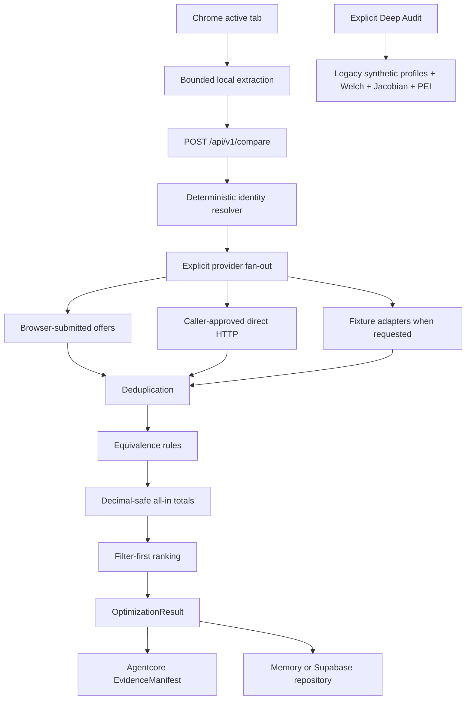

# Jacobi Price Optimization Architecture

This document describes the implementation on `pivot/price-optimization-mvp`. It complements the strategic [PDR](PDR_OPEN_SOURCE_PRICE_OPTIMIZATION.md); it does not describe planned components as if they were live.

## Product boundary

The normal comparison path answers: “What is the cheapest verified route to this exact product?” It does not launch the legacy synthetic-shopper matrix. The original pricing-discrimination system, Welch tests, Jacobian matrix, PEI, PDF exports, Agentcore REST routes, and enterprise records remain available as the slower, explicitly selected Deep Audit path.

## Browser extension

`extension/` is a Manifest V3 extension using `activeTab`, `storage`, `scripting`, `contextMenus`, and `sidePanel`. Network origins are optional permissions requested for the backend selected in Settings.

The extractor in `extension/shared/extraction.js` prefers JSON-LD, then page metadata and retailer-aware DOM selectors. It bounds JSON-LD to 256 KB, visits at most 500 nodes at depth 10, reads at most 50 scripts, caps visible text at 50,000 characters, and limits individual fields. The extension sends normalized fields and provenance, not the raw page by default.

Browser observations are evidence from the user's tab. They are not independent server verification. Checkout-only fees remain unknown unless observed.

## REST composition

`backend/main.py` remains the composition root and mounts:

- price optimization at `/api/v1/compare`, `/api/v1/comparisons/*`, `/api/v1/providers/*`, and `/api/v1/evidence/*`;
- Agentcore at `/api/v1/agent/*`;
- the legacy audit and enterprise routes.

`backend/compare/` owns price-optimization business logic:

| Module | Responsibility |
|---|---|
| `schemas.py` | Decimal-safe contracts, explicit cost states, result enums |
| `identity.py` | Canonical identifiers, aliases, contradictions, provenance and confidence |
| `equivalence.py` | Hard rejects and disclosed trade-offs |
| `total_cost.py` | Known/estimated/unknown/not-applicable cost calculation |
| `discovery.py` | Tracking-URL and seller/variant deduplication |
| `adapters/` | Capability-declared provider plug-ins |
| `ranking.py` | Filter-first eligibility and complete-total ordering |
| `service.py` | Bounded concurrency, failure isolation, persistence and evidence |
| `storage.py` | In-memory and explicit Supabase repositories |

Business rules stay outside `backend/main.py`.

The CLI and MCP tools call `backend/compare/tooling.py`, which delegates to the same identity, equivalence, total-cost, provider, service, persistence, and evidence components. See the [CLI guide](CLI.md) and [MCP guide](MCP_PRICE_OPTIMIZATION.md).

## Provider model

Every provider declares kind, domains, capabilities, zero/paid cost, evidence tier, timeout, retries, limitations, rate limit, health, extraction fields, fixture status, and whether explicit invocation is required.

Default registration contains fixture adapters only. A request must set `include_fixture_offers=true` to use them. Browser-submitted offers are supplied explicitly. Direct HTTP requires both `comparison_urls` and `allow_direct_http=true`. `OptionalManagedAdapter` starts disabled and no paid adapter is registered in the comparison path.

Provider failures are converted to structured partial errors. Per-provider timeout and overall comparison deadline prevent one source from blocking the result.

## Identity, equivalence, and totals

Identity resolution prioritizes GTIN, MPN, and model. It records field-level evidence, confidence, aliases, contradictions, and explicit unknowns. The golden dataset contains more than 100 labelled pairs.

Equivalence returns one of:

- `EXACT_EQUIVALENT`;
- `EQUIVALENT_WITH_DISCLOSED_TRADEOFF`;
- `SIMILAR_NOT_EQUIVALENT`;
- `REJECTED`.

Identifier, model, storage, memory, generation, processor, screen size, year, region, connectivity, and accessory-only conflicts cannot be rescued by title similarity. Condition, colour, warranty, bundle, accessories, and marketplace seller differences are exposed rather than hidden.

Money uses `Decimal`. Each component can be known, estimated, unknown, or not applicable. Unknown values never become zero. Only a complete payable total can win the headline saving; cashback and conditional discounts remain separate.

## Evidence and access

Comparison results reuse Agentcore `EvidenceManifest` creation and immutable hashes. Each comparison receives a high-entropy access token. Stored results omit the raw token. Comparison and evidence reads require `X-Jacobi-Access-Token` and return not-found semantics on failure.

Agentcore's pre-existing API-key/org boundary still governs `/api/v1/agent/*`. Comparison manifests are saved under a comparison-specific scope, not the public demo scope.

## Persistence

`JACOBI_COMPARE_STORAGE=memory` is the local default. It is bounded, process-local, and lost on restart. `JACOBI_COMPARE_STORAGE=supabase` is explicit and fails at startup/use if Supabase is not configured; it does not silently degrade to memory.

Migration `supabase/migrations/202607120001_price_optimization_persistence.sql` adds catalog, alias, offer, comparison, candidate, evidence-reference, event, watch, and preference tables. It enables RLS, revokes anonymous table access, scopes owned records to `auth.uid()`, and grants service-role writes.

## Deployment topology

The repository currently supports a single FastAPI container, a separately built Next.js frontend, Supabase, and the unpacked extension. Redis, a durable job queue, production merchant search integrations, Chrome Web Store distribution, and managed-provider adapters are not present.

See [deployment](DEPLOYMENT_PRICE_OPTIMIZATION.md), [security review](SECURITY_REVIEW_PRICE_OPTIMIZATION.md), and [limitations](LIMITATIONS_PRICE_OPTIMIZATION.md).
