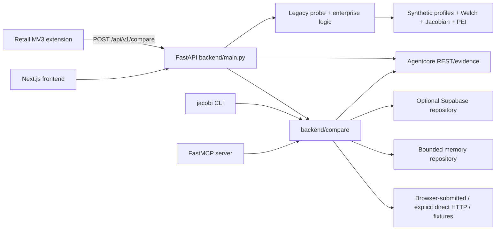
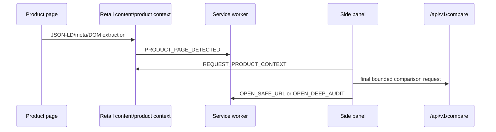

# Jacobi Travel Price Guardian: Phase 0 Repository Audit

- Audit date: 2026-07-13
- Implementation branch: `pivot/travel-price-guardian-v1`
- Foundation branch: `pivot/price-optimization-mvp`
- Foundation commit: `c4cb4e2b4ed3a0f98bce2b2ccd005d770c79be4a`
- Foundation PR: [#45](https://github.com/Hussain800/Jacobi_mark3/pull/45) (open draft against `main`)

This is a source and configuration audit, not a claim that travel behavior exists. It records the repository state before the first travel implementation commit.

## Source-of-truth controls

The authoritative PRD was read completely from `C:\Users\hussa\Downloads\Jacobi_Travel_Price_Guardian_PRD.md`.

| Document | Lines | SHA-256 |
|---|---:|---|
| Travel Price Guardian PRD | 2,272 | `FF915B5813C26554CFA87E998D09958E96E337E2A66817741131A357BE09D1CD` |
| Deep research report | 131 | `128DB667165015FAB01626E2ECCE0B2193000D37F9F7ACEBEFDA618F4D8CCE51` |

Recovery evidence:

```text
git fetch --all --prune
git status -sb
## pivot/price-optimization-mvp...origin/pivot/price-optimization-mvp

git rev-parse HEAD
c4cb4e2b4ed3a0f98bce2b2ccd005d770c79be4a

gh pr view 45 --json ...
OPEN, draft, head pivot/price-optimization-mvp at c4cb4e2, base main,
mergeStateStatus CLEAN
```

The new branch was created directly from that verified commit. No reset, squash, merge, or destructive synchronization was used.

## Current architecture map



The repository is currently a single FastAPI process plus a separately built Next.js application and MV3 extension. It has a Postgres/Supabase persistence option, but no Redis dependency, Redis event stream, travel queue, standalone worker, or Docker Compose topology.

## Repository tree

Only product-relevant paths are shown. Historical and design assets remain preserved.

```text
backend/
  main.py                     # 3,472 lines; assembly plus substantial legacy logic
  compare/                    # PR #45 retail comparison domain and adapters
  agentcore/                  # evidence, policy, REST, MCP, storage
  extractors/booking.py       # legacy booking-page price context, not TravelIntent
  enterprise_store.py        # existing scan-job lease patterns
  jacobi.py                   # retail comparison CLI
  tests/                      # 48 test modules; 1,690 collected cases
extension/
  manifest.json               # MV3 retail extension
  background.js
  content.js
  product-context.js
  shared/                     # config, bounded extraction, message validation
  sidepanel/                  # retail result UI
  tests/                      # Node contract tests and Chromium smoke
frontend/
  app/                        # Next.js App Router product and enterprise surfaces
  components/
  lib/
supabase/migrations/          # 13 additive migrations through 202607120001
docs/                         # price-optimization, security, setup and OSS docs
.github/workflows/            # backend clean-install/test and full build workflows
Dockerfile                    # single API image
render.yaml                   # single API web service
```

## Dependency map

| Layer | Present | Travel delta |
|---|---|---|
| API/runtime | FastAPI 0.115, Uvicorn 0.34, Pydantic 2.13, HTTPX 0.28 | Reuse. Add the travel router, worker entry point, dependency wiring, and SSE response path. |
| Persistence | `supabase>=2.7`; memory and Supabase repositories | Reuse patterns. Add travel-specific repositories and additive tables; do not reuse retail tables as travel entities. |
| Evidence/agents | FastMCP, Agentcore evidence and policy modules | Reuse manifest/hash/access conventions and extend MCP/CLI with travel commands. |
| Parsing | BeautifulSoup, lxml, bounded JSON-LD and HTML handling | Reuse only for bounded baseline observations. Normal travel search must not server-fetch arbitrary user URLs. |
| Numeric | `Decimal`-backed Pydantic money models; NumPy for legacy math | Reuse Decimal semantics. Travel costing, currency evidence, and completeness need separate typed contracts. |
| Browser | Plain MV3 JavaScript; optional local Playwright in Agentcore | Replace retail adapters/UI. Add travel fixtures, automatic/privacy modes, SPA debounce and Chromium E2E. |
| Frontend | Next.js 16.2.9, React 19.2.7, TypeScript 5.5 | Pivot the default product copy and travel surfaces; preserve Deep Audit and enterprise history as secondary paths. |
| Async infrastructure | In-process asyncio and legacy DB scan leases only | Add Redis client, queue/lease/event/cache/rate-limit abstractions, and a separate worker. |
| Testing | pytest; no Hypothesis dependency; Node built-in tests | Add Hypothesis, travel contract/golden/resilience tests, and repeatable extension adapter fixtures. |
| Deployment | one Dockerfile, one Render web service | Add Compose with Postgres, Redis, API, worker and frontend; separate API/worker commands and readiness checks. |

There is no Kafka, Kubernetes, Neo4j, vector database, Meilisearch, Celery, RQ, ARQ, or Dramatiq dependency. The travel build will not add those without a measured need and a new ADR.

## Reusable PR #45 components

| Existing component | Reuse decision | Boundary |
|---|---|---|
| `compare.schemas.Money`, `CostState`, cost-line validation | Adapt into `travel.domain.money` and `travel.costing` | Travel cost kinds and completeness are distinct; no retail product schema leakage. |
| `compare.adapters.base` descriptor/registry patterns | Adapt | Replace merchant vocabulary with vertical-aware travel provider contracts and truthful observation methods. |
| `compare.service` provider isolation and deadlines | Adapt | Search work becomes durable jobs with leases/events rather than request-local fan-out. |
| `compare.ranking` filter-first deterministic ordering | Adapt | Implement the PRD lexicographic travel key; no composite deal score. |
| `compare.storage` fail-closed backend selection and owner scoping | Reuse pattern | New travel repository interfaces and tables are required. |
| Agentcore `EvidenceManifest`, hashes, organization scope and storage | Reuse/extend | Travel evidence must include provider environment, offer freshness and revalidation. |
| Comparison capability tokens | Reuse pattern | New search-scoped opaque capability with expiry, rate limits and no anonymous global history. |
| SSRF, redirect-hop, private-IP and output bounds | Reuse/harden | Official APIs use fixed allowlisted endpoints; redirect service validates canonical deep links. |
| Extension sender/message validation and safe HTTP URL handling | Reuse | Replace retail message types with bounded travel intent/search/revalidation contracts. |
| CLI/MCP shared tooling facade | Reuse | Add travel namespace and commands using travel core services. |
| Default-off telemetry and Sentry scrubbing | Reuse/extend | Add PRD travel metrics without URLs, raw payloads or personal data. |
| Legacy probe, statistics, reports and Deep Audit | Preserve | Explicit specialist route only; never invoked by travel search. |

Two evidence-boundary hazards need deliberate adaptation:

- `agentcore.schemas.Money.amount` is a binary float and `compare.service` currently casts a Decimal price to float when constructing a manifest attempt. Travel authoritative prices must stay Decimal strings/values through normalization, storage and evidence; Agentcore compatibility data must not become the price authority.
- the explicit live Deep Audit path can execute `run_full_probe` after `allow_managed_provider=true`, while the REST `DeepAuditResult` wrapper always reports `automatic_paid_provider_calls=false`. That inherited response field is potentially misleading and must be corrected without changing the explicit opt-in boundary.

## Retail-specific components to isolate or replace

| Component | Decision |
|---|---|
| `ProductIdentity`, electronics variants and golden product pairs | Keep under `backend/compare`; never stretch into flights or hotels. |
| UAE retailer fixtures and merchant adapters | Preserve for `/api/v1`; remove from the default consumer product and travel provider registry. |
| `/api/v1/compare` and retail status/evidence routes | Keep compatible; route the extension and primary web product to `/api/v2/travel`. |
| Product JSON-LD extraction and `product-context.js` | Replace in the default extension flow with typed flight/hotel adapters. |
| Open-comparison-tab workflow | Keep only as optional legacy retail behavior; it is prohibited as the travel primary flow. |
| Retail side-panel states/copy | Replace with travel intent, progressive search, equivalence, cost, revalidation and redirect states. |
| Retail homepage, compare page and provider copy | Pivot to the travel guardian message. Deep Audit remains explicit and secondary. |

## Database and migration inventory

Thirteen additive migrations exist:

```text
003_outbox_webhooks.sql
202605260001_20260526_create_jacobi_tables.sql
202605262030_add_user_id_and_billing_columns.sql
202605270001_board_visibility_and_tiers.sql
202606240001_enterprise_price_integrity.sql
202606240002_live_scan_worker.sql
202606240003_enterprise_reporting_sharing.sql
202606240004_enterprise_security_controls.sql
202606240005_enterprise_rls_member_management.sql
202606240006_harden_set_updated_at_search_path.sql
202606240007_optimize_rls_initplan.sql
202607050001_agent_provenance_records.sql
202607120001_price_optimization_persistence.sql
```

Together they create 28 tables. The security audit identified three inherited policy hazards that must be resolved before hosted travel reuse:

- the initial enterprise RLS migration uses organization membership rather than declared role for organization updates, membership inserts and several `FOR ALL` table policies; the later member-management migration does not remove every broad policy;
- `outbox_log` stores arbitrary event payloads but its migration enables RLS only on `webhook_configs`; effective grants and the intended service-only boundary need correction/validation;
- retail `offer_observations` permits authenticated reads of rows with `user_id IS NULL`. That can be appropriate for non-sensitive shared retail catalogue facts, but it must not be copied to travel observations containing dates, occupancy or source context.

The latest migration adds nine retail comparison tables with RLS and service-role boundaries. Enterprise migrations contain useful job lease/reclaim and ownership patterns. There are no travel searches, provider attempts, itineraries, hotel properties/crosswalks, travel offers, cost components, revalidations, redirects, feedback or travel preferences tables.

Repository reality versus PRD:

- memory persistence is intentionally process-local and bounded;
- production Supabase selection fails closed when misconfigured;
- static migration tests exist, but real Supabase RLS validation requires credentials and has not been claimed;
- Postgres remains the travel Market Graph; no graph database will be introduced;
- travel migrations will be additive and rollback will preserve travel data.

## API inventory

Fresh OpenAPI generation reports 60 paths. They group as:

- legacy consumer/enterprise routes under `/api/*`;
- Agentcore routes under `/api/v1/agent/*`;
- retail identification, discovery, comparison, optimization, evidence, providers, feedback and Deep Audit under `/api/v1/*`;
- one general `/health` route.

No `/api/v2/travel` path exists. The required v2 router must add searches, results, replayable SSE events, revalidation, redirect, feedback, providers, health and preferences while keeping business logic outside `main.py`.

`backend/main.py` is not assembly-only today. It is 3,472 lines and contains legacy product logic as well as application assembly. The smallest safe interpretation of the PRD is:

1. do not destabilize or rewrite legacy behavior merely to satisfy a file-size ideal;
2. place every new travel rule in `backend/travel` and every new HTTP contract in `backend/api/v2_travel.py`;
3. limit `main.py` travel changes to router/lifecycle assembly;
4. document legacy extraction as later debt rather than expanding it.

## Extension permission and message-flow inventory

Current install-time permissions are `contextMenus`, `activeTab`, `scripting`, `storage`, and `sidePanel`. `tabs` is optional. There are no install-time host origins, but the manifest declares broad optional `http://*/*` and `https://*/*` origins and requests only a configured backend origin at runtime.

Current message flow:



Messages are type/field allowlisted, URLs are credential-free HTTP(S), and sensitive tab messages require a trusted extension sender with a tab. Local storage is bounded for recent results/dismissals/feedback and telemetry defaults off.

`content.js` and `popup.html`/`popup.js` are currently dormant: the manifest registers neither a content script nor an action popup. Automatic travel detection therefore cannot be inferred from their presence.

Travel delta:

- add explicit onboarding consent and versioned automatic/privacy settings;
- declare narrowly scoped travel-site host groups rather than wildcard optional hosts;
- locally extract and sanitize typed intents, not raw HTML or complete URLs;
- add SPA navigation observation, mutation debounce and intent fingerprint deduplication;
- add search/event/revalidation/redirect message contracts and badge states;
- open the side panel only on user action, but allow an attention badge for meaningful verified savings;
- preserve self-hosted backend configuration through a separately requested backend origin.

## Test and CI inventory

Fresh collection:

```text
python -m pytest --collect-only -q
1690 tests collected in 3.48s
```

The 48 backend test modules cover legacy probes/statistics, Agentcore, REST, price optimization, persistence/RLS static checks, security, MCP, CLI and deployment smoke. The extension has 14 Node contract tests plus an unpacked Chromium harness and a screenshot artifact. Frontend CI runs `npm ci` and `npm run build`; there is no configured lint or frontend unit-test script.

The existing workflows perform:

- clean Python dependency install, backend import smoke and backend suite;
- frontend dependency install and production build;
- Docker image build.

The full workflow is configured only for pull requests targeting `main`, so a stacked PR targeting `pivot/price-optimization-mvp` will not receive that gate without a workflow update or manual run. The backend workflow is path-filtered to `backend/**`; travel extension/docs-only commits would not invoke it.

Deployment configuration also conflicts with the PRD topology:

- `render.yaml` deploys only the API and explicitly selects memory comparison storage;
- no worker, Redis, Postgres or frontend Compose service exists;
- production-persistence detection is inconsistent across legacy enterprise paths and must fail closed in the travel API/worker;
- `backend/vercel.json` has no cron entry despite a legacy route comment referring to one.

Travel gaps include domain unit/property tests, 300+ flight pairs, 300+ hotel pairs, provider contracts, SSE reconnect, worker restart/lease expiry, travel CLI/MCP, extension adapter fixtures, Chromium end-to-end travel flows, Compose validation and real RLS validation when credentials exist.

## Security and secret-history findings

Inherited controls:

- URL scheme/credential/localhost/metadata/private-IP rejection;
- redirect-hop revalidation and response-size limits;
- bounded hostile JSON-LD/HTML parsing;
- token-scoped evidence access and fail-closed production persistence;
- extension sender/message validation and safe link handling;
- Sentry request scrubbing and default-off telemetry;
- paid-provider isolation from the default retail comparison path.

The detailed, non-secret baseline is in [`SECURITY_AND_SECRET_HISTORY_AUDIT.md`](SECURITY_AND_SECRET_HISTORY_AUDIT.md). Highest-impact inherited findings are:

1. the unauthenticated `/_next/static/{rest:path}` route permits percent-encoded parent traversal and returned an out-of-root tracked file during a local ASGI reproduction;
2. enterprise membership RLS permits self-enrolment with an attacker-selected role, while broad membership-only mutation policies cover jobs, findings, evidence and sharing;
3. `/api/analyze` reads private probes through the service role without the common ownership/publicity guard;
4. anonymous callers can self-assert authorization for deployer-managed Deep Audit work when credentials exist;
5. Agentcore's optional evidence HMAC is created but never verified, caller assertions determine `official_route`, and legacy evidence narrows Decimal prices to float;
6. direct HTTP, webhook and Playwright validation remains susceptible to DNS-rebinding races without connected-address or egress enforcement;
7. OAuth/Stripe redirect, webhook replay/body, extension URL-redaction and production fail-closed controls require repair before travel reuse;
8. the outbox table lacks an explicit service-only RLS/grant boundary, and public/shared retail policies are unsafe defaults for travel observations;
9. a Google API-key-shaped value removed in `caafa55` remains in reachable history; rotation/revocation and any coordinated history rewrite are external actions, and the value is never reproduced;
10. rate limits are process-local and must move to Redis/shared enforcement for travel.

No live provider, paid provider or retailer was called during this audit.

The principal audit run passed `92` focused persistence, URL, RLS, Agentcore-auth and repository-secret tests with one unrelated deprecation warning. Extension contract tests passed `14` tests. These results validate existing controls; they do not close the inherited RLS/history findings or prove travel behavior.

## Architecture contradictions and decisions

| Contradiction | Smallest sound adjustment |
|---|---|
| Research report suggested Meilisearch; PRD explicitly rejects it in V1. | Follow the later authoritative PRD: Postgres indexes only until measurements justify an ADR. |
| `main.py` already contains substantial legacy logic. | Do not perform a risky legacy rewrite. Keep all new travel logic outside it and use it only to assemble the travel router/lifecycle. |
| Existing extension protects install-time access but declares wildcard optional hosts. | Move to enumerated supported travel-site groups plus a separate user-selected backend origin. |
| Existing scan jobs have database leases but no Redis worker. | Reuse lease semantics, not the execution path; build the PRD Redis queue/event/cache spine and separate worker. |
| PR #45 calls browser observations a live zero-cost route. | For travel, label them strictly `browser_observed`; only independent production API responses may be labelled independently queried live. |
| Existing booking extractor recognizes Booking.com prices. | Treat it as legacy Deep Audit context only; implement typed hotel intent adapters with versioned fixtures before claiming support. |
| Agentcore evidence money is float-backed. | Keep the travel price record Decimal-authoritative and attach a compatible manifest reference without round-tripping totals through floats. |
| Deep Audit REST always reports no automatic paid calls even after explicit managed-provider execution. | Correct the response to distinguish “never automatic” from “explicit managed provider used” and regression-test the truth label. |

## Phase 0 conclusion

The foundation is reusable, but the travel product does not yet exist. The first implementation milestone must create a separate typed travel domain and durable search spine rather than renaming retail models. All later completion claims are governed by [`IMPLEMENTATION_LEDGER.md`](IMPLEMENTATION_LEDGER.md).
