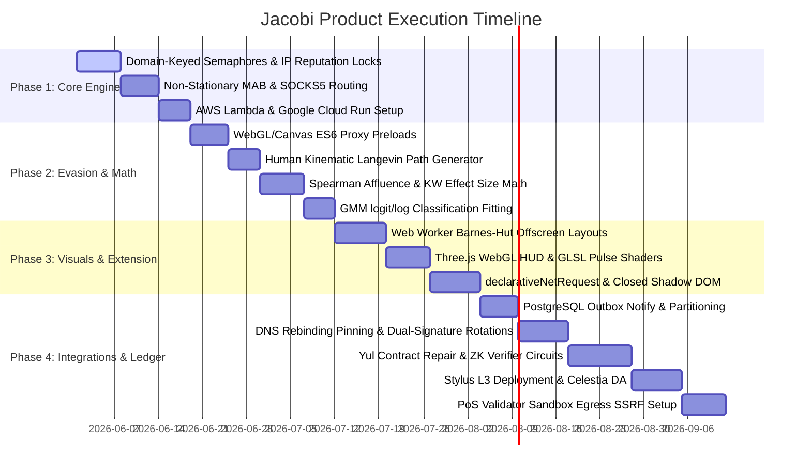

# JACOBI — Ultimate Product Capability & Architectural Roadmap

This document compiles, synthesizes, and refines the findings of our specialized research explorers into an actionable, high-fidelity architectural roadmap to scale **JACOBI — Adversarial Pricing Topology Probe** into an elite, market-leading pricing audit workstation.

---

## 1. Algorithmic Pricing Theory & Quantitative Modeling

To transition from simple price checks to authoritative corporate compliance audits, JACOBI formalizes the mathematical detection of price discrimination and dynamic pricing behavior.

### 1.1 The Price Exploitation Index ($PEI$)

We define the user profile vector space $\mathcal{U}$:
$$\mathbf{u} = [\mathbf{x}_{geo}, \mathbf{x}_{tech}, \mathbf{x}_{behav}, \mathbf{x}_{seg}] \in \mathcal{U}$$
The observed price for SKU $i$ at time $t$ shown to user profile $\mathbf{u}$ is $P(i, t, \mathbf{u})$. We establish the baseline pricing using a standardized Control Persona $\mathbf{u}_0$:
$$P_0(i, t) = P(i, t, \mathbf{u}_0)$$

We isolate the four sub-indicators of discrimination:

1.  **Geo-Discrimination ($GD(i, t)$)**: Measures spatial price variation weighted by regional income proxies:
    $$GD(i, t) = CV_{geo}(i, t) \cdot \max(0, \rho_{geo})$$
    where $CV_{geo}$ is the coefficient of variation across test locations. The Spearman rank correlation coefficient $\rho_{geo}$ is computed between median regional prices $\mathbf{P}_{geo}$ and regional affluence data $\mathbf{Y}_{affluence}$ (e.g., GDP per capita, purchasing power parity index):
    $$\rho_{geo} = \rho_s(\mathbf{P}_{geo}, \mathbf{Y}_{affluence})$$
    This design eliminates arbitrary Python dictionary insertion-ordering biases, ensuring that directional penalties are based strictly on macroeconomic affluence indicators.
2.  **Technological-Discrimination ($TD(i, t)$)**: Measures hardware-driven price variations (e.g. mobile vs. desktop markup). To isolate true discrimination from random intra-segment variance, we decompose device-level variance using the non-parametric Kruskal-Wallis $H$-statistic and rank-based effect size $\eta^2$:
    $$H = \frac{12}{N(N+1)} \sum_{j=1}^k \frac{R_j^2}{n_j} - 3(N+1)$$
    $$\eta^2 = \frac{H - k + 1}{N - k}$$
    To resolve scale-insensitivity (where a \$0.01 and a \$100.00 markup yield identical ranks), we scale $\eta^2$ by a price-magnitude coefficient and integrate it with Cohen's $d$ calculated on the raw price differentials:
    $$TD(i, t) = \eta^2 \cdot \max\left(0, \frac{\max(\tilde{x}_{dev}) - B}{B}\right)$$
    where $B$ is the baseline price.
3.  **Behavioral-Discrimination ($BD(i, t)$)**: Captures urgency markups (e.g. high-frequency searches):
    $$BD(i, t) = \max_{\beta \in B} \left( \frac{P(i, t, \mathbf{u}_{\beta}) - P_0(i, t)}{P_0(i, t)} \right)$$
4.  **Segmentation-Discrimination ($SD(i, t)$)**: Captures channel-based manipulation (e.g. metasearch referral discounts). We compute the Gini coefficient ($G_{seg}$) across channel medians:
    $$G_{seg} = \frac{\sum_{i=1}^{n} \sum_{j=1}^{n} |x_i - x_j|}{2 \, n \, \sum_{i=1}^{n} x_i}$$
    Because real-world audits often involve a small number of channels (e.g., $n=2$, web vs mobile), we apply a sample-size correction factor $\frac{n}{n-1}$ to prevent the Gini index from being compressed by $50\%$:
    $$SD(i, t) = \frac{n}{n-1} \cdot G_{seg}$$

The composite $PEI(i, t) \in [0, 1]$ is computed via Minkowski p-norm weighted aggregation followed by logistic normalization:
$$Z_p(i, t) = \left( \sum_{k=1}^4 w_k I_k^p \right)^{1/p}$$
$$PEI(i, t) = \frac{2}{1 + e^{-\lambda \cdot Z_p(i, t)}} - 1$$
where $I_k \in \{GD, TD, BD, SD\}$, $\sum w_k = 1.0$, $p = 2.0$ (Euclidean), and $\lambda = 5.0$.

### 1.2 Temporal Volatility & Signal Processing

To capture algorithmic adjustments over time, we introduce:
1.  **Dynamic Pricing Intensity ($DPI$)**: Measured over a window $T$ as the coefficient of variation of the baseline price $P_0(t)$:
    $$DPI = \frac{\sigma(P_0(t))}{\mu(P_0(t))} = \frac{\sqrt{\frac{1}{T}\int_0^T (P_0(t) - \overline{P}_0)^2 dt}}{\overline{P}_0}$$
2.  **Dynamic Pricing Velocity ($DPV$)**: Measures the average rate of price changes, capturing the frequency of algorithmic adjustments:
    $$DPV = \frac{1}{T} \int_0^T \left| \frac{dP_0(t)}{dt} \right| dt$$

#### Outlier Suppression & Data Verification
Pricing sweeps often contain spurious entries from scraped DOM artifacts, currency mismatches, or bundle packages.
*   **Temporal Outliers**: Apply a sliding Hampel filter of window size $2k+1$ centered at observation $t$. A data point is replaced if it deviates from the rolling median $\tilde{P}_t$ by more than three rolling median absolute deviations ($3 \times 1.4826 \times \text{MAD}_t$).
*   **Spatial Outliers**: Replace rolling Hampel filters (which are invalid on unordered spatial domains) with a global geographic Median Absolute Deviation (MAD) threshold or a spatial density clustering algorithm (DBSCAN) to identify and prune geographically isolated anomalies.
*   **Robust Baseline Estimation**: Replace the arithmetic mean with the Huber M-estimator $\theta$ to calculate the baseline price under heavy-tailed contamination, solving:
    $$\sum_{i=1}^n \psi\left(\frac{P_i - \theta}{\hat{\sigma}}\right) = 0$$
    where $\psi(u) = \max(-c, \min(c, u))$ is the tuning function (with $c=1.345$) and $\hat{\sigma}$ is a robust scale estimate.
*   **Ingestion Integrity**: Enforce cryptographic signature verification on all ingested pricing payloads to prevent malicious actors from spoofing inputs and poisoning statistical calculations.

### 1.3 Vendor Classification Matrix

By plotting user-centric exploitation ($PEI$) against time-centric market volatility ($DPI$):

```
         Dynamic Pricing Intensity (DPI)
              ▲
              │   II. PDMP             │   IV. APE
              │   (Pure Dynamic        │   (Algorithmic
  theta_DPI ──┼── Market Pricing) ─────┼── Personalized Exploitation) ──
              │                        │
              │   I. USP               │   III. SPD
              │   (Uniform Static      │   (Static Price
              │   Pricing)             │   Discrimination)
              │                        │
              └────────────────────────┴────────────────────────► PEI
                                   theta_PEI
```

We transition from static thresholding to an unsupervised Gaussian Mixture Model (GMM) classifier. Given the feature vector $\mathbf{x} = [PEI, DPI, DPV]^T$, we apply transformations to align bounded features with the infinite support of standard Gaussians:
$$\mathbf{x}_{trans} = \left[\text{logit}(PEI), \ln(DPI), \ln(DPV)\right]^T \in \mathbb{R}^3$$
where $\text{logit}(PEI) = \ln(PEI / (1 - PEI))$. The density of merchants is modeled as a mixture of $K=4$ distributions (USP, PDMP, SPD, APE):
$$p(\mathbf{x}_{trans}) = \sum_{k=1}^4 \pi_k \mathcal{N}(\mathbf{x}_{trans} \mid \mathbf{\mu}_k, \mathbf{\Sigma}_k)$$
The parameters are estimated via the Expectation-Maximization (EM) algorithm, assigning merchants to the category $k^*$ that maximizes the posterior probability $\gamma_k(\mathbf{x}_{trans})$.

---

## 2. Distributed Proxy Infrastructure & Concurrency Engine

To optimize the 24-agent distributed sweep, we replace sequential waves with high-performance concurrent pipelines.

### 2.1 Concurrency Optimization

*   **The Bottleneck**: The current 3-wave stagger in `backend/main.py` causes Head-of-Line Wave Blocking, where a single slow response delays subsequent waves, yielding $\approx 22\text{s}$ sweep times.
*   **The Architecture**: Implement an Asynchronous Concurrency Queue utilizing a Semaphore-capped sliding window. To prevent global rate-limit contraction (where rate limits on Domain $A$ throttle requests to Domain $B$), we instantiate isolated, domain-keyed semaphore registries:
    `domain_semaphores[domain] = asyncio.Semaphore(C_domain)`
*   **Proxy Zone Mapping**: Map all mobile agent identities strictly to Residential rotating or ISP (Static Residential) proxy zones, complying with the sunsetting of dedicated mobile zones.

### 2.2 Client-Side IP Reputation Broker

1.  **Egress IP Telemetry**: Extract the egress exit IP from the proxy response headers (e.g., `x-brd-ip` or `x-brd-customer-ip`) rather than discarding HTTP headers.
2.  **Reputation Registry**: Maintain a registry of blocked or failing IPs. If an IP fails $\ge 2$ requests, blacklist it for 10 minutes. Implement internal async serialization locks (`asyncio.Lock`) inside the broker to prevent race conditions during concurrent state mutations.
3.  **Dynamic Session Rotation**: Generate session strings dynamically:
    `brd-customer-<id>-zone-res-session-agent_<agent_id>_v<version>`
    Upon detection of a blocked exit IP, increment `_v<version>` to immediately rotate the exit node while maintaining agent configuration state.

### 2.3 Decoupled Dynamic Proxy Router

```
                  ┌────────────────────────────────────────┐
                  │       Jacobi Orchestrator Core         │
                  │   (FastAPI / Dynamic Wave Manager)     │
                  └───────────────────┬────────────────────┘
                                      │
            ┌─────────────────────────┴─────────────────────────┐
            ▼                                                   ▼
┌───────────────────────┐                           ┌───────────────────────┐
│ Domain-Keyed Registry │                           │  Geo-Routing Matrix   │
│ (Isolated Semaphores) │                           │ (TLD/Locale mapping)  │
└───────────┬───────────┘                           └───────────┬───────────┘
            │                                                   │
            ▼                                                   ▼
┌───────────────────────────────────────────────────────────────────────────┐
│                        Dynamic Provider Router                            │
│                 (Non-Stationary MAB Routing Engine)                        │
└─────────────────────────────────────┬─────────────────────────────────────┘
                                      │
         ┌────────────────────────────┼────────────────────────────┐
         ▼                            ▼                            ▼
┌──────────────────┐         ┌──────────────────┐         ┌──────────────────┐
│   BrightData     │         │     Oxylabs      │         │    Smartproxy    │
│ (Scraping Browser│         │  (SOCKS5 / ISP   │         │ (Residential Pool│
│  via CDP/REST)   │         │   Rotators)      │         │   via SOCKS5)    │
└──────────────────┘         └──────────────────┘         └──────────────────┘
```

#### Multi-Provider Bandits
To avoid single-provider dependency, we deploy a multi-provider routing layer across BrightData, Oxylabs, and Smartproxy. Because proxy performance is highly non-stationary and subject to sudden blockages, we replace standard stationary UCB-1 with a non-stationary Multi-Armed Bandit model (e.g., **Exp3.S** or sliding-window UCB) that discounts historical observations exponentially:
$$R_i^{UCB}(t, \tau) = \frac{S_i(t, \tau)}{\overline{L}_i(t, \tau)} + c \sqrt{\frac{\ln N(t, \tau)}{n_i(t, \tau)}}$$
where $\tau$ is the sliding window size, $S_i$ is the success rate, and $\overline{L}_i$ is the average latency.

#### Serverless Execution Workers
We transition local execution to distributed serverless environments to handle hundreds of concurrent sweeps without local resource exhaustion:
*   **Platforms**: Deploy workers on containerized AWS Lambda or Google Cloud Run. We deprecate Cloudflare Workers for scraping tasks, as the V8 isolate runtime does not support native headless Chromium binaries.
*   **Security**: Protect endpoints via HMAC-SHA256 signatures, verifying that the signature matches and the timestamp is within $30\text{s}$:
    $$\text{Signature} = \text{HMAC-SHA256}(K_{secret}, \text{Payload} \mathbin{\Vert} \text{Timestamp})$$

#### Native SOCKS5 Protocol Support
For direct SOCKS5 connection pools, we implement a custom socket wrapper using `anyio`. This enables the client to bypass provider-side REST limitations and execute raw TCP-level modifications:
$$\text{TCP\_WINDOW\_SIZE} = W_{target}, \quad \text{TCP\_MSS} = \text{MSS}_{target}$$
which ensures complete consistency with the spoofed OS fingerprint.

#### Geo-Specific Proxy Routing & Localization
The proxy coordinator resolves routing through a Geo-Routing Matrix:
1.  **TLD Parsing**: Extract top-level domains to determine target countries.
2.  **Language Matching**: Align headers (`Accept-Language`) with proxy egress locales.
3.  **Currency Alignment**: Route searches to egress IPs matching the target local currency to trigger native localized pricing logic.

---

## 3. Advanced Evasion & Coherent Fingerprint Spoofing

Advanced anti-bot engines (Cloudflare Turnstile, Akamai Bot Manager) detect automated agents via profile inconsistencies. JACOBI implements coherent fingerprint spoofing hooks before target scripts execute.

### 3.1 Script Overrides for Headless Browsers

All JavaScript preloads must execute at `document_start` in the `MAIN` world to prevent target pages from accessing native bindings beforehand. Overrides are built using ES6 Proxy wrappers to maintain native string representations and prototype chains.

#### Canvas Fingerprint Defeat
We avoid flat pixel offsets (which alter noise entropy and leave detectable spectral signatures in Fourier transform analysis). Instead, we inject organic, fractionally perturbed noise that preserves the covariance structure and spectral distribution of the canvas:
```javascript
(function() {
    const handler = {
        apply(target, thisArg, argumentsList) {
            const imgData = Reflect.apply(target, thisArg, argumentsList);
            const data = imgData.data;
            const seed = 0.4287;
            for (let i = 0; i < data.length; i += 4) {
                // Apply a fractional, covariance-preserving perturbation
                const noise = Math.sin(i * seed) * 1.5;
                data[i] = Math.min(255, Math.max(0, data[i] + Math.round(noise)));
            }
            return imgData;
        }
    };
    CanvasRenderingContext2D.prototype.getImageData = new Proxy(
        CanvasRenderingContext2D.prototype.getImageData,
        handler
    );
})();
```

#### WebGL Shader Hardware Spoofing
Mask WebGL credentials and match floating-point precision parameters using ES6 Proxy wrappers to ensure `toString()` checks return native outputs:
```javascript
const spoofWebGL = (gl, vendor, renderer) => {
    const parameterHandler = {
        apply(target, thisArg, argumentsList) {
            const pname = argumentsList[0];
            if (pname === 0x9245) return vendor; // UNMASKED_VENDOR_WEBGL
            if (pname === 0x9246) return renderer; // UNMASKED_RENDERER_WEBGL
            return Reflect.apply(target, thisArg, argumentsList);
        }
    };
    gl.getParameter = new Proxy(gl.getParameter, parameterHandler);
};
```

#### WebRTC Private IP Shielding
Obfuscate ICE candidate details to prevent WebRTC from leaking local LAN IPs past proxy layers:
```javascript
const pcHandler = {
    construct(target, argumentsList) {
        const pc = Reflect.construct(target, argumentsList);
        const addIceHandler = {
            apply(iceTarget, iceThisArg, iceArgs) {
                const candidate = iceArgs[0];
                if (candidate && candidate.candidate && candidate.candidate.includes('typ srflx')) {
                    return Reflect.apply(iceTarget, iceThisArg, iceArgs);
                }
                return Promise.resolve();
            }
        };
        pc.addIceCandidate = new Proxy(pc.addIceCandidate, addIceHandler);
        return pc;
    }
};
window.RTCPeerConnection = new Proxy(window.RTCPeerConnection, pcHandler);
```

### 3.2 Network Evasion

*   **Managed vs. Unmanaged Connections**:
    *   *Managed API (Web Unlocker)*: Web Unlocker terminates the client's TLS handshake and establishes a separate connection. For this, Jacobi relies on provider-side TLS spoofing and ensures browser-level HTTP headers match the proxy zone configuration.
    *   *Unmanaged SOCKS5 Pool*: For direct socket routing, Jacobi routes raw TCP streams through SOCKS5 and executes client-side TLS/JA4 evasion.
*   **TLS/JA4 Fingerprint Evasion**: Implement a custom socket layer using `utls` (or a Go-based sidecar proxy utilizing `cloudflare/tls`) to manipulate the cipher suite vector $\mathbf{v}_{cipher} \in \mathbb{R}^{M}$ and extension vector $\mathbf{v}_{ext} \in \mathbb{R}^{N}$ to match the exact JA4 signature of target browser profiles:
    $$\text{JA4} = A \_ B \_ C$$
*   **HTTP/2 Frame Fingerprinting**: Maintain settings frame consistency with the user-agent operating system:
    $$\mathbf{\theta}_{h2} = [W_{init}, S_{max\_concurrent}, S_{header\_table}, S_{initial\_window}, P_{weight}]$$

### 3.3 Stochastic Behavioral Noise Injection

To bypass behavioral tracking, we replace straight-line mouse movements. We model human-like mouse movements as a continuous stochastic trajectory $\mathbf{z}(t) = [x(t), y(t)]^T$ pulling toward target coordinates $\mathbf{x}_{target}$ governed by the Langevin equation:
$$d\mathbf{z}(t) = -\gamma (\mathbf{z}(t) - \mathbf{x}_{target}) dt + \sigma d\mathbf{W}(t)$$
where $\gamma$ is the drag coefficient, $\sigma$ is the noise intensity, and $\mathbf{W}(t)$ is a 2D standard Brownian motion. To avoid CPU thread saturation (which spikes loop latency and alerts anti-bot telemetry), mouse paths are integrated with Fitts' Law and the Lognormal Kinematic Theory of Rapid Human Movements:
$$\mathbf{v}(t) = \sum_{j} D_j \cdot \Lambda(t - t_0^j, t_0^j, \mu_j, \sigma_j^2)$$
representing discrete, ballistic planning phases rather than high-frequency Gaussian noise.

---

## 4. HUD Visualization Framework & Extension UI

Expose complex multi-dimensional price structures using coordinated, high-performance D3 and WebGL components.

### 4.1 React/D3 Dashboard Upgrades

#### Web Worker-Driven Force Topologies
To maintain a fluid 60 FPS UI during large sweeps, offload layout physics computations (Fruchterman-Reingold / Barnes-Hut) to a background Web Worker.
*   **Forces**:
    $$\mathbf{F}_{ij}^{repulsive} = \frac{k^2}{d_{ij}} \hat{\mathbf{r}}_{ij}, \quad \mathbf{F}_{ij}^{attractive} = -\frac{d_{ij}^2}{k} \hat{\mathbf{r}}_{ij}$$
*   **Barnes-Hut Quadtree Optimization**: Skip calculations for distant nodes where the cell width $s$ to distance $d$ ratio satisfies:
    $$\frac{s}{d} < \theta \quad (\text{where } \theta = 0.5)$$
*   **Offscreen Canvas Rendering**: Pass layout updates directly to the main thread via zero-copy `transferControlToOffscreen()`, bypassing serialization overhead.

#### Adaptive Projections
Deprecate the hardcoded North American Albers Conic projection in `GeoHeatmap.tsx`. Implement a globally adaptive map projection (Mercator or Orthographic) that centers dynamically on the geographic median of the active sweep targets.

#### GPU-Accelerated 3D HUD (WebGL/Three.js)
Replace CPU-bound 3D projections in `Tactical3DNetwork.tsx` with a Three.js WebGL pipeline.
*   **Camera Quaternions**: Avoid gimbal lock using unit quaternions $\mathbf{q} \in \mathbb{H}$, applying Spherical Linear Interpolation (Slerp) during transitions.
*   **GLSL Fragment Shaders**: Rasterize communication pulses traveling along connection spokes as sine waves with exponential decay:
    $$I(x, t) = I_0 \cdot e^{-\lambda x} \cdot \sin(k x - \omega t)$$

### 4.2 Browser Extension Architecture (Manifest V3)

```
sequenceDiagram
    participant WebPage as Target Web Page
    participant ExtCS as Extension Content Script (MAIN World)
    participant ExtSW as Extension Service Worker (MV3)
    participant DNR as declarativeNetRequest API
    participant Backend as Jacobi Backend

    Note over WebPage,ExtCS: Script loads at document_start
    ExtCS->>ExtCS: Cache Native prototypes (attachShadow, etc.)
    ExtSW->>DNR: Register dynamic headers for targeted domain
    WebPage->>DNR: Outgoing XHR/fetch Request
    Note over DNR: Spoof UA, Accept-Language, Sec-CH-UA in transit
    DNR->>WebPage: Return Response (Clean headers)
    ExtCS->>ExtCS: Inject widget into Closed Shadow DOM
    ExtCS->>ExtSW: Send Probe Message (URL, target details)
    Note over ExtSW: Rate Limiting check (Token Bucket)
    ExtSW->>Backend: Forward authorized probe request
```

*   **Request Interception**: Replace DOM-based header spoofing with Chrome's native `declarativeNetRequest` API, modifying outgoing headers (`User-Agent`, `Accept-Language`, `Sec-CH-UA`) at the browser network stack level before execution.
*   **Closed Shadow DOM Overlays**: Wrap the Jacobi savings widget in a `Closed Shadow Root`. Cache native prototypes (e.g., `Element.prototype.attachShadow`) immediately at `document_start` to prevent host scripts from intercepting the shadow root reference.
*   **Service Worker Token Buckets**: Maintain client-side token-bucket rate limits in the background worker to regulate request frequency and prevent API throttling (HTTP 429).
*   **Telemetry Channel**: Establish a WebSocket/SSE connection between the headless execution workers and the dashboard to stream real-time status, proxy hops, and block rates.
*   **High-Dimensional Math Metaphors**: Integrate visual contour bands representing GMM merchant classes, interactive Merkle verification path trees, and a live outbox webhook debugger interface.

---

## 5. Webhook Alerting, API Gateways, & Enterprise Integrations

Extend the Jacobi ecosystem to drive enterprise adoption while ensuring secure, low-latency integrations.

### 5.1 Transactional Outbox Pattern

To guarantee transactional consistency, Jacobi maintains a PostgreSQL-backed outbox pattern (`outbox_log`). We optimize database throughput and eliminate poll latency via a trigger-based reactive dispatching system:
1.  **LISTEN / NOTIFY Triggers**:
    ```sql
    CREATE OR REPLACE FUNCTION notify_outbox_insert()
    RETURNS TRIGGER AS $$
    BEGIN
        PERFORM pg_notify('outbox_event_channel', NEW.id::text);
        RETURN NEW;
    END;
    $$ LANGUAGE plpgsql;
    ```
2.  **Partitioning**: Partition the `outbox_log` table weekly using list-partitioning:
    $$\text{Partition}_t = \{ \text{row} \mid t_{start} \le \text{created\_at} < t_{end} \}$$
    Automated tasks drop completed partitions older than 7 days, maintaining lightweight indexes.
3.  **Unified Routing**: Route all platform events, including those in `triggerware.py`, through the transactional outbox log to prevent event loss.

### 5.2 Secure Webhook Dispatcher

```
sequenceDiagram
    participant DB as Postgres (outbox_log)
    participant WD as Webhook Dispatcher
    participant DNS as Secure DNS Resolver
    participant Target as Customer Endpoint

    DB-->>WD: LISTEN outbox_event_channel (pg_notify)
    Note over DB,WD: New event inserted in transaction
    DB->>WD: NOTIFY (event_id)
    WD->>DB: SELECT * FROM outbox_log FOR UPDATE SKIP LOCKED
    WD->>DNS: Resolve Hostname (A/AAAA)
    DNS-->>WD: Return IP Addresses (public only)
    Note over WD: Check if IP is in RFC 1918 / Loopback
    WD->>WD: Generate HMAC-SHA256 (Delivery UUID + TS + Payload)
    WD->>Target: POST to https://<IP>/path (Host: domain, SNI: domain)
    Target-->>WD: 200 OK
    WD->>DB: UPDATE outbox_log SET status = 'COMPLETED'
```

#### DNS Rebinding SSRF Mitigation
To prevent Time-of-Check to Time-of-Use (TOCTOU) DNS rebinding:
1.  **Resolve & Validate**: Resolve hostnames to IPs and verify they do not fall in private, loopback, or link-local ranges (RFC 1918, etc.).
2.  **Socket Pinning**: Bind the HTTP client connection socket directly to the validated IP address.
3.  **Host and SNI Injection**: Inject the original hostname into the HTTP `Host` header and override the TLS SNI configuration to match, preserving certificate validation while preventing rebinding.

#### Signature Validation & Key Rotation
*   **Dual-Signature Headers**: Update the database schema to support dual secrets (`secret_key_primary`, `secret_key_secondary`) per webhook. Payloads are signed with both keys to support zero-downtime key rotation:
    $$\text{Sig}_1 = \text{HMAC-SHA256}(K_{primary}, ts \mathbin{\Vert} \text{payload})$$
    $$\text{Sig}_2 = \text{HMAC-SHA256}(K_{secondary}, ts \mathbin{\Vert} \text{payload})$$
*   **Replay Protection**: The receiver verifies that the timestamp $ts$ is within the allowed window:
    $$|t_{system} - ts| \le 300\text{s}$$
    The event UUID (`X-Aegis-Delivery-Id`) is recorded in a sliding Bloom filter to deduplicate incoming requests.
*   **Asymmetric Options**: Support Ed25519 signatures, allowing clients to verify events using the validator network's public keys.

### 5.3 Developer APIs & Enterprise SDKs

*   **Argon2id API Key Hashing**: Key credentials (`jac_live_...`) are stored in the database as salted Argon2id hashes:
    $$\text{StoredHash} = \text{Argon2id}(\text{API\_Key}, \text{Salt})$$
*   **Token Bucket Rate Limiting**: Implement a Redis-backed rate limiter on API endpoints:
    $$C(t) = \min\left(C_{max}, C(t_{last}) + r \cdot (t - t_{last})\right)$$
    where $r$ is the refill rate, and $C_{max}$ is the burst capacity. If $C(t) < 1.0$, return HTTP 429.
*   **Durable Backoff & DLQ**: Dispatchers use truncated exponential backoff with jitter:
    $$t_{retry} = t_{now} + \min(T_{max}, T_{base} \cdot 2^{c_{retry}}) \pm \text{jitter}$$
    Upon reaching $R_{max} = 8$ retries, the event is moved to a Dead-Letter Queue (`webhook_dlq`), and the webhook endpoint is deactivated if the failure rate exceeds $95\%$.

---

## 6. Cryptographic Ledger & Consensus Layer

Ensure audit integrity and verification scalability by establishing a decentralized, privacy-preserving audit ledger.

### 6.1 Smart Contract Security Hardening

Refactor the assembly block in `contracts/JacobiPricingLedger.sol` to remove the terminal Yul `return` instruction which bypasses the Solidity compiler control flow:
```solidity
// Assign computed equality directly to a Solidity return variable 'isValid'
assembly {
    isValid := eq(computedHash, root)
}
// Compiler control flow resumes, executing nullifier mapping and events:
if (isValid) {
    require(!spentLeaves[leaf], "Proof already spent");
    spentLeaves[leaf] = true;
    emit PriceVerified(root, leaf, msg.sender);
}
```
Incorporate strict calldata boundary checks prior to reading proofs to prevent out-of-bounds calldata reads:
```solidity
assembly {
    if lt(calldatasize(), add(proofOffset, mul(proofLen, 0x20))) {
        // Revert execution on malformed calldata
        mstore(0x00, 0x08c379a0) // Error(string) selector
        mstore(0x20, 0x20)
        mstore(0x40, 0x14)
        mstore(0x60, "Calldata out of bounds")
        revert(0x00, 0x80)
    }
}
```

### 6.2 ZK-Proofs (zk-SNARKs) for Price Audits

To protect user transaction privacy, transition from public data submission to a Groth16 zk-SNARK scheme.

#### Arithmetic Circuit Specification
We define a relation $\mathcal{R}$ over a prime field $\mathbb{F}_p$.
*   **Private Witness**:
    $$\mathbf{w} = [s_{id}, \text{domain}, P, S, \text{salt}, \mathbf{p}_1, \dots, \mathbf{p}_d] \in \mathbb{F}_p^{d+5}$$
    where $P$ is the price, $S$ is the spread, and $\mathbf{p}_k$ represents the Merkle sibling path.
*   **Public Inputs**:
    $$\mathbf{x} = [R, \mathcal{H}_{domain}, PEI_{min}] \in \mathbb{F}_p^3$$
    where $R$ is the Merkle root, $\mathcal{H}_{domain} = \text{Poseidon}(\text{domain})$, and $PEI_{min}$ is the minimum price exploitation index threshold.

#### Constraints
1.  **Poseidon Hashing**: Reconstruct the leaf:
    $$L = \text{Poseidon}(s_{id}, \text{domain}, P, S, \text{salt})$$
2.  **Merkle Path Verification**: For each layer $k \in [0, d-1]$:
    $$H_{k+1} = \text{Poseidon}(\min(H_k, \mathbf{p}_k), \max(H_k, \mathbf{p}_k))$$
    Assert $H_d == R$.
3.  **Threshold Validation**: Assert $S \cdot 100 \ge P \cdot PEI_{min}$.
4.  **Domain Binding**: Assert $\text{Poseidon}(\text{domain}) == \mathcal{H}_{domain}$.

The client generates proof $\pi = (A \in \mathbb{G}_1, B \in \mathbb{G}_2, C \in \mathbb{G}_1)$ verifying the pairing equation on-chain via `JacobiZKVerifier.sol`:
$$e(A, B) = e(\alpha, \beta) \cdot e(x \cdot \gamma, \delta) \cdot e(C, \delta)$$

### 6.3 Layer 2 Scaling & Gas Optimization

To handle high commitment throughput, deploy a tiered scaling architecture:
1.  **L2/L3 Arbitrum Orbit & Stylus**: Deploy verification contracts on an Arbitrum Orbit L3 chain. We implement the verification logic in Rust compiled to WASM using Arbitrum Stylus, reducing execution gas fees by $\approx 100\times$.
2.  **Celestia Data Availability (DA)**: Compress audit preimages and post them to Celestia. The resulting transaction hash is committed alongside the Merkle root to the L3 chain, guaranteeing data availability for proof construction while keeping state bloat minimal.
3.  **Merkle Root Batching**: Batch aggregate sub-roots ($R_1, \dots, R_N$) into a single master root $R_{master}$, executing a single storage write per epoch.

### 6.4 Decentralized Validator Nodes

Introduce a Proof-of-Stake validator network to audit and seal committed roots:
*   **Staking & Slashing**: Validators stake $JAC$ tokens. Validators that sign blocks containing fraudulent or manipulated pricing records are slashed and ejected.
*   **Consensus**: A block is finalized when it receives signatures representing $\ge \frac{2}{3}$ of the active validator stake.
*   **SSRF Mitigation**: To prevent malicious target domains from exploiting validator nodes, validators run pricing probes in isolated sandboxes equipped with strict egress DNS-level SSRF filters.

---

## 7. Implementation Stages & Timeline


