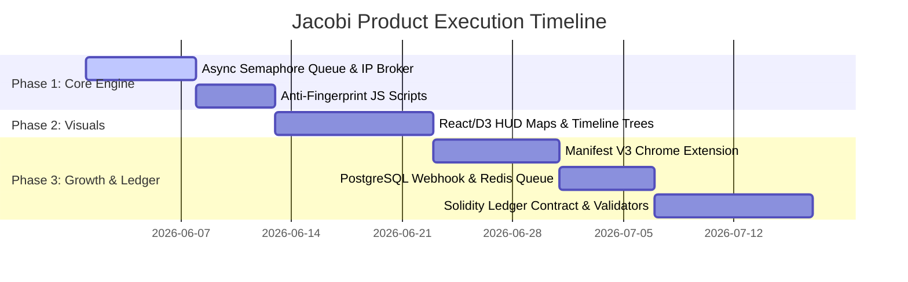

# JACOBI — Ultimate Product Capability & Architectural Roadmap

This document compiles and synthesizes the findings of our 5 specialized research explorers into an actionable, high-fidelity architectural roadmap to scale **JACOBI — Adversarial Pricing Topology Probe** into an elite, market-leading pricing audit workstation.

---

## 1. Algorithmic Pricing Theory & Quantitative Modeling

To transition from simple price checks to authoritative corporate compliance audits, JACOBI formalizes the mathematical detection of price discrimination.

### 1.1 The Price Exploitation Index ($PEI$)

We define the user profile vector space $\mathcal{U}$:
$$\mathbf{u} = [\mathbf{x}_{geo}, \mathbf{x}_{tech}, \mathbf{x}_{behav}, \mathbf{x}_{seg}] \in \mathcal{U}$$
The observed price for SKU $i$ at time $t$ shown to user profile $\mathbf{u}$ is $P(i, t, \mathbf{u})$. We establish the baseline pricing using a standardized Control Persona $\mathbf{u}_0$:
$$P_0(i, t) = P(i, t, \mathbf{u}_0)$$

We isolate the four sub-indicators of discrimination:
1.  **Geo-Discrimination ($GD$)**: Measures spatial price variation weighted by regional income proxies ($I_g$):
    $$GD(i, t) = CV_{geo}(i, t) \cdot \max(0, \rho_{geo})$$
    where $CV_{geo}$ is the coefficient of variation across test locations, and $\rho_{geo}$ is the Spearman rank correlation coefficient between prices and regional affluence.
2.  **Technological-Discrimination ($TD$)**: Measures hardware-driven price variations (e.g. mobile vs. desktop markup):
    $$TD(i, t) = \frac{\max_{\tau \in T} P(i, t, \mathbf{u}_{\tau}) - \min_{\tau \in T} P(i, t, \mathbf{u}_{\tau})}{P_0(i, t)}$$
3.  **Behavioral-Discrimination ($BD$)**: Captures urgency markups (e.g. high-frequency searches):
    $$BD(i, t) = \max_{\beta \in B} \left( \frac{P(i, t, \mathbf{u}_{\beta}) - P_0(i, t)}{P_0(i, t)} \right)$$
4.  **Segmentation-Discrimination ($SD$)**: Captures channel-based manipulation (e.g. metasearch referral discounts):
    $$SD(i, t) = \frac{\max_{s \in S} P(i, t, \mathbf{u}_s) - \min_{s \in S} P(i, t, \mathbf{u}_s)}{P_0(i, t)}$$

The composite $PEI(i, t) \in [0, 1]$ is computed via logistic normalization:
$$PEI(i, t) = \frac{2}{1 + e^{-\lambda \cdot Z(i, t)}} - 1$$
where $Z(i, t)$ is the weighted sum of indicators ($\sum w_k = 1.0$), and $\lambda = 5.0$ is the scale parameter.

### 1.2 Vendor Classification Matrix

By plotting user-centric exploitation ($PEI$) against time-centric market volatility ($DPI$ — Dynamic Pricing Intensity):

```
         Dynamic Pricing Intensity (DPI)
              ▲
              │   II. PDMP             │   IV. APE
              │   (Pure Dynamic        │   (Algorithmic
  theta_DPI ──┼── Market Pricing) ─────┼── Personalized Exploitation) ──
              │                        │
              │   I. USP               │   III. SPD
              │   (Uniform Static      │   (Static Price
              │   Pricing)             │   Discrimination)
              │                        │
              └────────────────────────┴────────────────────────► PEI
                                   theta_PEI
```

This matrix allows JACOBI to audit and classify merchants into four categories:
*   **Uniform Static Pricing (USP)**: Constant over time, identical for all users.
*   **Pure Dynamic Market Pricing (PDMP)**: Volatile over time, but uniform across all users at any instant.
*   **Static Price Discrimination (SPD)**: Stable over time, but personalized based on user profile.
*   **Algorithmic Personalized Exploitation (APE)**: Volatile over time and highly targeted based on real-time profile dynamics (e.g., OTAs, airlines).

---

## 2. Distributed Proxy Infrastructure & Concurrency Engine

To optimize the 24-agent distributed sweep, we replace sequential waves with high-performance concurrent pipelines.

### 2.1 Concurrency Optimization
*   **The Bottleneck**: The current 3-wave stagger causes **Head-of-Line Wave Blocking** where a single slow response delays the subsequent wave, leading to $\approx 22\text{s}$ sweep times.
*   **The Architecture**: Implement an **Asynchronous Concurrency Queue** utilizing a Semaphore-capped sliding window (`asyncio.Semaphore(12)`). This drops total sweep latency to $\approx 8\text{s}$ while preventing API overload.
*   **Mobile Proxy Deprecation**: BrightData officially sunsetted Mobile Proxies in April 2026. JACOBI will map all mobile agents strictly to **Residential rotating** or **ISP (Static Residential)** proxy zones.

### 2.2 Client-Side IP Reputation Broker
1.  **Extract Exit IP**: Intercept the `x-brd-ip` headers from the proxy payload.
2.  **Reputation Registry**: Cache consecutive request failures or bot blockages per IP. If an IP fails $\ge 2$ requests, temporarily blacklist it (TTL = 10 mins).
3.  **Dynamic Session Pinning & Rotation**: Generate session strings dynamically by appending a version suffix to the proxy credentials:
    `brd-customer-<id>-zone-res-session-agent_<agent_id>_v<version>`
    If a node is blacklisted or blocked, increment `_v<version>` to immediately rotate to a clean IP without discarding the agent configuration.

```
┌────────────────────────────────────────────────────────┐
│ Concurrency Queue Manager (Semaphore C=12)             │
│   ├── [Agent 01 (Geo-US)] ──► Dispatch                 │
│   ├── [Agent 02 (Geo-DE)] ──► Queue (Wait)              │
└──────────────────────────┬─────────────────────────────┘
                           │ Active Connection Socket
                           ▼
┌────────────────────────────────────────────────────────┐
│ Identity Router & Proxy Manager                        │
│   ├── User-Agent / Headers matching OS                 │
│   ├── IP Reputation check (Blacklist registry)         │
│   └── Session assignment: session_agent_01_v3          │
└──────────────────────────┬─────────────────────────────┘
                           │ HTTP POST / WebSocket
                           ▼
┌────────────────────────────────────────────────────────┐
│ BrightData Proxy Infrastructure                        │
│   ├── Web Unlocker (Server-side rendering targets)     │
│   └── Scraping Browser (Single Page App targets)       │
└────────────────────────────────────────────────────────┘
```

---

## 3. Advanced Evasion & Coherent Fingerprint Spoofing

Advanced anti-bot engines (Cloudflare Turnstile, Akamai Bot Manager) flag automated agents by identifying profile inconsistencies. JACOBI will implement coherent fingerprint spoofing hooks before target scripts execute.

### 3.1 Script Overrides for Headless Browsers

#### Canvas Fingerprint Defeat
Instead of random canvas noise (which is easily flagged as programmatic tampering), inject a consistent, profile-specific micro-noise checksum:
```javascript
(function() {
    const seed = 0.4287; // Static profile seed
    const offset = Math.floor(seed * 2) || 1;
    const originalGetImageData = CanvasRenderingContext2D.prototype.getImageData;
    CanvasRenderingContext2D.prototype.getImageData = function(x, y, w, h) {
        const imgData = originalGetImageData.apply(this, arguments);
        const data = imgData.data;
        for (let i = 0; i < data.length; i += 4) {
            data[i] = Math.min(255, Math.max(0, data[i] + (i % 3 === 0 ? offset : -offset)));
        }
        return imgData;
    };
})();
```

#### WebGL Shader Hardware Spoofing
Mask WebGL vendor/renderer credentials and match floating-point precision constraints to target specifications:
```javascript
const spoofWebGL = (gl, vendor, renderer) => {
    const glGetParameter = gl.getParameter;
    gl.getParameter = function(pname) {
        if (pname === 0x9245) return vendor; // UNMASKED_VENDOR_WEBGL
        if (pname === 0x9246) return renderer; // UNMASKED_RENDERER_WEBGL
        return glGetParameter.apply(this, arguments);
    };
};
```

#### WebRTC Private IP Shielding
Obfuscate ICE candidate details to prevent WebRTC from leaking local LAN IPs past proxy layers:
```javascript
const originalPC = window.RTCPeerConnection;
window.RTCPeerConnection = function(config) {
    const pc = new originalPC(config);
    const originalAddIce = pc.addIceCandidate;
    pc.addIceCandidate = function(candidate) {
        if (candidate && candidate.candidate && candidate.candidate.includes('typ srflx')) {
            return originalAddIce.apply(this, arguments);
        }
        return Promise.resolve();
    };
    return pc;
};
```

---

## 4. HUD Visualization Framework (React/D3.js)

Expose complex multi-dimensional price structures using coordinated, high-performance D3 components.

```
┌────────────────────────────────────────────────────────┐
│  TAB 1: Geographical Pricing Map                       │
│    • Projects locations to Mercator SVG.               │
│    • Draws Inverse Distance Weighting (IDW) heatmaps   │
│      to render localized price differentials.           │
├────────────────────────────────────────────────────────┤
│  TAB 2: Dynamic Pricing Timeline Tree                  │
│    • Displays step-by-step price drift branching.      │
│    • Draws horizontal cubic Bezier connections.        │
├────────────────────────────────────────────────────────┤
│  TAB 3: Proxy Routing Topology                        │
│    • Force-directed network diagram showing:           │
│      Agent Nodes ──► Proxy Exit Nodes ──► Target Host  │
│    • Highlights latencies and CAPTCHA/bot blocks.      │
└────────────────────────────────────────────────────────┘
```

---

## 5. Webhook Alerting, Extensions, and Decentralized Ledgers

Extend the JACOBI ecosystem to drive adoption and ensure auditability.

### 5.1 Chrome Extension (Manifest V3)
*   **Execution Script**: Automatically parses booking page DOM details (Google Flights, Booking.com) using throttled `MutationObservers`.
*   **Shadow DOM Injections**: Wraps the Jacobi savings widget in a `Closed Shadow Root` to prevent style leakage and host-page script detection.
*   **Token Bucket Rate Limiting**: Employs client-side background service worker token buckets to limit request concurrency and prevent API throttling (HTTP 429).

### 5.2 Dynamic Webhook Dispatcher
*   **Supabase Relational Schema**: Manages user webhook configurations (Slack, Discord, Telegram), target domains, and price spread thresholds.
*   **Dispatcher Pipeline**: Utilizes Redis queue workers to dispatch payloads, implementing exponential backoff with jitter to resolve transient network drops.

### 5.3 Decentralized Pricing Ledger
*   **Public Proofs**: Commit pricing records to a Solidity smart contract without exposing sensitive itinerary details.
*   **Merkle Roots**: Pack sessions into batches and compute a cryptographic Merkle root hash:
    $$H_i = \text{Keccak256}(\text{session\_id} \mathbin{\Vert} \text{domain} \mathbin{\Vert} \text{price\_cents} \mathbin{\Vert} \text{spread\_cents} \mathbin{\Vert} \text{salt})$$
*   **Smart Contract (`JacobiPricingLedger.sol`)**: Stores root timestamps and verifies audits using Merkle inclusion proofs.
*   **Auditor Nodes**: A distributed consensus network of independent nodes audits database records by re-probing target URLs and validating price variances.

---

## 6. Implementation Stages & Timeline


